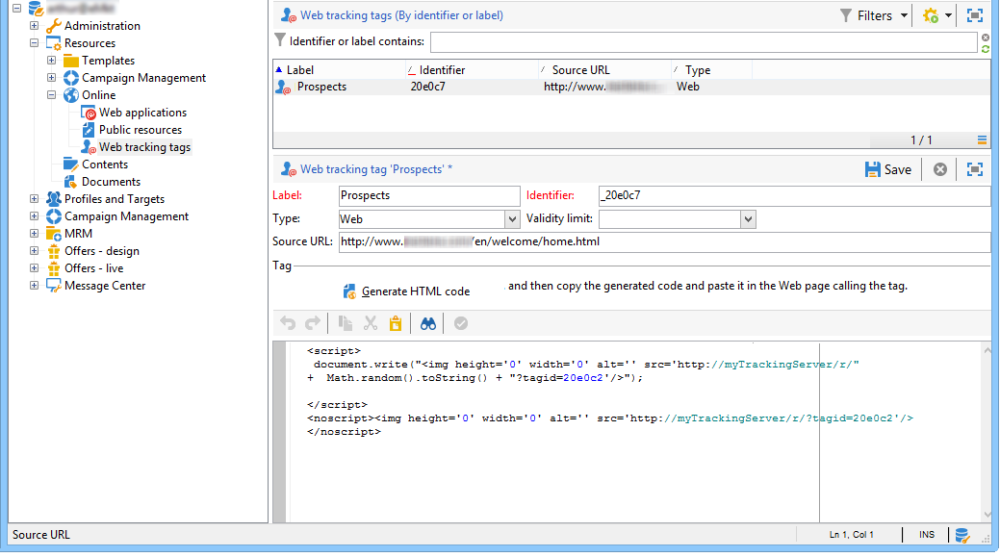

# Erstellen von Webtrackingtags{#creating-web-tracking-tags}

Jede Seite der Site, die Sie verfolgen möchten, muss in Ihrer Adobe Campaign-Plattform referenziert werden. Diese Referenz kann auf zwei Arten durchgeführt werden:

1. manuelle Definition der zu verfolgenden URLs,
1. Erstellen von URLs, die im Handumdrehen verfolgt werden sollen.

## Definieren der URLs, die in der Anwendung verfolgt werden sollen {#defining-the-urls-to-be-tracked-in-the-application}

Auf diese Weise können Sie die zu verfolgenden Seiten manuell definieren und dann ein Beispiel für den zugehörigen Web-Trackingtag generieren. Dieser Vorgang wird im Knoten **[!UICONTROL Kampagne-Ausführung>Resources>Webtrackingtags]** der Client-Konsole definiert.



So generieren Sie den HTML-Code, der in die Seite eingefügt werden soll:

* Geben Sie die Beschriftung des Tags ein: es wird in den Trackinglogs angezeigt,
* Quell-URL angeben: dieses Feld dient Informationszwecken und ermöglicht die Angabe der verfolgten Seite (optional),
* Geben Sie bei Bedarf eine Gültigkeitsdauer ein,
* Klicken Sie auf HTML-Code **[!UICONTROL generieren]** .

Kopieren Sie dann den generierten Code und fügen Sie ihn in die zu verfolgende Seite ein.

## On-the-fly-Erstellung von zu verfolgenden URLs {#on-the-fly-creation-of-urls-to-be-tracked}

Sie können die Web-Tracking-URLs spontan erstellen, indem Sie dem Wert des **tagid** -Parameters Informationen hinzufügen:

* Typ der verfolgten Seite: &#39;w&#39; für WEB oder &#39;t&#39; für TRANSACTION,
* Der interne Name des Ordners, in dem die URL erstellt werden muss.

Diese beiden Informationen müssen mit dem Bezeichner der verfolgten Seite verknüpft werden, indem das Zeichen &quot;|&quot; hinzugefügt wird:

```
tagid=<identifier>|<type>|<foldername>
```

>[!IMPORTANT]
>
>Denken Sie daran, den Wert des Parameters **tagid** zu kodieren, wenn er als URL-Parameter verwendet wird.

**Beispiel**: Erstellung einer Transaktionstyp-Web-Tracking-URL.

**http://myserver.adobe.com/r/a?tagid=home%7Ct%7CMyFolder**
