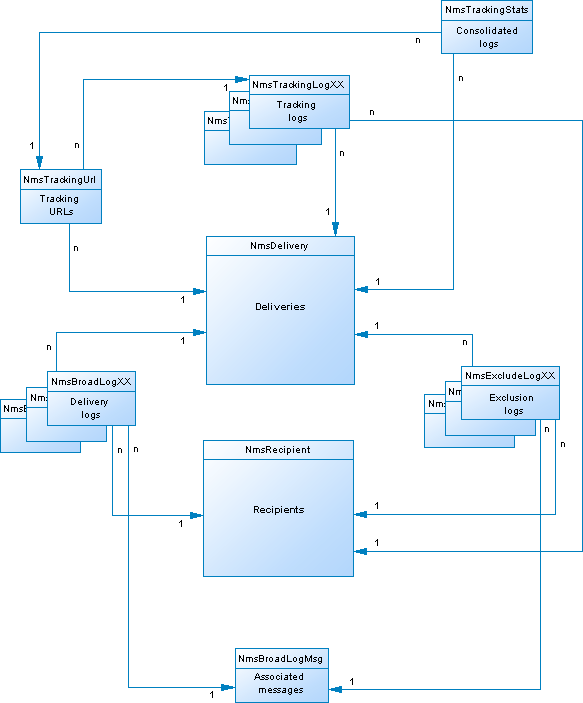

# Beschreibung des Campaign-Datenmodells{#data-model-description}

Adobe Campaign enthält ein vordefiniertes Datenmodell. In diesem Abschnitt finden Sie einige Details zu den integrierten Tabellen des Adobe Campaign-Datenmodells und deren Interaktion.

Um Beschreibungen der einzelnen Tabellen aufzurufen, navigieren Sie zu **[!UICONTROL &quot;Admin&quot; > &quot;Konfiguration&quot; > &quot;Datenschemata&quot;]**, wählen Sie eine Ressource aus der Liste und klicken Sie auf die Registerkarte **[!UICONTROL Dokumentation]**.

>[!NOTE]
>
>Die physische und logische Struktur der in der Anwendung übertragenen Daten wird in XML beschrieben. Sie folgt einer Adobe Campaign-spezifischen Grammatik namens „Schema“. Weitere Informationen zu Adobe Campaign-Schemata finden Sie [ (diesem Abschnitt](../../configuration/using/about-schema-reference.md).

## Beschreibung der Haupttabellen {#description-main-tables}

Adobe Campaign stützt sich auf eine relationale Datenbank, die miteinander verknüpfte Tabellen enthält.

Das folgende Diagramm zeigt die Joins zwischen den Hauptgeschäftstabellen des Adobe Campaign-Datenmodells mit den jeweiligen Hauptfeldern.

<!---->

Das vordefinierte Adobe Campaign-Datenmodell umfasst die unten aufgeführten Haupttabellen.

### NmsRecipient {#NmsRecipient}

Diese Tabelle entspricht dem **nms:recipient**-Schema.

Dies ist die Standardtabelle für die **Empfänger von Sendungen**. Daher enthält sie die Informationen, die für Sendungen über die verschiedenen Kanäle erforderlich sind:

* sEmail: E-Mail-Adresse.
* iEmailFormat: Bevorzugtes Format für E-Mails (1 für Text, 2 für HTML und 0, wenn nicht definiert).
* sAddress1, sAddress2, sAddress3, sAddress4, sZipCode, sCity werden zur Erstellung der Postanschrift verwendet (in Übereinstimmung mit dem XPZ 10-011 AFNOR-Standard vom Mai 1997).
* sPhone, sMobilePhone, sFax enthalten die Telefon-, Handy- und Faxnummern.
* iBlackList ist die standardmäßige Opt-out-Markierung, die für die Profile verwendet wird (1 bedeutet „abgemeldet“, andernfalls 0).

Das Feld iFolderId ist der Fremdschlüssel, der den Empfänger mit dem Ausführungsordner verknüpft. Weitere Informationen hierzu finden Sie unter [XtkFolder](#XtkFolder).

Das Feld sCountryCode entspricht dem ISO-Code 3166-1 Alpha 2 (2 Zeichen) des Landes, das dem Empfänger zugeordnet ist. Dieses Feld ist eigentlich ein Fremdschlüssel in der Länderreferenztabelle (NmsCountry), die die Länderkennzeichnungen und andere Ländercodedaten enthält. Wenn das Land nicht ausgefüllt ist, wird der Wert „XX“ gespeichert (und anstelle eines Null-ID-Eintrags verwendet).

Weitere Informationen zur Empfängertabelle finden Sie [diesem Abschnitt](../../configuration/using/about-data-model.md#default-recipient-table).

### NmsGroup {#NmsGroup}

Diese Tabelle entspricht dem **nms:group**-Schema.

Damit können Sie **statische Empfängergruppen“**. Es besteht eine Viele-zu-Viele-Beziehung zwischen Empfängern und Gruppen. Ein Empfänger kann beispielsweise mehreren Gruppen angehören und eine Gruppe kann mehrere Empfänger enthalten. Gruppen können manuell erstellt werden, entweder über einen Import oder über die Versandzielgruppe. Gruppen werden oft als Versandzielgruppe verwendet. Für das Feld, das den internen Namen der sName-Gruppe darstellt, gibt es einen eindeutigen Index. Die Gruppe ist mit einem Ordner verknüpft (der Schlüssel ist iFolderId). Weitere Informationen hierzu finden Sie unter [XtkFolder](#XtkFolder)).

### NmsRcpGrpRel {#NmsRcpGrpRel}

Die Beziehungstabelle „NmsRcpGrpRel“ enthält nur die beiden Felder, die den Kennungen der verknüpften Tabellen „iRecipientId“ und „iGroupId“ entsprechen.

### NmsService {#NmsService}

Diese Tabelle entspricht dem **nms:service**-Schema.

In Adobe Campaign können Sie Abonnements für Informations-Services (Themen) erstellen und verwalten. Die Tabelle NmsService speichert die Definition der Informations-Services (Themen), die Sie Ihren Empfängern anbieten, zu abonnieren (z. B. einen Newsletter).

Dienste sind Entitäten, die Gruppen ähnlich sind (statische Empfängergruppierungen), mit dem Unterschied, dass sie mehr Informationen verteilen und die Verwaltung von An- und Abmeldungen über Formulare erleichtern.

Das Feld enthält einen eindeutigen Index, der den internen Namen des sName-Dienstes darstellt. Der Dienst ist mit einem Ordner verknüpft (der Schlüssel ist iFolderId). Weitere Informationen hierzu finden Sie unter [XtkFolder](#XtkFolder)). Schließlich gibt das Feld iType den Versandkanal dieses Dienstes an (0 für E-Mail, 1 für SMS, 2 für Telefon, 3 für Briefpost und 4 für Fax).

### NmsSubscription {#NmsSubscription}

Diese Tabelle entspricht dem **nms:subscription**-Schema.

Damit können Sie Empfängerabonnements für Informationsdienste verwalten.

### NmsSubHisto {#NmsSubHisto}

Diese Tabelle entspricht dem **nms:subHisto**-Schema.

Wenn die Abonnements über Web-Formulare oder die Benutzeroberfläche der Anwendung verwaltet werden, werden alle An- und Abmeldungen in der Tabelle NmsSubHisto protokolliert. Das Feld iAction gibt die Aktion (0 für Abmeldung und 1 für Abonnement) an, die an dem im Feld tsDate gespeicherten Datum durchgeführt wird.

### NmsDelivery {#NmsDelivery}

Diese Tabelle entspricht dem **nms:delivery**-Schema.

Jeder Datensatz in dieser Tabelle stellt eine **Versandaktion** oder eine **Versandvorlage** dar. Es enthält alle erforderlichen Parameter für die Durchführung von Sendungen (Zielgruppe, Inhalt usw.). Versand-(Broadcast)-Logs (NmsBroadLog) und zugehörige Tracking-URLs (NmsTrackingUrl) werden während der Analysephase erstellt (weitere Informationen zu beiden Tabellen finden Sie weiter unten).

Das Feld enthält einen eindeutigen Index, der den internen Namen des sInternalName-Versands oder -Szenarios darstellt. Der Versand ist mit einem Ausführungsordner verknüpft (der Fremdschlüssel ist iFolderProcessId). Weitere Informationen hierzu finden Sie unter [XtkFolder](#XtkFolder)).

### XtkFolder {#XtkFolder}

Es enthält **alle Ordner in der Baumstruktur** die auf der Registerkarte **Navigation** der Konsole sichtbar sind.

Die Ordner werden typisiert: Der Wert des sModel-Felds gibt den Typ der Daten an, die im Ordner enthalten sein können. Dieses Feld ermöglicht es der Client-Konsole auch, die Daten mit den entsprechenden Formularen korrekt anzuzeigen. Die möglichen Werte für dieses Feld werden in der navTree definiert.

Die Struktur wird von den Feldern iParentId und iChildCount verwaltet. Das Feld sFullName gibt den vollständigen Pfad des Ordners in der Baumstruktur an. Schließlich gibt es einen eindeutigen Index für das Feld, der den internen Namen des sName-Ordners darstellt.

## Versand und Tracking {#delivery-and-tracking}

Dieser Tabellensatz ist mit dem Modul **Versand** verknüpft, das die Überwachung von Sendungen und ggf. auftretenden Problemen beim Nachrichtenversand ermöglicht. Weitere Informationen hierzu finden Sie unter [Überwachen von Sendungen](../../delivery/using/about-delivery-monitoring.md). Weitere Informationen zum Tracking finden Sie unter [Tracking von Nachrichten](../../delivery/using/about-message-tracking.md).

**NmsBroadLogMsg**: Diese Tabelle entspricht dem **nms:broadLogMsg**-Schema. Dies ist eine Erweiterung der Versandlog-Tabelle.

## Kampagnen-Management {#campaign-management}

Dieser Tabellensatz ist mit dem Modul **Marketing-Kampagnen** verknüpft, mit dem Sie Kommunikations- und Marketing-Kampagnen definieren, optimieren, ausführen und analysieren können. Weitere Informationen hierzu finden Sie in der [ zu Campaign v8](https://experienceleague.adobe.com/docs/campaign/campaign-v8/campaigns/campaigns.html?lang=de){target=_blank}.

* **NmsOperation**: Diese Tabelle entspricht dem **nms:operation**-Schema. Es enthält die Daten von Marketing-Kampagnen.
* **NmsDeliveryOutline**: Diese Tabelle entspricht dem **nms:deliveryOutline**-Schema. Sie enthält die erweiterten Eigenschaften des Versands (Versandentwurf).
* **NmsDlvOutlineItem**: Diese Tabelle entspricht dem **nms:dlvOutlineItem**-Schema. Es enthält die Artikel eines Versandentwurfs.
* **NmsDeliveryCustomization**: Diese Tabelle entspricht dem **nms:deliveryCustomization**-Schema. Es enthält die Personalisierungsfelder eines Versands.
* **NmsBudget**: Diese Tabelle entspricht dem **nms:budget**-Schema. Es enthält Daten zu einem Budget für eine Kampagne, einen Plan, ein Programm, eine Aufgabe und/oder Sendungen.
* **NmsDocument**: Diese Tabelle entspricht dem **nms:document**-Schema. Sie enthält die Marketingdokumente der Kampagne in Form von Dateien (Bilder, Excel- oder Word-Dateien usw.)
* **XtkWorkflow**: Diese Tabelle entspricht dem **xtk:workflow**-Schema. Es enthält Kampagnen-Targeting.
* **NmsTask**: Diese Tabelle entspricht dem **nms:task**-Schema. Sie enthält die Definition einer Marketing-Aufgabe.
* **NmsAsset**: Diese Tabelle entspricht dem **nms:asset**-Schema. Sie enthält die Definition einer Marketing-Ressource.

## Kommunikationskonsistenz {#communication-consistency}

Dieser Tabellensatz ist mit dem Modul **Kampagnenoptimierung** verknüpft, das die Steuerung, Filterung und Überwachung des Versands von Sendungen ermöglicht. Weitere Informationen finden Sie in der [Dokumentation zu Campaign v8](https://experienceleague.adobe.com/docs/campaign/automation/campaign-optimization/campaign-typologies.html?lang=de){target="_blank"}.

* **NmsTypologyRule**: Diese Tabelle entspricht dem **nms:typologyRule**-Schema. Sie enthält die Regeln, die je nach Typologie für Sendungen gelten.
* **NmsTypology**: Diese Tabelle entspricht dem **nms:typology**-Schema. Sie enthält die Regeln, die auf Sendungen anzuwenden sind, die der Typologie entsprechen.
* **NmsTypologyRuleRel**: Diese Tabelle entspricht dem **nms:typologyRuleRel**-Schema. Es enthält die Beziehungen zwischen Typologien und ihren Regeln.
* **NmsVolumeLine**: Diese Tabelle entspricht dem **nms:volumeLine**-Schema. Sie enthält die Verfügbarkeitszeilen der Kapazitätsregeln.
* **NmsVolumeConsumed**: Diese Tabelle entspricht dem **nms:volumeConsumed**-Schema. Es enthält alle Verbrauchszeilen der Kapazitätsregeln.

## Reaktionsverwaltung {#response-management}

Dieser Tabellensatz ist mit dem Modul **Response Manager** verknüpft, mit dem der Erfolg und die Rentabilität von Marketing-Kampagnen oder Angebotsvorschlägen für alle Kommunikationskanäle gemessen werden können. Weitere Informationen hierzu finden Sie unter [Über den Antwort-Manager](../../response/using/about-response-manager.md).

### NmsRemaHypothesis {#NmsRemaHypothesis}

Diese Tabelle entspricht dem Schema **nms:remaHypothesis**. Sie enthält die Definition der Messhypothese.

Diese Tabelle enthält wichtige in XML gespeicherte Informationen, darunter:

**Ausführungskontext (in XML gespeicherte Informationen)**

Der Ausführungskontext füllt die Tabellen und Felder, die für die Messberechnung berücksichtigt werden sollen, nämlich:
* Das Speicherschema :remaMatchRcp nms: Reaktionslog.
* Das Transaktionstabellenschema (z. B. Käufe).
* Das Abfrageschema, mit dem Sie die Starttabelle der Hypothesenbedingungen definieren können.
* Die Verknüpfungen zu Einzelpersonen, mit denen Sie die Person anhand des Abfrageschemas identifizieren können.
* Das Transaktionsdatum. Dieses Feld ist nicht obligatorisch. Es wird jedoch empfohlen, es zu verwenden, um den Berechnungszeitraum einzuschränken.
* Der Transaktionsbetrag: Dies ist ein optionales Feld für die automatische Berechnung von Umsatzindikatoren.

**Hypothesenperimeter (in XML gespeicherte Informationen)**

Das Perimeter der Hypothese besteht in der Filterung der Hypothese anhand der Tabelle des Abfrageschemas.

**Hypothesenüberschreibungsskript (in XML gespeicherte Informationen)**

Das Hypothesenüberschreibungsskript ist ein JavaScript-Code, mit dem Sie den Inhalt der Hypothese während der Ausführung überschreiben können.

**Messindikatoren**

Die folgenden Indikatoren werden während der Ausführung der Hypothese automatisch aktualisiert:

* Anzahl der Reaktionen: **iTransaction**. Anzahl der Zeilen in der Tabelle der Reaktionslogs.
* Anzahl der Kontakte: **iContactReacted**. Anzahl der Zielkontakte in der Hypothese
* Anzahl der Kontrollgruppen: **iProofReacted**. Anzahl der Zielgruppenkontakte in der Hypothese
* Reaktionsrate Kontakte: **dContactReactedRate**. Reaktionsrate der Zielkontakte in der Hypothese
* Reaktionsrate der Kontrollgruppe: **dProofReactedRate**. Reaktionsrate der Hypothese-Kontrollgruppe.
* Gesamtumsatz der kontaktierten Population: **dContactReactedTotalAmount**. Gesamtumsatz der Zielkontakte in der Hypothese
* Durchschnittlicher Umsatz der Kontrollgruppe: **dContactReactedAvgAmount**. Durchschnittlicher Umsatz der Zielgruppenkontakte in der Hypothese.
* Gesamtumsatz der Kontrollgruppe: **dProofReactedTotalAmount**. Gesamtumsatz der Hypothese-Kontrollgruppe.
* Durchschnittlicher Umsatz der Kontrollgruppe: **dProofReactedAvgAmount**. Durchschnittlicher Umsatz der Hypothese-Kontrollgruppe.
* Gesamtspanne pro Kontakt: **dContactReactedTotalMargin**. Gesamtspanne der in der Hypothese bestimmten Kontakte
* Durchschnittliche Spanne pro Kontakt: **dContactReactedAvgMargin**. Durchschnittliche Spanne pro Kontakt, auf den sich die Hypothese bezieht.
* Gesamtspanne Kontrollgruppe: **dProofReactedTotalMargin**. Gesamtspanne der in der Hypothese bestimmten Kontrollgruppe.
* Durchschnittliche Spanne der Kontrollgruppe: **dProofReactedAvgMargin**. Durchschnittliche Spanne der in der Hypothese bestimmten Kontrollgruppe.
* Zusätzlicher Umsatz: **dAdditionnalAmount**. (Durchschnittlicher Umsatz der kontaktierten Personen - durchschnittlicher Umsatz der Kontrollgruppe) * Anzahl der kontaktierten Personen.
* Zusätzliche Spanne: **dAdditionnalMargin**. (Durchschnittliche Spanne der kontaktierten Personen - Durchschnittliche Spanne der Kontrollgruppe) / Anzahl der kontaktierten Personen.
* Durchschnittskosten pro Kontakt (SQL-Ausdruck). Berechnete Kosten des Versands/Anzahl der Kontakte
* ROI (SQL-Ausdruck) Berechnete Kosten des Versands/Gesamtspanne der kontaktierten Personen.
* Effektiver ROI (SQL-Ausdruck). Berechnete Kosten des Versands / zusätzliche Marge.
* Signifikanz: **iSignifikanz** (SQL-Ausdruck). Enthält Werte von 0 bis 3, je nach Bedeutung der Kampagne.

### NmsRemaMatchRcp {#NmsRemaMatchRcp}

Diese Tabelle entspricht dem **nms:remaMatchRcp**-Schema.

Sie enthält einen Datensatz, der die Reaktion eines Individuums auf eine bestimmte Hypothese darstellt. Diese Datensätze wurden bei der Ausführung der Hypothese erstellt.

## Simulation und Versand {#simulation-and-delivery}

Dieser Tabellensatz ist mit dem Modul **Simulation** verknüpft, das es ermöglicht, die Verteilung von Angeboten einer Kategorie oder einer Umgebung zu testen, bevor der Vorschlag an die Empfänger gesendet wird. Weitere Informationen hierzu finden Sie unter [Über die Angebotssimulation](../../interaction/using/about-offers-simulation.md).

* **NmsSimulation**: Diese Tabelle entspricht dem **nms:simulation**-Schema. Er stellt eine Simulation für eine Gruppe von Sendungen oder Angeboten für eine bestimmte Population dar.
* **NmsDlvSimulationRel**: Diese Tabelle entspricht dem **nms:dlvSimulationRel**-Schema. Sie enthält die Liste der in der Simulation berücksichtigten Sendungen. Der Umfang der Simulation wird in XML gespeichert.
* **NmsOfferSimulationRel**: Diese Tabelle entspricht dem **nms:offerSimulationRel**-Schema. Damit können Sie eine Simulation mit einem Angebot verknüpfen.

## Interaction-Modul {#interaction-module}

Dieser Tabellensatz ist mit dem Modul **Interaction** verknüpft, das es ermöglicht, in Echtzeit während einer Interaktion mit einem bestimmten Kontakt zu reagieren, indem es ihm ein oder mehrere angepasste Angebote unterbreitet. Weitere Informationen hierzu finden Sie unter [Interaction und Angebotsverwaltung](../../interaction/using/interaction-and-offer-management.md).

* **NmsOffer**: Diese Tabelle entspricht dem **nms:offer**-Schema. Es enthält die Definition der einzelnen Marketing-Angebote.
* **NmsPropositionRcp**: Diese Tabelle entspricht dem **nms:propositionRcp**-Schema. Es enthält das kanalübergreifende Protokoll der Marketing-Vorschläge, die an jede Person gesendet werden. Der Datensatz wird erstellt, wenn ein Vorschlag vorbereitet oder einem Kontakt effektiv unterbreitet wird.
* **NmsOfferSpace**: Diese Tabelle entspricht dem **nms:offerSpace**-Schema. Es enthält die Definition der Positionen, an denen Vorschläge gemacht werden.
* **NmsOfferContext**: Diese Tabelle entspricht dem **nms:offerContext**-Schema. Es enthält zusätzliche Kriterien für die Anwendbarkeit des Vorschlags sowie die Definition der Formel zur Berechnung der Gewichtung.
* **NmsOfferView**: Diese Tabelle entspricht der **nms:offerView**. Es enthält die Angebotsdarstellungen.
* **NmsOfferCategory**: Diese Tabelle entspricht der **nms:offerCategory**. Es enthält die Angebotskategorien.
* **NmsOfferEnv**: Diese Tabelle entspricht der **nms:offerEnv**. Es enthält die Angebotsumgebungen.

## Message-Center-Modul {#message-center-module}

Die folgenden Tabellen sind mit dem Modul **Transaktionsnachrichten** (Message Center) verknüpft, das die Verwaltung individueller und eindeutiger Nachrichten ermöglicht, die an einen Benutzer gesendet und von Ereignissen generiert werden, die von Informationssystemen ausgelöst werden. Weitere Informationen hierzu finden Sie unter [Über Transaktionsnachrichten](../../message-center/using/about-transactional-messaging.md).

### NmsRtEvent {#NmsRtEvent}

Diese Tabelle entspricht dem **nms:rtEvent**-Schema. Es enthält eine Definition von Echtzeit-Ereignissen.

### NmsBatchEvent {#NmsBatchEvent}

Diese Tabelle entspricht dem **nms:batchEvent**-Schema. Sie enthält die Definition der Ereignisse nach Batch.

<!--## Microsites Module {#microsites-module}

This set of tables is linked to the **Web applications** functionality, which allows to create and publish dynamic and interactive web applications with data from the database and content adapted to the rights of the connected user. For more on this, see [About web applications](../../web/using/about-web-applications.md).

* **NmsTrackingUrl**: This table matches the **nms:trackingUrl** schema.

* **NmsPurl**: This table matches the **nms:purl** schema.-->

## NMAC-Modul {#nmac-module}

Dieser Tabellensatz ist mit dem **Mobile-App-Kanal** verknüpft, der das Senden personalisierter Benachrichtigungen über Apps an iOS- und Android-Terminals ermöglicht. Weitere Informationen hierzu finden Sie unter [Über den Mobile-App-Kanal](../../delivery/using/about-mobile-app-channel.md).

* **NmsMobileApp**: Diese Tabelle entspricht dem **nms:mobileApp**-Schema. Es enthält die in Adobe Campaign definierten Mobile Apps.
* **NmsAppSubscription**: Diese Tabelle entspricht dem **nms:appSubscription**-Schema. Es enthält die Abonnenteninformationen zu einer oder mehreren Anwendungen.
* **NmsAppSubscriptionRcp**: Diese Tabelle entspricht dem **nms:appSubscriptionRcp**-Schema. Damit können Sie Besucherinnen und Besucher, die eine Anwendung abonniert haben, mit der Empfängertabelle verknüpfen.
* **NmsExcludeLogAppSubRcp**: Diese Tabelle entspricht dem Schema **nms:excludeLogAppSubRcp**.
* **NmsTrackingLogAppSubRcp**: Diese Tabelle entspricht dem **nms:trackingLogAppSubRcp**-Schema.
* **NmsBroadLogAppSubRcp**: Diese Tabelle entspricht dem **nms:broadLogAppSubRcp**-Schema.

## Modul für Social Marketing {#social-marketing-module}

Dieser Satz von Tabellen ist mit dem Modul **Verwalten sozialer Netzwerke** verknüpft, das die Interaktion mit Kunden und potenziellen Kunden über Facebook und X (früher als Twitter bekannt) ermöglicht. Weitere Informationen hierzu finden Sie unter [Über Social Marketing](../../social/using/about-social-marketing.md).

* **NmsVisitor**: Diese Tabelle entspricht dem **nms:visitor**-Schema. Es enthält Informationen zu Besuchern.
* **NmsVisitorSub**: Diese Tabelle entspricht dem **nms:visitorSub**-Schema. Sie ermöglicht es, einen Besucher mit den Diensten zu verknüpfen, die er abonniert hat (X oder Facebook).
* **NmsFriendShipRel**: Diese Tabelle entspricht dem **nms:friendshipRel**-Schema. Sie ermöglicht es, Besucher im Rahmen des Facebook-Service mit ihren Freunden zu verbinden.
* **NmsVisitorInterestRel**: Diese Tabelle entspricht dem **nms:visitorInterestRel**-Schema. Es ermöglicht Ihnen, Besucher und deren Interessen zu verbinden.
* **NmsInterest**: Diese Tabelle entspricht dem **nms:interest**-Schema. Es enthält die Liste der Interessen jedes Besuchers.
