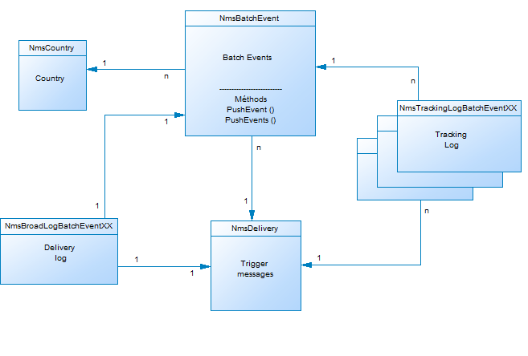

# Beschreibung des Kampagne-Datenmodells{#data-model-description}

Adobe Campaign enthält ein vordefiniertes Datenmodell. Dieser Abschnitt enthält einige Details zu den integrierten Tabellen des Adobe Campaign-Datenmodells und deren Interaktion.

Um die Tabellenbeschreibung aufzurufen, wählen Sie &quot; **[!UICONTROL Admin&quot;> &quot;Konfiguration&quot;> &quot;Schema]**&quot;aus, wählen Sie eine Ressource aus der Liste und klicken Sie auf die Registerkarte &quot; **[!UICONTROL Dokumentation]** &quot;.

>[!NOTE]
>
>Die physische und logische Struktur der in der Anwendung übertragenen Daten wird in XML beschrieben. Sie folgt einer Adobe Campaign-spezifischen Grammatik namens „Schema“. For more on Adobe Campaign schemas, read out [this section](../../configuration/using/about-schema-reference.md).

## Beschreibung der Haupttabellen {#description-main-tables}

Adobe Campaign setzt auf eine relationale Datenbank, die Tabellen enthält, die miteinander verknüpft sind.

Das folgende Diagramm zeigt die Verbindungen zwischen den wichtigsten Geschäftstabellen des Adobe Campaign-Datenmodells mit den jeweiligen Hauptfeldern.

<!---->

Das vordefinierte Adobe Campaign-Datenmodell umfasst die unten aufgeführten Haupttabellen.

### NmsRecipient {#NmsRecipient}

Diese Tabelle entspricht dem Schema **nms:Empfänger** .

Dies ist die Standardtabelle für die **Empfänger von Versänden**. Sie enthält daher die Informationen, die für Versand über die verschiedenen Kanal erforderlich sind:

* sEmail: E-Mail-Adresse.
* iEmailFormat: bevorzugte Format für E-Mails (1 für Text, 2 für HTML und 0, wenn nicht definiert).
* sAddress1, sAddress2, sAddress3, sAddress4, sZipCode, sCity werden zum Aufbau der Postanschrift verwendet (gemäß XPZ 10-011 AFNOR Standard ab Mai 1997).
* sPhone, sMobilePhone, sFax enthalten die Telefon-, Handy- und Faxnummern.
* iBlackList ist das standardmäßige Ausschluss-Flag, das für die Profil verwendet wird (1 bedeutet &quot;unsubscribed&quot;, 0 ansonsten).

Das Feld iFolderId ist der Fremdschlüssel, der den Empfänger mit dem Ausführungsordner verknüpft. For more on this, see [XtkFolder](#XtkFolder).

Das Feld sCountryCode ist der ISO-Code 3166-1 Alpha 2 (2 Zeichen) des Landes, das mit dem Empfänger verknüpft ist. Dieses Feld ist tatsächlich ein ausländischer Schlüssel in der Länderreferenztabelle (NmsCountry), die die Länderbeschriftungen und andere Ländercodedaten enthält. Wenn das Land nicht ausgefüllt wird, wird der Wert &quot;XX&quot;gespeichert (und anstelle eines Null-ID-Datensatzes verwendet).

For more on the Recipient table, see [this section](../../configuration/using/about-data-model.md#default-recipient-table).

### NmsGroup {#NmsGroup}

Diese Tabelle entspricht dem Schema **nms:group** .

Sie können **statische Gruppen von Empfängern** erstellen. Zwischen Empfängern und Gruppen besteht eine Beziehung zwischen vielen und vielen. Ein Empfänger kann beispielsweise zu mehreren Gruppen gehören und eine Gruppe kann mehrere Empfänger enthalten. Gruppen können manuell, über einen Import oder über Versand-Targeting erstellt werden. Gruppen werden oft als Versand-Zielgruppen verwendet. Es gibt einen eindeutigen Index im Feld, der den internen Namen der sName-Gruppe darstellt. Die Gruppe ist mit einem Ordner verknüpft (der Schlüssel ist iFolderId. For more on this, see [XtkFolder](#XtkFolder)).

### NmsRcpGrpRel {#NmsRcpGrpRel}

Die Beziehungstabelle NmsRcpGrpRel enthält nur die beiden Felder, die den Bezeichnern der verknüpften Tabellen iRecipientId und iGroupId entsprechen.

### NmsService {#NmsService}

Diese Tabelle entspricht dem Schema **nms:service** .

In Adobe Campaign können Sie Abonnement für Informationsdienst (Themen) erstellen und verwalten. Die NmsService-Tabelle speichert die Definition der Informationsdienst (Themen), die Sie Ihren Empfängern zum Abonnieren Angebot geben (z. B. einen Newsletter).

Dienste sind Einrichtungen, die Gruppen ähnlich sind (statische Empfänger), mit der Ausnahme, dass sie mehr Informationen verbreiten und eine einfache Verwaltung von Abonnements und Abmeldungen über Formulare ermöglichen.

Es gibt einen eindeutigen Index im Feld, der den internen Namen des sName-Dienstes darstellt. Der Dienst ist mit einem Ordner verknüpft (der Schlüssel ist iFolderId. For more on this, see [XtkFolder](#XtkFolder)). Schließlich gibt das Feld &quot;iType&quot;den Kanal des Versands dieses Dienstes an (0 für E-Mail, 1 für SMS, 2 für Telefon, 3 für Direktwerbung und 4 für Fax).

### NmsSubscription {#NmsSubscription}

Diese Tabelle entspricht dem Schema **nms:Abonnement** .

Es ermöglicht Ihnen die Verwaltung von Empfänger-Abonnements an Informationsdienst.

### NmsSubHisto {#NmsSubHisto}

Diese Tabelle entspricht dem Schema **nms:subHisto** .

Wenn die Abonnement mithilfe von Webformularen oder der Benutzeroberfläche der Anwendung verwaltet werden, werden alle Abonnements und Abmeldungen in der NmsSubHisto-Tabelle verzeichnet. Das Feld &quot;iAction&quot;gibt die Aktion (0 für Abmeldung und 1 für Abonnement) an, die an dem im Feld &quot;tsDate&quot;gespeicherten Datum ausgeführt wird.

### NmsDelivery {#NmsDelivery}

Diese Tabelle entspricht dem Schema **nms:Versand** .

Jeder Datensatz in dieser Tabelle stellt eine **Versand-Aktion** oder eine **Versandvorlage** dar. Es enthält alle erforderlichen Parameter für die Ausführung von Versänden (Zielgruppe, Inhalt usw.). Während der Analyse werden Versand- (Broadcast-)Protokolle (NmsBroadLog) und zugehörige Tracking-URLs (NmsTrackingUrl) erstellt (weitere Informationen zu beiden Tabellen finden Sie unten).

Es gibt eine eindeutige Indexposition auf dem Feld, die den internen Namen des Versands sInternalName oder Szenarios darstellt. Der Versand ist mit einem Ausführungsordner verknüpft (der Fremdschlüssel ist iFolderProcessId. For more on this, see [XtkFolder](#XtkFolder)).

### XtkFolder {#XtkFolder}

Es enthält **alle Ordner in der Struktur** , die auf der Registerkarte &quot; **Navigation** &quot;der Konsole angezeigt werden.

Die Ordner sind typisiert: Der Wert des Felds sModel gibt den Datentyp an, der im Ordner enthalten sein kann. Dieses Feld ermöglicht es der Client-Konsole auch, die Daten mit den entsprechenden Formularen korrekt anzuzeigen. Die möglichen Werte für dieses Feld werden in der navTree definiert.

Die Struktur wird von den Feldern iParentId und iChildCount verwaltet. Das Feld sFullName gibt den vollständigen Pfad des Ordners in der Struktur an. Schließlich befindet sich im Feld ein eindeutiger Index, der den internen Namen des Ordners sName darstellt.

## Versand und Verfolgung {#delivery-and-tracking}

Dieser Tabellensatz ist mit dem **Versand** -Modul verknüpft, das die Überwachung von Versänden und eventuell aufgetretenen Problemen beim Senden von Nachrichten ermöglicht. For more on this, see [Monitoring deliveries](../../delivery/using/monitoring-a-delivery.md). Weitere Informationen zur Verfolgung finden Sie unter [Rückverfolgungsmeldungen](../../delivery/using/about-message-tracking.md).

**NmsBroadLogMsg**: Diese Tabelle entspricht dem **nms:wideLogMsg** -Schema. Es handelt sich um eine Erweiterung der Protokolltabelle des Versands.

## Kampagnenverwaltung {#campaign-management}

Dieser Tabellensatz ist mit dem Modul **Marketing-Kampagnen** verknüpft, das die Definition, Optimierung, Ausführung und Analyse von Kommunikations- und Marketing-Kampagnen ermöglicht. For more on this, see [About marketing campaigns](../../campaign/using/designing-marketing-campaigns.md).

* **NmsOperation**: Diese Tabelle entspricht dem Schema **nms:operation** . Es enthält die Daten zu Marketing-Kampagnen.
* **NmsDeliveryOutline**: Diese Tabelle entspricht dem Schema **nms:deliveryOutline** . Es enthält die erweiterten Eigenschaften des Versands (Versandentwurf).
* **NmsDlvOutlineItem**: Diese Tabelle entspricht dem Schema **nms:dlvOutlineItem** . Es enthält die Artikel eines Versandentwurfs.
* **NmsDeliveryCustomization**: Diese Tabelle entspricht dem Schema **nms:deliveryCustomization** . Es enthält die Personalisierungsfelder eines Versands.
* **NmsBudget**: Diese Tabelle entspricht dem Schema **nms:budget** . Es enthält die Daten eines Budgets über eine Kampagne, einen Plan, ein Programm, eine Aufgabe und/oder Versände.
* **NmsDocument**: Diese Tabelle entspricht dem Schema **nms:Dokument** . Es enthält die Marketing-Dokumente der Kampagne in Form von Dateien (Bilder, Excel- oder Wortdateien usw.)
* **XtkWorkflow**: Diese Tabelle entspricht dem Schema **xtk:workflow** . Es enthält Kampagnen-Targeting.
* **NmsTask**: Diese Tabelle entspricht dem Schema **nms:Aufgabe** . Es enthält die Definition einer Marketing-Aufgabe.
* **NmsAsset**: Diese Tabelle entspricht dem Schema **nms:asset** . Es enthält die Definition einer Marketing-Ressource.

## Kommunikationskonsistenz {#communication-consistency}

Dieser Tabellensatz ist mit dem **Campaign Optimization** -Modul verknüpft, das das Steuern, Filtern und Überwachen des Sendens von Versänden ermöglicht. For more on this, see [About campaign typologies](../../campaign/using/about-campaign-typologies.md).

* **NmsTypologyRule**: Diese Tabelle entspricht dem Schema **nms:typologyRule** . Er enthält die Regeln, die je nach Typologie für Versand gelten.
* **NmsTypology**: Diese Tabelle entspricht dem Schema **nms:typology** . Es enthält die Regeln, die auf Versand angewendet werden, die der Typologie entsprechen.
* **NmsTypologyRuleRel**: Diese Tabelle entspricht dem Schema **nms:typologyRuleRel** . Es enthält die Beziehungen zwischen Typologien und ihren Regeln.
* **NmsVolumeLine**: Diese Tabelle entspricht dem Schema **nms:volumeLine** . Er enthält die Verfügbarkeitslinien der Kapazitätsregeln.
* **NmsVolumeConsumed**: Diese Tabelle entspricht dem **nms:volumeConsumed** -Schema. Er enthält alle Verbrauchslinien der Kapazitätsregeln.

## Reaktionsmanagement {#response-management}

Dieser Tabellensatz ist mit dem **Reaktionsverwaltung** -Modul verknüpft, das es ermöglicht, den Erfolg und die Rentabilität von Marketing-Kampagnen oder Angebotsvorschlägen für alle Kommunikations-Kanal zu messen. For more on this, see [About response manager](../../campaign/using/about-response-manager.md).

### NmsRemaHypothese {#NmsRemaHypothesis}

Diese Tabelle fällt mit dem **nms:remaHypothese** -Schema zusammen. Es enthält die Definition der Hypothese der Messung.

Diese Tabelle enthält wichtige Informationen, die in XML gespeichert sind, darunter:

**Ausführungskontext (in XML gespeicherte Informationen)**

Der Ausführungskontext füllt die Tabellen und Felder aus, die bei der Berechnung der Messung berücksichtigt werden sollen, d. h.:
* Das Schema nms:remaMatchRcp Reaktionsprotokoll-Datenspeicherung.
* Das Schema der Transaktionstabelle (z. B. Einkäufe).
* Das abfragende Schema, mit dem Sie die Tabelle &quot;Beginn&quot;der Hypothesen definieren können.
* Die Links zu Einzelpersonen, mit denen Sie die Einzelperson anhand des abfragenden Schemas identifizieren können.
* Das Transaktionsdatum. Dieses Feld ist nicht obligatorisch, aber wir empfehlen Ihnen, den Berechnungsrahmen einzuschränken.
* Transaktionsbetrag: es ist ein optionales Feld zur automatischen Berechnung von Umsatzindikatoren.

**Umfang der Hypothese (in XML gespeicherte Informationen)**

Der Umfang der Hypothese besteht in der Filterung der Hypothese auf der Grundlage der Tabelle des abfragenden Schemas.

**Überlastungsskript für Hypothesen (in XML gespeicherte Informationen)**

Das Skript zum Überladen von Hypothesen ist ein JavaScript-Code, mit dem Sie den Inhalt der Hypothese während der Ausführung überladen können.

**Messindikatoren**

Die folgenden Indikatoren werden während der Ausführung der Hypothese automatisch aktualisiert:

* Anzahl der Reaktionen: **Transaktion**. Anzahl der Zeilen in der Tabelle der Reaktionsprotokolle.
* Anzahl der Kontaktpersonen: **iContactReact**. Bestimmte Anzahl der gezielten Kontakte in der Hypothese.
* Anzahl der Kontrollgruppen: **iProofReact**. Spezifische Anzahl der Kontakte mit gezielten Kontrollgruppen in der Hypothese.
* Ansprechrate: **dContactReactRate**. Antwortquote der gezielten Kontakte in der Hypothese.
* Ansprechrate der Kontrollgruppe: **dProofReactRate**. Ansprechrate der Kontrollgruppe der Hypothese.
* Gesamteinnahmen der kontaktierten Bevölkerung: **dContactReactTotalAmount**. Gesamteinnahmen der gezielten Kontakte in der Hypothese.
* Durchschnittlicher Umsatz aus Kontrollgruppen: **dContactReactAvgAmount**. Durchschnittlicher Umsatz der Kontakte mit der gezielten Kontrollgruppe in der Hypothese.
* Gesamteinnahmen der Kontrollgruppe: **dProofReactTotalAmount**. Gesamtumsatz der Kontrollgruppe der Hypothese.
* Durchschnittlicher Umsatz aus Kontrollgruppen: **dProofReactAvgAmount**. Durchschnittlicher Umsatz der Kontrollgruppe der Hypothese.
* Gesamtspanne pro Kontaktperson: **dContactReactTotalMargin**. Gesamtspanne pro Kontaktperson, die in der Hypothese angesprochen wird.
* Durchschnittliche Marge pro Kontaktperson: **dContactReactAvgMargin**. Durchschnittliche Marge pro Kontaktperson, die in der Hypothese angesprochen wird.
* Gesamter Spielraum für Kontrollgruppen: **dProofReactTotalMargin**. Gesamtmarge der Kontrollgruppe, auf die sich die Hypothese bezieht.
* Durchschnittliche Kontrollgruppe: **dProofReactAvgMargin**. Durchschnittliche Marge der Kontrollgruppe, die in der Hypothese als Ziel dient.
* Zusätzliche Einnahmen: **dAdditionalbetrag**. (Durchschnittlicher Umsatz der kontaktierten Personen - Durchschnittlicher Umsatz der Kontrollgruppe) * Anzahl der kontaktierten Personen.
* Zusätzliche Marge: **dAdditionalMargin**. (Durchschnittliche kontaktierte Marge - Durchschnittliche Kontrollgruppe) / Anzahl der kontaktierten Personen.
* Durchschnittliche Kosten pro Kontakt (SQL Ausdruck). Berechnete Kosten des Versands / Anzahl der kontaktierten Personen.
* ROI (SQL Ausdruck). Berechnete Kosten des Versands/Gesamtmarge der kontaktierten Personen.
* Effektiver ROI (SQL Ausdruck). Berechnete Kosten des Versands/zusätzliche Marge.
* Bedeutung: **Signifikanz** (SQL Ausdruck). Enthält Werte von 0 bis 3, je nach Bedeutung der Kampagne.

### NmsRemaMatchRcp {#NmsRemaMatchRcp}

Diese Tabelle entspricht dem **nms:remaMatchRcp** -Schema.

Es enthält einen Datensatz, der die Reaktion eines Individuums auf eine bestimmte Hypothese darstellt. Diese Datensätze wurden während der Ausführung der Hypothese erstellt.

## Simulation und Versand {#simulation-and-delivery}

Dieser Tabellensatz ist mit dem Modul **Simulation** verknüpft, das es ermöglicht, die Verteilung von Angeboten zu einer Kategorie oder Umgebung zu testen, bevor Sie Ihren Vorschlag an Empfänger senden. For more on this, see [About offers simulation](../../interaction/using/about-offers-simulation.md).

* **NmsSimulation**: Diese Tabelle entspricht dem Schema **nms:Simulation** . Es stellt eine Simulation für eine Reihe von Versänden oder Angeboten für eine bestimmte Bevölkerungsgruppe dar.
* **NmsDlvSimulationRel**: Diese Tabelle entspricht dem **nms:dlvSimulationRel** -Schema. Er enthält die Liste der bei der Simulation berücksichtigten Versände. Der Umfang der Simulation wird in XML gespeichert.
* **NmsOfferSimulationRegel**: Diese Tabelle entspricht dem **nms:offerSimulationRel** -Schema. Damit können Sie eine Simulation mit einem Angebot verknüpfen.

## Interaktionsmodul {#interaction-module}

Dieser Tabellensatz ist mit dem **Interaktionsmodul** verknüpft, das es ermöglicht, während einer Interaktion mit einem bestimmten Kontakt in Echtzeit zu reagieren, indem es zu einem oder mehreren angepassten Angeboten macht. Weitere Informationen finden Sie unter [Interaktion und Angebot-Management](../../interaction/using/interaction-and-offer-management.md).

* **NmsOffer**: Diese Tabelle entspricht dem Schema **nms:Angebot** . Es enthält die Definition der einzelnen Marketing-Angebot.
* **NmsPropositionRcp**: Diese Tabelle entspricht dem **nms:propositionRcp** -Schema. Es enthält das Kanal-übergreifende Protokoll der Marketingvorschläge, die an die einzelnen Personen gesendet werden. Der Datensatz wird erstellt, wenn ein Vorschlag vorbereitet oder effektiv an eine Einzelperson gemacht wird.
* **NmsOfferSpace**: Diese Tabelle entspricht dem Schema **nms:offerSpace** . Es enthält die Definition der Orte, an denen Vorschläge gemacht werden.
* **NmsOfferContext**: Diese Tabelle entspricht dem Schema **nms:offerContext** . Er enthält zusätzliche Kriterien für die Anwendbarkeit des Vorschlags sowie die Festlegung der Berechnungsformel der Gewichtung.
* **NmsOfferView**: Diese Tabelle entspricht **nms:offerView**. Es enthält die Angebotsdarstellungen.
* **NmsOfferCategory**: Diese Tabelle entspricht **nms:offerCategory**. Es enthält die Angebot-Kategorien.
* **NmsOfferEnv**: Diese Tabelle entspricht **nms:offerEnv**. Es enthält die Angebot-Umgebung.

## Nachrichtencenter-Modul {#message-center-module}

Die folgenden Tabellen sind mit dem Modul **Transaktionsnachrichten** (Message Center) verknüpft, mit dem individuelle und individuelle Nachrichten verwaltet werden können, die an einen Benutzer gesendet und aus Ereignissen generiert werden, die aus Informationssystemen ausgelöst werden. For more on this, see [About transactional messaging](../../message-center/using/about-transactional-messaging.md).

### NmsRtEvent {#NmsRtEvent}

Diese Tabelle entspricht dem Schema **nms:rtEvent** . Es enthält eine Definition von Echtzeit-Ereignissen.

### NmsBatchEvent {#NmsBatchEvent}

Diese Tabelle entspricht dem Schema **nms:batchEvent** . Es enthält die Definition von Ereignissen nach Stapeln.

<!--## Microsites Module {#microsites-module}

This set of tables is linked to the **Web applications** functionality, which allows to create and publish dynamic and interactive web applications with data from the database and content adapted to the rights of the connected user. For more on this, see [About web applications](../../web/using/about-web-applications.md).

* **NmsTrackingUrl**: This table matches the **nms:trackingUrl** schema.

* **NmsPurl**: This table matches the **nms:purl** schema.-->

## NMAC-Modul {#nmac-module}

Dieser Tabellensatz ist mit dem **Mobile App Kanal** verknüpft, mit dem personalisierte Benachrichtigungen über Apps an iOS- und Android-Terminals gesendet werden können. Weitere Informationen finden Sie unter [Info zu Mobile App Kanal](../../delivery/using/about-mobile-app-channel.md).

* **NmsMobileApp**: Diese Tabelle entspricht dem Schema **nms:mobileApp** . Es enthält die in Adobe Campaign definierten Mobilanwendungen.
* **NmsAppSubscription**: Diese Tabelle entspricht dem Schema **nms:appSubscription** . Es enthält die Abonnenteninformationen zu einer oder mehreren Anwendungen.
* **NmsAppSubscriptionRcp**: Diese Tabelle entspricht dem Schema **nms:appSubscriptionRcp** . Dadurch können Sie Besucher, die eine Anwendung abonniert haben, mit der Tabelle &quot;Empfänger&quot;verknüpfen.
* **NmsExcludeLogAppSubRcp**: Diese Tabelle entspricht dem **nms:excludeLogAppSubRcp** -Schema.
* **NmsTrackingLogAppSubRcp**: Diese Tabelle entspricht dem **nms:trackingLogAppSubRcp** -Schema.
* **NmsBroadLogAppSubRcp**: Diese Tabelle entspricht dem **nms:wideLogAppSubRcp** -Schema.

## Social Marketing-Modul {#social-marketing-module}

Dieser Tabellensatz ist mit dem Modul **Verwalten sozialer Netzwerke** verknüpft, das die Interaktion mit Kunden und Potenzieller Kunden über Facebook und Twitter ermöglicht. For more on this, see [About social marketing](../../social/using/about-social-marketing.md).

* **NmsVisitor**: Diese Tabelle entspricht dem Schema **nms:Besucher** . Es enthält Informationen zu Besuchern.
* **NmsVisitorSub**: Diese Tabelle entspricht dem Schema **nms:visitorSub** . Damit können Sie einen Besucher mit den Diensten verknüpfen, die sie abonniert haben (Twitter oder Facebook).
* **NmsFriendShipRel**: Diese Tabelle entspricht dem **nms:friendlyRel** Schema. Dadurch können Sie Besucher im Rahmen des Facebook-Dienstes mit ihren Freunden verknüpfen.
* **NmsVisitorInterestRel**: Diese Tabelle entspricht dem Schema **nms:visitorInterestRel** . Sie ermöglicht es Ihnen, Besucher und deren Interessen zu verbinden.
* **NmsInterest**: Diese Tabelle entspricht dem Schema **nms:interest** . Er enthält die Liste der Interessen für jeden Besucher.