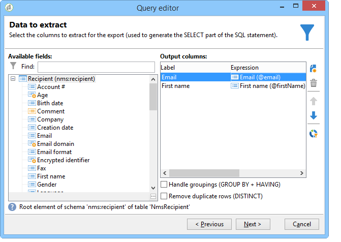

# Datenorientierte APIs{#data-oriented-apis}

Mit datenorientierten APIs können Sie das gesamte Datenmodell ansprechen.

## Übersicht über das Datenmodell {#overview-of-the-datamodel}

Adobe Campaign Angebot keine dedizierte Lese-API pro Entität (keine getRecipient- oder getDelivery-Funktion usw.). Verwenden Sie die ABFRAGE- und WRITER-Methode zum Lesen und Ändern von Daten, um auf die Modelldaten zuzugreifen.

Mit Adobe Campaign können Sie Sammlungen verwalten: Mit Abfragen können Sie eine Reihe von Informationen wiederherstellen, die auf der Grundlage gesammelt wurden. Im Gegensatz zum Zugriff im SQL-Modus geben Adobe Campaign-APIs eine XML-Struktur anstelle von Datenspalten zurück. Adobe Campaign erstellt so zusammengesetzte Dokumente mit allen erfassten Daten.

Dieser Betriebsmodus Angebot keine Eins-zu-Eins-Zuordnung zwischen den Attributen und Elementen der XML-Dokumente und den Tabellenspalten in der Datenbank.

XML-Dokumente werden in den Feldern des MEMO-Typs der Datenbank gespeichert.

## Beschreibung des Modells {#description-of-the-model}

Sie müssen mit dem Adobe Campaign-Datenmodell vertraut sein, um die Datenbankfelder in Ihren Skripten bearbeiten zu können.

Eine Darstellung des Datenmodells finden Sie in der Beschreibung des [Adobe Campaign-Datenmodells](../../configuration/using/data-model-description.md).

Informationen zum Generieren der Struktur finden Sie in diesem Artikel: [Generieren eines Datenmodells oder eines Datenwörterbuchs](https://helpx.adobe.com/campaign/kb/generate-data-model.html).

## Abfrage und Schriftsteller {#query-and-writer}

Im folgenden Einführungs-Schema wird beschrieben, wie auf niedriger Ebene zwischen Datenbank und Kunden (Webseiten oder Adobe Campaign-Client-Konsole) zum Lesen (ExecuteQuery) und Schreiben (Writer) gewechselt wird.


### ExecuteQuery {#executequery}

Für Spalten und Bedingungen können Sie Abfragen verwenden.

Dadurch können Sie die zugrunde liegende SQL isolieren. Die Sprache der Abfrage hängt nicht von der zugrunde liegenden Engine ab: Einige Funktionen werden neu zugeordnet, was mehrere SELECT SQL-Bestellungen generieren kann.

Weitere Informationen dazu finden Sie unter [Beispiel zur Methode &#39;ExecuteQuery&#39; des Schemas &#39;xtk:queryDef&#39;](../../configuration/using/web-service-calls.md#example-on-the--executequery--method-of-schema--xtk-querydef-).

Die **ExecuteQuery** -Methode wird in [ExecuteQuery (xtk:queryDef)](#executequery--xtk-querydef-)dargestellt.

### schreiben {#write}

Mit Schreibbefehlen können Sie einfache oder komplexe Dokumente mit Einträgen in einer oder mehreren Tabellen der Basis schreiben.

Mit Transaktions-APIs können Sie Abversationen über den Befehl **updateOrInsert** verwalten: Mit einem Befehl können Sie Daten erstellen oder aktualisieren. Sie können auch die Änderungszusammenführung (**Zusammenführen**) konfigurieren: In diesem Betriebsmodus können Sie Teilaktualisierungen autorisieren.

Die XML-Struktur Angebot eine logische Ansicht der Daten und ermöglicht es Ihnen, die physische Struktur der SQL-Tabelle zu umgehen.

Die Write-Methode wird in [Write / WriteCollection (xtk:session)](#write---writecollection--xtk-session-)dargestellt.

## ExecuteQuery (xtk:queryDef) {#executequery--xtk-querydef-}

Auf diese Weise können Sie Abfragen aus Daten durchführen, die mit einem Schema verbunden sind. Es benötigt eine Authentifizierungszeichenfolge (muss angemeldet sein) und ein XML-Dokument, das die Abfrage beschreibt, die als Parameter gesendet werden soll. Der Parameter return ist ein XML-Dokument, das das Ergebnis der Abfrage im Format des Schemas enthält, auf das die Abfrage verweist.

Definition der Methode &quot;ExecuteQuery&quot;im Schema &quot;xtk:queryDef&quot;:

```
<method name="ExecuteQuery" const="true">
  <parameters>
    <param desc="Output XML document" name="output" type="DOMDocument" inout="out"/>
  </parameters>
</method>
```

>[!NOTE]
>
>Dies ist eine &quot;const&quot;-Methode. Die Eingabeparameter sind in einem XML-Dokument im Format des Schemas &quot;xtk:queryDef&quot;enthalten.

### Format des XML-Dokuments der Eingabe-Abfrage {#format-of-the-xml-document-of-the-input-query}

Die Struktur des XML-Dokuments der Abfrage wird im Schema &quot;xtk:queryDef&quot;beschrieben. In diesem Dokument werden die Klauseln einer SQL-Abfrage beschrieben: &quot;select&quot;, &quot;where&quot;, &quot;order by&quot;, &quot;group by&quot;, &quot;having&quot;.

```
<queryDef schema="schema_key" operation="operation_type">
  <select>
    <node expr="expression1">
    <node expr="expression2">
    ...
  </select>
  <where> 
    <condition expr="expression1"/> 
    <condition expr="expression2"/>
    ... 
  </where>
  <orderBy>
    <node expr="expression1">
    <node expr="expression2">
    ...
  </orderBy>
  <groupBy>
    <node expr="expression1">
    <node expr="expression2">
    ...
  </groupBy>
  <having>
    <condition expr="expression1"/> 
    <condition expr="expression2"/>
    ...
  </having>
</queryDef>
```

Eine Unter-Abfrage ( `<subquery>` ) kann in einem `<condition> ` Element definiert werden. Die Syntax für ein `<subquery> ` Element basiert auf der Syntax eines `<querydef>`.

Example of a `<subquery>  : </subquery>`

```
<condition setOperator="NOT IN" expr="@id" enabledIf="$(/ignored/@ownerType)=1">
  <subQuery schema="xtk:operatorGroup">
     <select>
       <node expr="[@operator-id]" />
     </select>
     <where>
       <condition expr="[@group-id]=$long(../@owner-id)"/>
     </where>
   </subQuery>
</condition>  
  
```

Eine Abfrage muss auf ein Beginn-Schema aus dem **Schema** -Attribut verweisen.

Der gewünschte Vorgangstyp wird in das **operation** -Attribut eingegeben und enthält einen der folgenden Werte:

* **get**: ruft einen Datensatz aus der Tabelle ab und gibt einen Fehler zurück, wenn die Daten nicht vorhanden sind,
* **getIfExists**: ruft einen Datensatz aus der Tabelle ab und gibt ein leeres Dokument zurück, wenn die Daten nicht vorhanden sind.
* **auswählen**: einen Cursor erstellt, um mehrere Datensätze zurückzugeben, und ein leeres Dokument zurückgibt, wenn keine Daten vorhanden sind,
* **Anzahl**: gibt eine Datenanzahl zurück.

Die **XPath** -Syntax wird verwendet, um Daten basierend auf dem Eingabe-Schema zu suchen. Weitere Informationen zu XPaths finden Sie unter [Data Schemas](../../configuration/using/data-schemas.md).

#### Beispiel mit der &quot;get&quot;-Operation {#example-with-the--get--operation}

Ruft den Nachnamen und Vornamen eines Empfängers (&quot;nms:Empfänger&quot;-Schema) mit einem Filter in der E-Mail ab.

```
<queryDef schema="nms:recipient" operation="get">
  <!-- fields to retrieve -->
  <select>
    <node expr="@firstName"/>
    <node expr="@lastName"/>
  </select> 

  <!-- condition on email -->
  <where>  
    <condition expr="@email= 'john.doe@aol.com'"/>
  </where>
</queryDef>
```

#### Beispiel mit dem Vorgang &quot;Auswählen&quot; {#example-with-the--select--operation}

Gibt die Liste der auf einem Ordner gefilterten Empfänger und die E-Mail-Domäne mit einer Sortierung in absteigender Reihenfolge am Geburtsdatum zurück.

```
<queryDef schema="nms:recipient" operation="select">
  <select>
    <node expr="@email"/>
    <!-- builds a string with the concatenation of the last name and first name separated by a dash -->      
    <node expr="@lastName+'-'+@firstName"/>
    <!-- get year of birth date -->
    <node expr="Year(@birthDate)"/>
  </select> 

  <where>  
     <condition expr="[@folder-id] = 1234 and @domain like 'Adobe%'"/>
  </where>

  <!-- order by birth date -->
  <orderBy>
    <node expr="@birthDate" sortDesc="true"/> <!-- by default sortDesc="false" -->
  </orderBy>
</queryDef>
```

Ausdruck können einfache Felder oder komplexe Ausdruck wie Arithmetik-Vorgänge oder die Verkettung von Zeichenfolgen sein.

Um die Anzahl der zurückzugebenden Datensätze zu begrenzen, fügen Sie dem Element das Attribut **lineCount** hinzu `<querydef>` .

So begrenzen Sie die Anzahl der von der Abfrage zurückgegebenen Datensätze auf 100:

```
<queryDef schema="nms:recipient" operation="select" lineCount="100">
...
```

Um die nächsten 100 Datensätze abzurufen, führen Sie die gleiche Abfrage erneut aus und fügen Sie das Attribut **startLine** hinzu.

```
<queryDef schema="nms:recipient" operation="select" lineCount="100" startLine="100">
...
```

#### Beispiel mit dem Vorgang &quot;count&quot; {#example-with-the--count--operation}

So zählen Sie die Anzahl der Datensätze auf einer Abfrage:

```
<queryDef schema="nms:recipient" operation="count"">
  <!-- condition on the folder and domain of the e-mail -->
  <where>  
    <condition expr="[@folder-id] = 1234" and @domain like 'Adobe%'"/>
  </where>
</queryDef>
```

>[!NOTE]
>
>Wieder verwenden wir die Bedingung aus dem vorherigen Beispiel. Die Klauseln `<select>` und werden nicht verwendet. </select>`

#### Nach welchen Kriterien werden die Daten gruppiert {#data-grouping}

So rufen Sie E-Mail-Adressen ab, auf die mehr als einmal verwiesen wird:

```
<queryDef schema="nms:recipient" operation="select">
  <select>
    <node expr="@email"/>
    <node expr="count(@email)"/>
  </select>

  <!-- e-mail grouping clause -->
  <groupby>
    <node expr="@email"/>
  </groupby>

  <!-- grouping condition -->
  <having>
    <condition expr="count(@email) > 1"/>
  </having>

</queryDef>
```

Die Abfrage kann vereinfacht werden, indem das Attribut **groupBy** direkt zum zu gruppierenden Feld hinzugefügt wird:

```
<select>
  <node expr="@email" groupBy="true"/>
</select>
```

>[!NOTE]
>
>Es ist nicht mehr erforderlich, das `<groupby>` Element zu füllen.

#### Bremsung unter Bedingungen {#bracketing-in-conditions}

Im Folgenden finden Sie zwei Beispiele für die Blockierung bei der gleichen Bedingung.

* Die einfache Version in einem Ausdruck:

   ```
   <where>
     <condition expr="(@age > 15 or @age <= 45) and  (@city = 'Newton' or @city = 'Culver City') "/>
   </where>
   ```

* Die strukturierte Version mit `<condition>` Elementen:

   ```
   <where>
     <condition bool-operator="AND">
       <condition expr="@age > 15" bool-operator="OR"/>
       <condition expr="@age <= 45"/>
     </condition>
     <condition>
       <condition expr="@city = 'Newton'" bool-operator="OR"/>
       <condition expr="@city = 'Culver City'"/>
     </condition>
   </where>
   ```

Es ist möglich, den Operator &quot;OR&quot;durch den &quot;IN&quot;-Vorgang zu ersetzen, wenn für dasselbe Feld mehrere Bedingungen gelten:

```
<where>
  <condition>
    <condition expr="@age IN (15, 45)"/>
    <condition expr="@city IN ('Newton', 'Culver City')"/>
  </condition>
</where>
```

Diese Syntax vereinfacht die Abfrage, wenn mehr als zwei Daten in der Bedingung verwendet werden.

#### Beispiele für Links {#examples-on-links}

* Links 1-1 oder N1: Wenn die Tabelle über den Fremdschlüssel verfügt (die Link-Beginn aus der Tabelle), können die Felder der verknüpften Tabelle direkt gefiltert oder abgerufen werden.

   Beispiel für einen Filter auf der Ordnerbeschriftung:

   ```
   <where>
     <condition expr="[folder/@label] like 'Segment%'"/>
   </where>
   ```

   So rufen Sie die Ordnerfelder aus dem Schema &quot;nms:Empfänger&quot;ab:

   ```
   <select>
     <!-- label of recipient folder -->
     <node expr="[folder/@label]"/>
     <!-- displays the string count of the folder -->
     <node expr="partition"/>
   </select>
   ```

* Sammlungslinks (1N): Die Filterung der Felder einer Sammlungstabelle muss über den **EXISTS** - oder **NOT EXISTS** -Operator erfolgen.

   So filtern Sie die Empfänger, die den Informationsdienst &quot;Newsletter&quot;abonniert haben:

   ```
   <where>
     <condition expr="subscription" setOperator="EXISTS">
       <condition expr="@name = 'Newsletter'"/>
     </condition>
   </where>
   ```

   Das direkte Abrufen der Felder eines Sammlungslinks aus der `<select>` Klausel wird nicht empfohlen, da die Abfrage ein Kardinalprodukt zurückgibt. Sie wird nur verwendet, wenn die verknüpfte Tabelle nur einen Datensatz enthält (Beispiel `<node expr="">`).

   Beispiel für den Link zur Sammlung &quot;Abonnement&quot;:

   ```
   <select>
     <node expr="subscription/@label"/>
   </select>
   ```

   Es ist möglich, eine Unter-Liste abzurufen, die die Elemente eines Sammlungslinks in der `<select>` Klausel enthält. Die XPaths der referenzierten Felder sind kontextuell vom Collection-Element.

   Die Filter- ( `<orderby>` ) und Beschränkungselemente ( `<where>` ) können dem Collection-Element hinzugefügt werden.

   In diesem Beispiel gibt die Abfrage für jeden Empfänger die E-Mail und die Liste der Informationsdienst zurück, die der Empfänger abonniert:

   ```
   <queryDef schema="nms:recipient" operation="select">
     <select>
       <node expr="@email"/>
   
       <!-- collection table (unbound type) -->
       <node expr="subscription">  
         <node expr="[service/@label]"/>    
         <!-- sub-condition on the collection table -->
         <where>  
           <condition expr="@expirationDate >= GetDate()"/>
         </where>
         <orderBy>
           <node expr="@expirationDate"/> 
         </orderBy>
       </node>
     </select> 
   </queryDef>
   ```

#### Binden der Parameter der Klausel &quot;where&quot;und &quot;select&quot; {#binding-the-parameters-of-the--where--and--select--clause}

Durch die Parameterbindung kann die Engine die Werte der in der Abfrage verwendeten Parameter festlegen. Dies ist sehr nützlich, da die Engine für die Escape-Funktion von Werten verantwortlich ist und es den zusätzlichen Vorteil gibt, dass ein Cache für die Parameter abgerufen werden kann.

Wenn eine Abfrage erstellt wird, werden die &quot;gebundenen&quot; Werte durch ein Zeichen (? in ODBC, `#[index]#` in postgres...) im Körper der SQL-Abfrage.

```
<select>
  <!--the value will be bound by the engine -->
  <node expr="@startDate = #2002/02/01#"/>                   
  <!-- the value will not be bound by the engine but visible directly in the query -->
  <node expr="@startDate = #2002/02/01#" noSqlBind="true"/> 
</select>
```

Um eine Bindung eines Parameters zu vermeiden, muss das Attribut &quot;noSqlBind&quot;mit dem Wert &quot;true&quot;ausgefüllt werden.

>[!IMPORTANT]
>
>Wenn die Abfrage eine &quot;Order-by&quot;- oder &quot;group-by&quot;-Anweisung enthält, können die Datenbankmaschinen keine Werte &quot;binden&quot;. Sie müssen das Attribut &quot;@noSqlBind=&quot;true&quot; auf die Anweisungen &quot;select&quot;und/oder &quot;where&quot;der Abfrage setzen.

#### Tipps zum Aufbau von Abfragen: {#query-building-tip-}

Um die Syntax einer Abfrage zu unterstützen, können Sie die Abfrage mit dem Generische Abfragetool in der Adobe Campaign-Client-Konsole ( **[!UICONTROL Tools/ Generische Abfragetool...]** ). Gehen Sie dazu wie folgt vor:

1. Wählen Sie die abzurufenden Daten aus:

   

1. Definieren Sie die Filterbedingung:

   

1. Führen Sie die Abfrage aus und drücken Sie STRG+F4, um den Quellcode der Abfrage Ansicht.

   

### Ausgabeformat Dokument {#output-document-format}

Der Parameter return ist ein XML-Dokument im Format des mit der Abfrage verknüpften Schemas.

Beispiel für eine Rückkehr aus dem Schema &quot;nms:Empfänger&quot;bei einer &quot;get&quot;-Operation:

```
<recipient email="john.doe@adobe.com" lastName"Doe" firstName="John"/>
```

Bei einem Auswahlvorgang ist das zurückgegebene Dokument eine Auflistung von Elementen:

```
<!-- the name of the first element does not matter -->
<recipient-collection>   
  <recipient email="john.doe@adobe.com" lastName"Doe" firstName="John"/>
  <recipient email="peter.martinez@adobe.com" lastName"Martinez" firstName="Peter"/>
  <recipient...
</recipient-collection>  
```

Beispiel eines Dokuments, das für den Vorgang &quot;count&quot; zurückgegeben wird:

```
<recipient count="3"/>
```

#### Alias {#alias}

Mit einem Alias können Sie den Speicherort der Daten im Output-Dokument ändern. Das **Alias** -Attribut muss einen XPath für das entsprechende Feld angeben.

```
<queryDef schema="nms:recipient" operation="get">
  <select>
    <node expr="@firstName" alias="@firstName"/>
    <node expr="@lastName"/>
    <node expr="[folder/@label]" alias="@My_folder"/>
  </select> 
</queryDef>
```

Gibt zurück:

```
<recipient My_folder="Recipients" First name ="John" lastName="Doe"/>
```

Statt:

```
<recipient firstName="John" lastName="Doe">
  <folder label="Recipients"/>
</recipient>
```

### Beispiel für SOAP-Meldungen {#example-of-soap-messages}

* Abfrage:

   ```
   <?xml version='1.0' encoding='ISO-8859-1'?>
   <SOAP-ENV:Envelope xmlns:xsd='http://www.w3.org/2001/XMLSchema' xmlns:xsi='http://www.w3.org/2001/XMLSchema-instance' xmlns:ns='http://xml.apache.org/xml-soap' xmlns:SOAP-ENV='http://schemas.xmlsoap.org/soap/envelope/'>
     <SOAP-ENV:Body>
       <ExecuteQuery xmlns='urn:xtk:queryDef' SOAP-ENV:encodingStyle='http://schemas.xmlsoap.org/soap/encoding/'>
         <__sessiontoken xsi:type='xsd:string'/>
         <entity xsi:type='ns:Element' SOAP-ENV:encodingStyle='http://xml.apache.org/xml-soap/literalxml'>
           <queryDef operation="get" schema="nms:recipient" xtkschema="xtk:queryDef">
             <select>
               <node expr="@email"/>
               <node expr="@lastName"/>
               <node expr="@firstName"/>
             </select>
             <where>
               <condition expr="@id = 3599"/>
             </where>
           </queryDef>
         </entity>
       </ExecuteQuery>
     </SOAP-ENV:Body>
   </SOAP-ENV:Envelope>
   ```

* Antwort:

   ```
   <?xml version='1.0' encoding='ISO-8859-1'?>
   <SOAP-ENV:Envelope xmlns:xsd='http://www.w3.org/2001/XMLSchema' xmlns:xsi='http://www.w3.org/2001/XMLSchema-instance' xmlns:ns='http://xml.apache.org/xml-soap' xmlns:SOAP-ENV='http://schemas.xmlsoap.org/soap/envelope/'>
     <SOAP-ENV:Body>
       <ExecuteQueryResponse xmlns='urn:xtk:queryDef' SOAP-ENV:encodingStyle='http://schemas.xmlsoap.org/soap/encoding/'>
         <pdomOutput xsi:type='ns:Element' SOAP-ENV:encodingStyle='http://xml.apache.org/xml-soap/literalxml'>
           <recipient email="john.doe@adobe.com" lastName"Doe" firstName="John"/>
         </pdomOutput>
       </ExecuteQueryResponse>
     </SOAP-ENV:Body>
   </SOAP-ENV:Envelope>
   ```

## Write/WriteCollection (xtk:session) {#write---writecollection--xtk-session-}

Diese Dienste werden zum Einfügen, Aktualisieren oder Löschen einer Entität (&quot;Write&quot;-Methode) oder einer Auflistung von Entitäten (&quot;WriteCollection&quot;-Methode) verwendet.

Die zu aktualisierenden Entitäten sind mit einem Schema verknüpft. Bei den Eingabeparametern handelt es sich um eine Authentifizierungszeichenfolge (muss angemeldet sein) und ein XML-Dokument, das die zu aktualisierenden Daten enthält.

Dieses Dokument wird durch Anweisungen zur Konfiguration der Schreibvorgänge ergänzt.

Der Aufruf gibt keine Daten außer Fehler zurück.

Definition der Methoden &quot;Write&quot;und &quot;WriteCollection&quot;im Schema &quot;xtk:session&quot;:

```
<method name="Write" static="true">
  <parameters>
    <param name="doc" type="DOMDocument" desc="Difference document"/>
  </parameters>
</method>
<method name="WriteCollection" static="true">
  <parameters>
    <param name="doc" type="DOMDocument" desc="Difference collection document"/>
  </parameters>
</method>
```

>[!NOTE]
>
>Dies ist eine &quot;statische&quot;Methode. Die Eingabeparameter sind in einem XML-Dokument im Format des zu aktualisierenden Schemas enthalten.

### Übersicht {#overview}

Der Datenabgleich basiert auf der Definition der Schlüssel, die im zugehörigen Schema eingegeben werden. Beim Schreiben wird anhand der im Eingabe-Dokument eingegebenen Daten nach dem ersten zulässigen Schlüssel gesucht. Die Entität wird je nach ihrer Existenz in der Datenbank eingefügt oder aktualisiert.

Der Schlüssel des Schemas der Entität, die aktualisiert werden soll, wird basierend auf dem **xtkschema** -Attribut abgeschlossen.

Der Abstimmschlüssel kann daher mit dem **_key** -Attribut, das die Liste von XPaths enthält, aus denen der Schlüssel besteht (durch Kommas getrennt), gezwungen werden.

Sie können den Typ des Vorgangs erzwingen, indem Sie das Attribut **_operation** mit den folgenden Werten füllen:

* **Einfügen**: erzwingt das Einfügen des Datensatzes (der Abstimmschlüssel wird nicht verwendet),
* **insertOrUpdate**: aktualisiert oder fügt den Datensatz je nach Abstimmschlüssel ein (Standardmodus),
* **update**: aktualisiert den Datensatz; nichts tut, wenn die Daten nicht vorhanden sind,
* **löschen**: löscht die Datensätze,
* **none**: wird nur für die Linkabstimmung verwendet, ohne Aktualisierung oder Einfügen.

### Beispiel mit der Methode &#39;Write&#39; {#example-with-the--write--method}

Aktualisieren oder Einfügen eines Empfängers (impliziter &quot;insertOrUpdate&quot;-Vorgang) mit E-Mail-Adresse, Geburtsdatum und Ort:

```
<recipient xtkschema="nms:recipient" email="john.doe@adobe.com" birthDate="1956/05/04" folder-id=1203 _key="@email, [@folder-id]">
  <location city="Newton"/>
</recipient>
```

Löschen eines Empfängers:

```
<recipient xtkschema="nms:recipient" _operation="delete" email="rene.dupont@adobe.com" folder-id=1203 _key="@email, [@folder-id]"/>
```

>[!NOTE]
>
>Bei einem Löschvorgang darf das Eingabefeld nur die Dokumente enthalten, aus denen der Abstimmschlüssel besteht.

### Beispiel mit der Methode &#39;WriteCollection&#39; {#example-with-the--writecollection--method}

Aktualisieren oder Einfügen für mehrere Empfänger:

```
<recipient-collection xtkschema="nms:recipient">    
  <recipient email="john.doe@adobe.com" firstName="John" lastName="Doe" _key="@email"/>
  <recipient email="peter.martinez@adobe.com" firstName="Peter" lastName="Martinez" _key="@email"/>
  <recipient ...
</recipient-collection>
```

### Beispiel für Links {#example-on-links}

#### Example 1 {#example-1}

Verknüpfen des Ordners mit einem Empfänger, der auf seinem internen Namen (@name) basiert.

```
<recipient _key="[folder/@name], @email" email="john.doe@adobe.net" lastName="Doe" firstName="John" xtkschema="nms:recipient">
  <folder name="Folder2" _operation="none"/>
</recipient>
```

Die Attribute &quot;_key&quot;und &quot;_operation&quot;können in ein verknüpftes Element eingegeben werden. Das Verhalten bei diesem Schema ist mit dem beim Hauptelement identisch.

Die Definition des Schlüssels der Hauptentität (&quot;nms:Empfänger&quot;) besteht aus einem Feld aus einer verknüpften Tabelle (Element- `<folder>` Schema &quot;xtk:folder&quot;) und der E-Mail.

>[!NOTE]
>
>Der im Ordnerelement eingegebene Vorgang &quot;none&quot;definiert einen Abgleich im Ordner ohne Aktualisierung oder Einfügen.

#### Example 2 {#example-2}

Aktualisieren der Firma (verknüpfte Tabelle im Schema &quot;cus:Firma&quot;) von einem Empfänger:

```
<recipient _key="[folder/@name], @email" email="john.doe@adobe.net" lastName="Doe" firstName="John" xtkschema="nms:recipient">
  <company name="adobe" code="ERT12T" _key="@name" _operation="update"/>
</recipient>
```

#### Example 3 {#example-3}

Hinzufügen eines Empfängers zu einer Gruppe mit der Tabelle für die Gruppenbeziehung (&quot;nms:rcpGrpRel&quot;):

```
<recipient _key="@email" email="martin.ledger@adobe.net" xtkschema="nms:recipient">
  <rcpGrpRel _key="[rcpGroup/@name]">
    <rcpGroup name="GRP1"/>
  </rcpGrpRel>
</recipient>
```

>[!NOTE]
>
>Die Schlüsseldefinition wird nicht in das `<rcpgroup>` Element eingegeben, da ein impliziter Schlüssel, der auf dem Gruppennamen basiert, im Schema &quot;nms:group&quot;definiert ist.

### XML-Erfassungselemente {#xml-collection-elements}

Standardmäßig müssen alle Sammlungselemente ausgefüllt sein, um die XML-Sammlungselemente zu aktualisieren. Daten aus der Datenbank werden durch Daten aus dem Dokument ersetzt. Wenn das Dokument nur die zu aktualisierenden Elemente enthält, müssen Sie das Attribut &quot;_operation&quot;für alle zu aktualisierenden Sammlungselemente ausfüllen, um eine Zusammenführung mit den XML-Daten der Datenbank zu erzwingen.

### Beispiel für SOAP-Meldungen {#example-of-soap-messages-1}

* Abfrage:

   ```
   <?xml version='1.0' encoding='ISO-8859-1'?>
   <SOAP-ENV:Envelope xmlns:xsd='http://www.w3.org/2001/XMLSchema' xmlns:xsi='http://www.w3.org/2001/XMLSchema-instance' xmlns:ns='http://xml.apache.org/xml-soap' xmlns:SOAP-ENV='http://schemas.xmlsoap.org/soap/envelope/'>
     <SOAP-ENV:Body>
       <Write xmlns='urn:xtk:persist' SOAP-ENV:encodingStyle='http://schemas.xmlsoap.org/soap/encoding/'>
         <__sessiontoken xsi:type='xsd:string'/>
         <domDoc xsi:type='ns:Element' SOAP-ENV:encodingStyle='http://xml.apache.org/xml-soap/literalxml'>
           <recipient xtkschema="nms:recipient" email="rene.dupont@adobe.com" firstName="René" lastName="Dupont" _key="@email">
         </domDoc>
       </Write>
     </SOAP-ENV:Body>
   </SOAP-ENV:Envelope>
   ```

* Antwort:

   ```
   <?xml version='1.0' encoding='ISO-8859-1'?>
   <SOAP-ENV:Envelope xmlns:xsd='http://www.w3.org/2001/XMLSchema' xmlns:xsi='http://www.w3.org/2001/XMLSchema-instance' xmlns:ns='http://xml.apache.org/xml-soap' xmlns:SOAP-ENV='http://schemas.xmlsoap.org/soap/envelope/'>
     <SOAP-ENV:Body>
       <WriteResponse xmlns='urn:' SOAP-ENV:encodingStyle='http://schemas.xmlsoap.org/soap/encoding/'>
       </WriteResponse>
     </SOAP-ENV:Body>
   </SOAP-ENV:Envelope>
   ```

   Rückgabe mit Fehler:

   ```
   <?xml version='1.0'?>
   <SOAP-ENV:Envelope xmlns:xsd="http://www.w3.org/2001/XMLSchema" xmlns:xsi="http://www.w3.org/2001/XMLSchema-instance" xmlns:SOAP-ENV='http://schemas.xmlsoap.org/soap/envelope/'>
     <SOAP-ENV:Body>
       <SOAP-ENV:Fault>
         <faultcode>SOAP-ENV:Server</faultcode>
         <faultstring xsi:type="xsd:string">Error while executing the method 'Write' of service 'xtk:persist'.</faultstring>
         <detail xsi:type="xsd:string">PostgreSQL error: ERROR:  duplicate key violates unique constraint &quot;nmsrecipient_id&quot;Impossible to save document of type 'Recipients (nms:recipient)'</detail>
       </SOAP-ENV:Fault>
     </SOAP-ENV:Body>
   </SOAP-ENV:Envelope>
   ```

