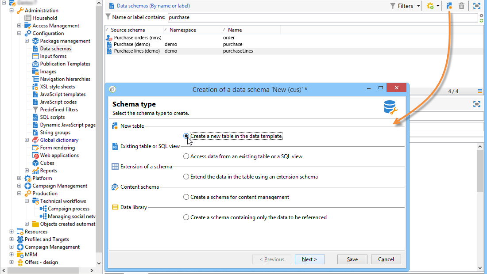

# Datenschemata{#data-schemas}

## Grundsätze {#principles}

Um die Schemata zu bearbeiten, zu erstellen und zu konfigurieren, klicken Sie auf den **[!UICONTROL Administration > Configuration > Data schemas]** Knoten der Adobe Campaign-Client-Konsole.

>[!NOTE]
>
>Vordefinierte Datenschemata können nur von einem Administrator Ihrer Adobe Campaign Classic-Konsole gelöscht werden.


Das Bearbeitungsfeld zeigt den XML-Inhalt des Quellschemas an:


>[!NOTE]
>
>Mit dem Bearbeitungssteuerelement &quot;Name&quot;können Sie den Schemaschlüssel aus Name und Namespace eingeben. Die Attribute &quot;name&quot;und &quot;namespace&quot;des Stammelements des Schemas werden automatisch in der XML-Bearbeitungszone des Schemas aktualisiert.

Die Vorschau generiert automatisch das erweiterte Schema:


>[!NOTE]
>
>Beim Speichern des Quellschemas wird die Generierung des erweiterten Schemas automatisch gestartet.

Wenn Sie die vollständige Struktur eines Schemas überprüfen müssen, können Sie die Registerkarte &quot;Vorschau&quot;verwenden. Wenn das Schema erweitert wurde, können Sie alle Erweiterungen visualisieren. Ergänzend dazu werden auf der Registerkarte &quot;Dokumentation&quot;alle Schemaattribute und -elemente sowie deren Eigenschaften (SQL-Feld, Typ/Länge, Bezeichnung, Beschreibung) angezeigt. Die Registerkarte &quot;Dokumentation&quot;gilt nur für erstellte Schemata. For more on this, refer to the [Regenerating schemas](../../configuration/using/regenerating-schemas.md) section.

## Beispiel: Erstellen einer Vertragstabelle {#example--creating-a-contract-table}

Im folgenden Beispiel möchten wir eine neue Tabelle für **Verträge** im Datenbankmodell der Adobe Campaign-Datenbank erstellen. In dieser Tabelle können Sie für jeden Vertrag Vor- und Nachnamen sowie E-Mail-Adressen von Inhabern und Mitinhabern speichern.

Dazu müssen Sie das Schema der Tabelle erstellen und die Datenbankstruktur aktualisieren, um die entsprechende Tabelle zu erstellen. Folgende Schritte sind dazu nötig:

1. Bearbeiten Sie den **[!UICONTROL Administration > Configuration > Data schemas]** Knoten der Adobe Campaign-Struktur und klicken Sie auf **[!UICONTROL New]** .
1. Wählen Sie die **[!UICONTROL Create a new table in the data model]** Option und klicken Sie auf **[!UICONTROL Next]** .

   

1. Geben Sie einen Namen für die Tabelle und einen Namespace an.

   

   >[!NOTE]
   >
   >Standardmäßig werden von Benutzern erstellte Schemata im Namespace &quot;cus&quot;gespeichert. Weitere Informationen hierzu finden Sie unter [Identifizierung eines Schemas](../../configuration/using/about-schema-reference.md#identification-of-a-schema).

1. Erstellen Sie den Inhalt der Tabelle. Es wird empfohlen, den Einstiegsassistenten zu verwenden, um sicherzustellen, dass keine Einstellungen fehlen. Klicken Sie dazu auf die **[!UICONTROL Insert]** Schaltfläche und wählen Sie die hinzuzufügende Einstellung aus.

   

1. Legen Sie die Einstellungen für die Vertragstabelle fest:

   ```
   <srcSchema desc="Active contracts" img="ncm:channels.png" label="Contracts" labelSingular="Contract" mappingType="sql" name="Contracts" namespace="cus" xtkschema="xtk:srcSchema">
     <element desc="Active contracts" img="ncm:channels.png" label="Contracts" labelSingular="Contract"
              name="Contracts" autopk="true">
              <attribute name="holderName" label="Holder last name" type="string"/>
              <attribute name="holderFirstName" label="Holder first name" type="string"/>
              <attribute name="holderEmail" label="Holder email" type="string"/>
              <attribute name="co-holderName" label="Co-holder last name" type="string"/>           
              <attribute name="co-holderFirstName" label="Co-holder first name" type="string"/>           
              <attribute name="co-holderEmail" label="Co-holder email" type="string"/>    
              <attribute name="date" label="Subscription date" type="date"/>     
              <attribute name="noContract" label="Contract number" type="long"/>  
     </element>
   </srcSchema>
   ```

   Fügen Sie den Vertragstyp hinzu und fügen Sie einen Index auf die Vertragsnummer ein.

   ```
   <srcSchema _cs="Contracts (cus)" desc="Active contracts" entitySchema="xtk:srcSchema" img="ncm:channels.png"
              label="Contracts" labelSingular="Contract" name="Contracts" namespace="cus" xtkschema="xtk:srcSchema">
     <enumeration basetype="byte" name="typeContract">
       <value label="Home" name="home" value="0"/>
       <value label="Car" name="car" value="1"/>
       <value label="Health" name="health" value="2"/>
       <value label="Pension fund" name="pension fund" value="2"/>
     </enumeration>
     <element autopk="true" desc="Active contracts" img="ncm:channels.png" label="Contracts"
              labelSingular="Contract" name="Contracts">
       <attribute label="Holder last name" name="holderName" type="string"/>
       <attribute label="Holder first name" name="holderFirstName" type="string"/>
       <attribute label="Holder email" name="holderEmail" type="string"/>
       <attribute label="Co-holder last name" name="co-holderName" type="string"/>
       <attribute label="Co-holder first name" name="co-holderFirstName" type="string"/>
       <attribute label="Co-holder email" name="co-holderEmail" type="string"/>
       <attribute label="Subscription date" name="date" type="date"/>
      <attribute desc="Type of contract" enum="cus:Contracts:typeContract" label="Type of contract"
                  name="type" type="byte"/>
       <attribute label="Contract number" name="noContract" type="long"/>
       <dbindex name="noContract" unique="true">
         <keyfield xpath="@noContract"/>
       </dbindex>
     </element>
   </srcSchema>
   ```

1. Speichern Sie das Schema, um die Struktur zu erstellen:

   

1. Aktualisieren Sie die Datenbankstruktur, um die Tabelle zu erstellen, mit der das Schema verknüpft werden soll. For more on this, refer to [Updating the database structure](../../configuration/using/updating-the-database-structure.md).

