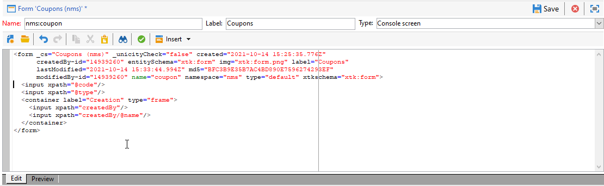

# Formulare bearbeiten{#editing-forms}

Auf den Anzeigebereich &quot;Formularerstellung und -konfiguration&quot;können Sie über den Ordner &quot; **[!UICONTROL Administration] &quot;> &quot; [!UICONTROL Konfiguration] &quot;> &quot; [!UICONTROL Eingabeformulare]** &quot;in der Client-Konsole des Adobe Campaigns zugreifen:

Der XML-Code des Formulars wird im Editor erfasst:

Die Vorschau generiert eine Anzeige des Eingabefelds:

