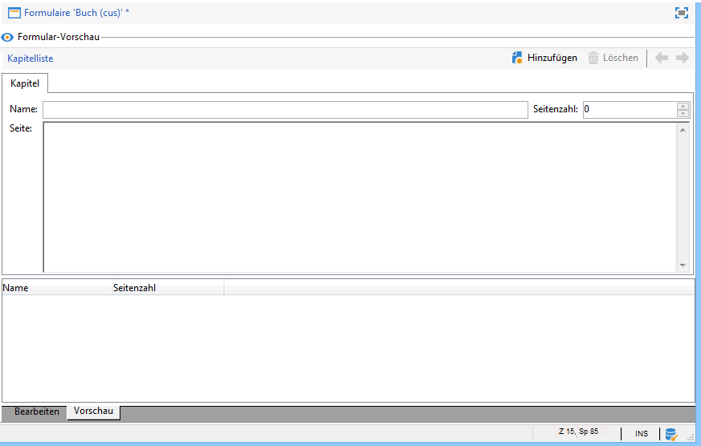

# Bearbeiten von Formularen{#editing-forms}


## Überblick

Marketer und Benutzer verwenden Eingabeformulare, um Datensätze zu erstellen, zu ändern und in der Vorschau anzuzeigen. Forms zeigt eine visuelle Darstellung von Informationen an.

Sie können Eingabeformulare erstellen und ändern:

* Sie können die werkseitigen Eingabeformulare ändern, die standardmäßig bereitgestellt werden. Die werkseitigen Eingabeformulare basieren auf den werkseitigen Datenschemata.
* Sie können benutzerdefinierte Eingabeformulare erstellen, die auf von Ihnen definierten Datenschemata basieren.

Forms sind Entitäten von `xtk:form` Typ. Sie können die Struktur des Eingabeformulars im `xtk:form` Schema. Um dieses Schema anzuzeigen, wählen Sie **[!UICONTROL Administration]** > **[!UICONTROL Konfiguration]** > **[!UICONTROL Datenschemata]** aus dem Menü. Mehr dazu [Formularstruktur](form-structure.md).

Um auf Eingabeformulare zuzugreifen, wählen Sie **[!UICONTROL Administration] > [!UICONTROL Konfiguration] > [!UICONTROL Formulare]** aus dem Menü:


Um Formulare zu entwerfen, bearbeiten Sie den XML-Inhalt im XML-Editor:


[Mehr dazu](form-structure.md#formatting)

Klicken Sie auf die Schaltfläche **[!UICONTROL Vorschau]** tab:


## Formulartypen

Sie können verschiedene Arten von Eingabeformularen erstellen. Der Formulartyp bestimmt, wie Benutzer im Formular navigieren:

* Konsolenbildschirm

   Dies ist der Standardformulartyp. Das Formular besteht aus einer einzelnen Seite.

   

* Content-Management

   Verwenden Sie diesen Formulartyp für das Content Management. Siehe dies [Anwendungsfall](../../delivery/using/use-case--creating-content-management.md).

   

* Assistent

   Dieses Formular umfasst mehrere schwebende Bildschirme, die in einer bestimmten Sequenz angeordnet sind. Benutzer navigieren von einem Bildschirm zum nächsten. [Mehr dazu](form-structure.md#wizards)

* Iconbox

   Dieses Formular umfasst mehrere Seiten. Um durch das Formular zu navigieren, wählen Benutzer auf der linken Seite des Formulars Symbole aus.

   

* Notebook

   Dieses Formular umfasst mehrere Seiten. Um durch das Formular zu navigieren, wählen Benutzer Registerkarten oben im Formular aus.

   

* Vertikaler Bereich

   Dieses Formular zeigt eine Navigationsstruktur.

* Horizontaler Bereich

   Dieses Formular zeigt eine Liste von Elementen an.

## Container

In Formularen können Sie Container für verschiedene Zwecke verwenden:

* Organisieren von Inhalten in Formularen
* Zugriff auf Eingabefelder definieren
* Verschachteln von Formularen in anderen Formularen

[Mehr dazu](form-structure.md#containers)

### Inhalt organisieren

Verwenden Sie Container zum Organisieren von Inhalten in Formularen:

* Sie können Felder in Abschnitten gruppieren.
* Sie können mehrseitigen Formularen Seiten hinzufügen.

Verwenden Sie zum Einfügen eines Containers die `<container>` -Element. [Mehr dazu](form-structure.md#containers)

#### Gruppenfelder

Verwenden Sie Container, um Eingabefelder in organisierte Abschnitte zu gruppieren.

Verwenden Sie dieses Element, um einen Abschnitt in ein Formular einzufügen: `<container type="frame">`. Wenn Sie optional einen Abschnittstitel hinzufügen möchten, verwenden Sie die `label` -Attribut.

Syntax: `<container type="frame" label="`*section_title*`"> […] </container>`

In diesem Beispiel definiert ein Container die **Erstellung** -Abschnitt, der die **[!UICONTROL Erstellt von]** und **[!UICONTROL Name]** Eingabefelder:

```xml
<form _cs="Coupons (nms)" entitySchema="xtk:form" img="xtk:form.png" label="Coupons"
      name="coupon" namespace="nms" type="default" xtkschema="xtk:form">
  <input xpath="@code"/>
  <input xpath="@type"/>
  <container label="Creation" type="frame">
    <input xpath="createdBy"/>
    <input xpath="createdBy/@name"/>
  </container>
</form>
```


#### Hinzufügen von Seiten zu mehrseitigen Formularen

Verwenden Sie für mehrseitige Formulare einen Container, um eine Formularseite zu erstellen.

Dieses Beispiel zeigt Container für **Allgemein** und **Details** Seiten eines Formulars:

```xml
<container img="ncm:book.png" label="General">
[…]
</container>
<container img="ncm:detail.png" label="Details">
[…]
</container>
```

### Zugriff auf Felder definieren

Verwenden Sie Container, um zu definieren, was sichtbar ist, und um den Zugriff auf Felder zu definieren. Sie können Gruppen von Feldern aktivieren oder deaktivieren.

### Verschachteln von Formularen

Verwenden Sie Container zum Verschachteln von Formularen in anderen Formularen. [Mehr dazu](#add-pages-to-multipage-forms)

## Verweise auf Bilder

Um Bilder zu suchen, wählen Sie **[!UICONTROL Administration]** > **[!UICONTROL Konfiguration]** > **[!UICONTROL Bilder]** aus dem Menü.

Um ein Bild mit einem Element im Formular zu verknüpfen, z. B. einem Symbol, können Sie einem Bild einen Verweis hinzufügen. Verwenden Sie die `img` -Attribut, beispielsweise im `<container>` -Element.

Syntax: `img="`*`namespace`*`:`*`filename`*`.`*`extension`*`"`

Dieses Beispiel zeigt Verweise auf die `book.png` und `detail.png` Bilder aus `ncm` namespace:

```xml
<container img="ncm:book.png" label="General">
[…]
</container>
<container img="ncm:detail.png" label="Details">
[…]
</container>
```

Diese Bilder werden für Symbole verwendet, auf die Benutzer klicken, um in einem mehrseitigen Formular zu navigieren:


