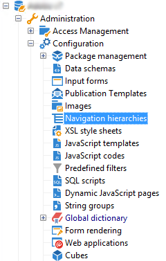

# Bearbeitung{#edition}

Auf den Bildschirm zum Erstellen und Konfigurieren der Konfigurationshierarchie-Dokumente kann über den Knoten **[!UICONTROL Administration > Konfiguration > Navigationshierarchien]** zugegriffen werden:

Die Konfiguration der Navigationshierarchie ist auf mehrere XML-Dokumente aufgeteilt. Sie verfolgt einen ähnlichen Grundsatz wie die Ausweitung des Schemas: alle Dokumente zusammengeführt werden, um ein Dokument zu generieren, das die gesamte Konfiguration enthält. Dieses Dokument kann nicht bearbeitet werden und wird über die Registerkarte &quot;Vorschau&quot;angezeigt.

Das Bearbeitungsfeld enthält den Inhalt des XML-Dokuments:

>[!NOTE]
>
>Mit dem Bearbeitungssteuerelement &quot;Name&quot;können Sie den Dokument-Schlüssel eingeben, der aus Name und Namensraum besteht. Die Attribute &quot;name&quot;und &quot;Namensraum&quot;des **`<navtree>`** Elements werden automatisch im XML-Bearbeitungsfeld des Schemas aktualisiert.

Die Vorschau generiert automatisch das zusammengeführte Dokument mit der vollständigen Konfiguration:

