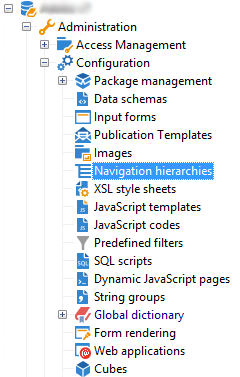
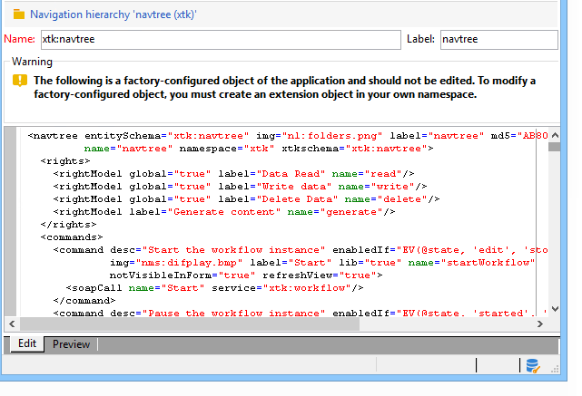
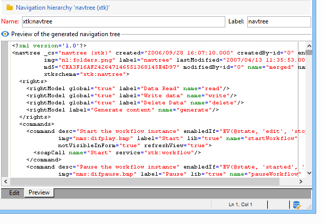

# Navigationsbaum in Campaign Explorer bearbeiten{#edition}

Der Bildschirm zum Erstellen und Konfigurieren der Konfigurationsdokumente für die Navigationshierarchie ist über den Knoten **[!UICONTROL Administration > Konfiguration > Navigationshierarchien]** zugänglich:

Die Konfiguration der Navigationshierarchie ist auf mehrere XML-Dokumente aufgeteilt. Es funktioniert nach einem ähnlichen Prinzip wie die Schemaerweiterung: Alle Dokumente werden zusammengeführt, um ein einziges Dokument zu erzeugen, das die gesamte Konfiguration enthält. Dieses Dokument kann nicht bearbeitet werden und wird über die Registerkarte „Vorschau“ angezeigt.

Das Bearbeitungsfeld stellt den Inhalt des XML-Dokuments bereit:

>[!NOTE]
>
>Mit dem Bearbeitungssteuerelement „Name“ können Sie den Dokumentschlüssel eingeben, der aus dem Namen und dem Namespace besteht. Die Attribute „name“ und „namespace“ des **`<navtree>`** werden automatisch im XML-Bearbeitungsfeld des Schemas aktualisiert.

Die Vorschau generiert automatisch das zusammengeführte Dokument, das die vollständige Konfiguration enthält:

