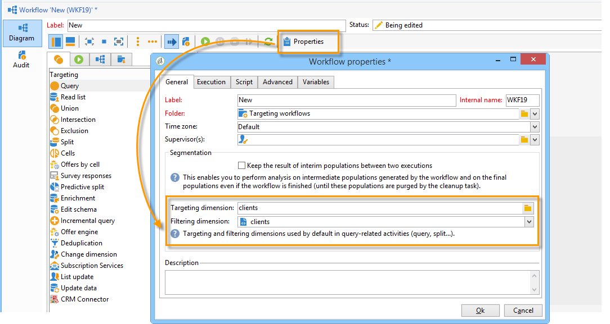

# Workflows verwalten{#managing-workflows}

Standardmäßig basieren Ihre neuen Workflows auf einer vorkonfigurierten Workflow-Vorlage und auf einer Empfängertabelle (nms:recipient). Damit sie automatisch auf der benutzerdefinierten Empfängertabelle basieren, auf die in der Option **Nms_DefaultRcpSchema** verwiesen wird (siehe Abschnitt [Konfigurieren der &#x200B;](../../configuration/using/configuring-the-interface.md)), müssen Sie eine neue Workflow-Vorlage erstellen.

Erstellen Sie eine neue Vorlage über den Knoten **[!UICONTROL Ressourcen > Vorlagen > Workflow-]**&quot;. In den Eigenschaften der Vorlage entsprechen die bereitgestellten Dimensionen Ihrer externen Empfängertabelle.

Wenn Ihre neuen Workflows auf einer kürzlich erstellten Vorlage basieren, wird Ihre personalisierte Tabelle standardmäßig für die globalen Zielgruppen- und Filterdimensionen des Workflows ausgewählt.

Alle in Ihrem Workflow verwendeten Aktivitäten verwenden somit Ihre benutzerdefinierte Tabelle, ohne dass eine zusätzliche manuelle Konfiguration erforderlich ist.

Weiterführende Informationen zu Workflows finden Sie in [diesem Abschnitt](../../workflow/using/about-workflows.md).

