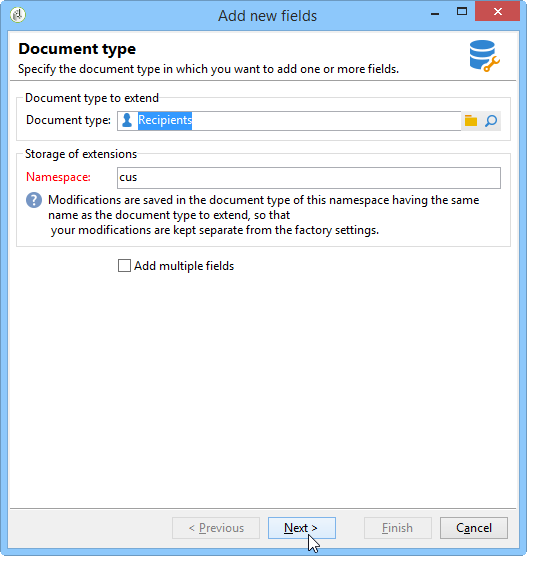
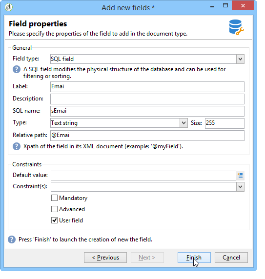

# Assistent für neue Felder{#new-field-wizard}


Mit einem Assistenten, auf den Sie über **[!UICONTROL Tools > Erweitert > Neue Felder hinzufügen]** zugreifen können, können Sie ein oder mehrere Felder zu einer Tabelle in der Datenbank hinzufügen.

Durch die Validierung des Assistenten wird das Erweiterungsschema der zu erweiternden Tabelle aktualisiert und das SQL-Script zur Änderung der physischen Struktur der Datenbank gestartet.

Dieser Assistent bietet den Vorteil, dass ein Feld schnell hinzugefügt werden kann, ohne die Struktur eines Datenschemas kennen zu müssen.

Der Hauptnachteil ist die Beschränkung der Daten und der zu erweiternden Eigenschaften.

Die Assistenten-Bildschirme enthalten die folgenden Schritte:

1. Auf der ersten Seite können Sie den Namen des zu erweiternden Schemas und den Namespace des Erweiterungsschemas eingeben, in dem die Änderungen gespeichert werden:

   

1. Auf der nächsten Seite können Sie die Eigenschaften des hinzuzufügenden Felds eingeben.

   

1. Um die Änderungen zu bestätigen, klicken Sie auf die Schaltfläche **[!UICONTROL Beenden]**.

Eine Erweiterungsdatei mit dem Namen „cus:recipient wird in unserem Beispiel automatisch erstellt und das entsprechende SQL-Script wird ausgeführt:

```
<srcSchema extendedSchema="nms:recipient" label="Recipients" name="recipient"  namespace="cus">  
  <element name="recipient">    
    <attribute belongsTo="cus:recipient" dataPolicy="email" label="Email" length="80" name="email1" sqlname="sEmail1" type="string" user="true"/>  
  </element>
</srcSchema>
```

>[!NOTE]
>
>Standardmäßig werden die hinzugefügten Felder mit der Eigenschaft **Benutzer“ deklariert** mit dem Wert „true„). Auf diese Weise können Sie das Feld im Eingabeformular des erweiterten Schemas mithilfe eines Steuerelements vom Typ „treeEdit“ anzeigen und bearbeiten (siehe Eingabeformular).
