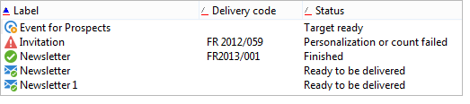

# Schemamerkmale{#schema-characteristics}


Ein Schema, das auf eine vorhandene Tabelle verweist, weist die folgenden Merkmale auf:

* Adobe Campaign darf SQL-Objekte in Bezug auf bestehende Tabellen nicht ändern.
* Die Namen von Tabellen und Spalten müssen explizit angegeben werden.
* Indizes müssen deklariert werden.

>[!IMPORTANT]
>
>Löschen Sie keine Felder in der integrierten Empfängertabelle, selbst wenn sie nutzlos sind. Dies kann zu Verhaltensfehlern in der Adobe Campaign-Datenbank führen.

## Das Attribut view {#the-view-attribute}

Source-Schemata akzeptieren das **view**-Attribut für das **srcSchema**-Stammelement. Sie muss verwendet werden, wenn Adobe Campaign in benutzerdefinierten Tabellen bearbeitet wird. Das Attribut **view=„true“** weist den Datenbankstruktur-Aktualisierungsassistenten an, dieses Schema zu ignorieren. Die Anwendung darf daher die Tabelle, ihre Spalten und ihre Indizes nicht mit dem entsprechenden Schema synchronisieren.

Wenn dieses Attribut auf &quot;**&quot; gesetzt**, wird das Schema nur zum Generieren von SQL-Abfragen verwendet, um auf die Daten dieser Tabelle zuzugreifen.

## Namen von Tabellen und Spalten {#names-of-tables-and-columns}

Wenn Tabellen vom Assistenten zur Tabellenaktualisierung erstellt werden, werden die Namen der Tabellen und Spalten automatisch auf der Grundlage der Namen der jeweiligen Schemata und Attribute generiert. Es ist jedoch möglich, die Verwendung der SQL-Namen zu erzwingen, indem die folgenden Attribute eingegeben werden:

* **sqltable** innerhalb des Hauptelements des Schemas verwenden, um die Tabelle anzugeben.
* **sqlname** innerhalb jedes Attributs, um die Spalten anzugeben.

**Beispiel**:

```
<element label="Individual" name="individual" sqltable="individual">
    <key internal="true" name="id">
      <keyfield xpath="@id"/>
    </key> 
    <attribute name="id" type="long" length="32" />
    <attribute name="lastName" type="string" length="100" sqlname="Last_Name"/>
    <attribute name="firstName" type="string" length="100" sqlname="First_Name"/>
    <attribute name="email" type="string" length="100"/>
    <attribute name="mobile" type="string" length="100"/>
</element>
```

Wenn in diesem Beispiel die Namen der Tabellen und Spalten nicht explizit angegeben worden wären, hätte die Anwendung **CusIndividual** für die Tabelle, **lastName** und **firstName** für die Spalten verwendet.

In einem Schema ist es möglich, nur einen Teil der Spalten einer vorhandenen Tabelle auszufüllen. Nicht ausgefüllte Spalten sind nicht für Benutzende zugänglich.

## Indizierte Felder {#indexed-fields}

Beim Sortieren der Datensätze einer Liste über die Client-Konsole wird eine bessere Leistung erzielt, wenn indizierte Felder sortiert werden. Wenn Sie einen Index in einem Schema deklarieren, zeigt die Konsole die indizierten Felder mit einer roten Linie unter dem Sortierpfeil links neben der Spaltenbeschriftung an, wie unten dargestellt:



In einem Schema wird ein Index wie folgt definiert:

```
<dbindex name="name_of_index" unique="true/false"
  <keyfield xpath="xpath_1st_field"/
  <keyfield xpath="xpath_2nd_field"/
  ...
</dbindex
```

Daher ist es wichtig, vorhandene Indizes der benutzerdefinierten Tabelle im entsprechenden Schema zu deklarieren.

Implizit wird für jede Schlüssel- und Linkdeklaration des Quellschemas ein Index deklariert. Die Indexdeklaration kann verhindert werden, indem das Attribut **noDbIndex=„true“** angegeben wird:

**Beispiel**:

```
<key internal="true" name="customer" noDbIndex="true">
  <keyfield xpath="@customerId"/>
</key>
```
