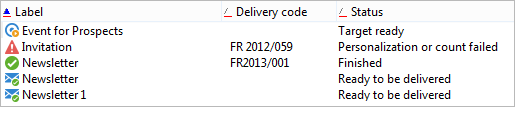

# Schemamerkmale{#schema-characteristics}


Die Merkmale eines Schemas, das auf eine vorhandene Tabelle verweist, lauten wie folgt:

* Adobe Campaign darf SQL-Objekte nicht relativ zu vorhandenen Tabellen ändern;
* Die Namen der Tabellen und Spalten müssen explizit angegeben werden.
* Indizes müssen deklariert werden.

>[!IMPORTANT]
>
>Löschen Sie keine Felder in der integrierten Empfängertabelle, auch wenn sie nutzlos sind. Dies kann zu Verhaltensfehlern in der Adobe Campaign-Datenbank führen.

## Das Ansichtsattribut {#the-view-attribute}

Source-Schemas akzeptieren das Attribut **view** für das Stammelement **srcSchema** . Sie muss verwendet werden, wenn Adobe Campaign in benutzerdefinierten Tabellen bearbeitet wird. Das Attribut **view=&quot;true&quot;** weist den Assistenten zur Aktualisierung der Datenbankstruktur an, dieses Schema zu ignorieren. Die Anwendung ist daher nicht berechtigt, die Tabelle, ihre Spalten und Indizes mit dem entsprechenden Schema zu synchronisieren.

Wenn dieses Attribut auf **true** festgelegt ist, wird das Schema nur zum Generieren von SQL-Abfragen für den Zugriff auf die Daten dieser Tabelle verwendet.

## Namen von Tabellen und Spalten {#names-of-tables-and-columns}

Wenn Tabellen vom Tabellenaktualisierungs-Assistenten erstellt werden, werden die Namen der Tabellen und Spalten automatisch anhand der Namen der jeweiligen Schemas und Attribute generiert. Es ist jedoch möglich, die Verwendung der SQL-Namen zu erzwingen, indem die folgenden Attribute eingegeben werden:

* **sqltable** innerhalb des Hauptelements des Schemas, um die Tabelle anzugeben,
* **sqlname** innerhalb jedes Attributs, um die Spalten anzugeben.

**Beispiel**:

```
<element label="Individual" name="individual" sqltable="individual">
    <key internal="true" name="id">
      <keyfield xpath="@id"/>
    </key> 
    <attribute name="id" type="long" length="32" />
    <attribute name="lastName" type="string" length="100" sqlname="Last_Name"/>
    <attribute name="firstName" type="string" length="100" sqlname="First_Name"/>
    <attribute name="email" type="string" length="100"/>
    <attribute name="mobile" type="string" length="100"/>
</element>
```

Wenn in diesem Beispiel die Namen der Tabellen und Spalten nicht explizit angegeben wurden, hätte die Anwendung für die Tabelle **CusIndividual**, für die Spalten **lastName** und **firstName** verwendet.

In einem Schema ist es möglich, nur einen Teil der Spalten einer vorhandenen Tabelle auszufüllen. Auf nicht ausgefüllte Spalten kann nicht vom Benutzer zugegriffen werden.

## Indexierte Felder {#indexed-fields}

Beim Sortieren der Datensätze einer Liste in der Clientkonsole wird eine bessere Leistung erzielt, indem eine Sortierung nach indizierten Feldern vorgenommen wird. Wenn Sie einen Index in einem Schema deklarieren, zeigt die Konsole die indizierten Felder mit einer roten Linie unter dem Sortierungspfeil links neben der Spaltenbeschriftung an, wie unten dargestellt:



In einem Schema wird ein Index wie folgt definiert:

```
<dbindex name="name_of_index" unique="true/false"
  <keyfield xpath="xpath_1st_field"/
  <keyfield xpath="xpath_2nd_field"/
  ...
</dbindex
```

Daher ist es wichtig, vorhandene Indizes der benutzerdefinierten Tabelle im entsprechenden Schema zu deklarieren.

Ein Index wird implizit für jede Schlüssel- und Link-Deklaration des Quellschemas deklariert. Die Indexdeklaration kann durch Angabe des Attributs **noDbIndex=&quot;true&quot;** verhindert werden:

**Beispiel**:

```
<key internal="true" name="customer" noDbIndex="true">
  <keyfield xpath="@customerId"/>
</key>
```
