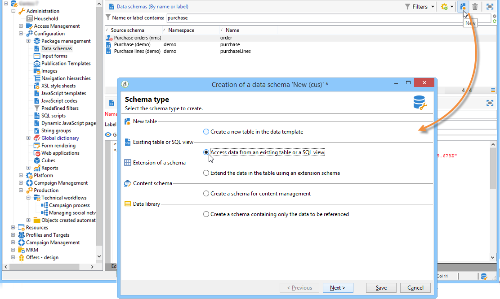
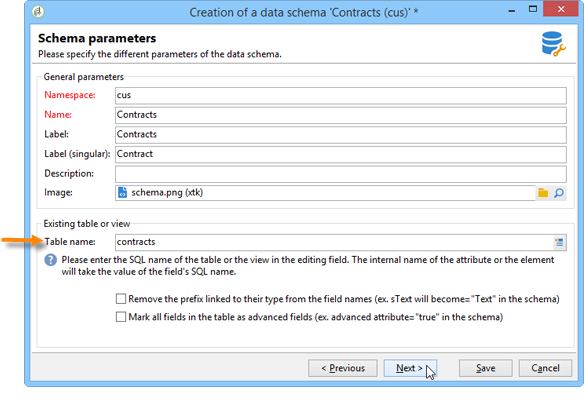
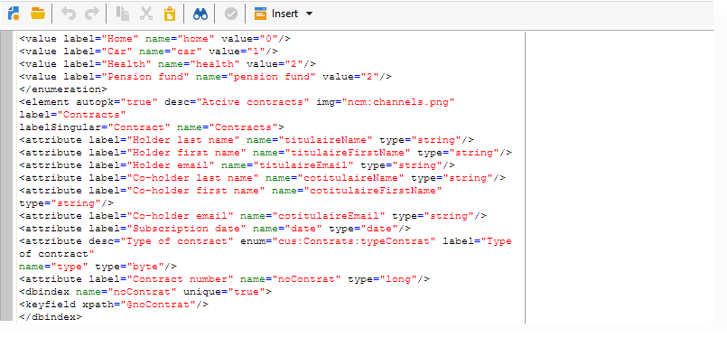

# Schema einer vorhandenen Tabelle{#schema-of-an-existing-table}

## Übersicht {#overview}

Wenn die Anwendung auf die Daten einer bestehenden Tabelle, einer SQL-Ansicht oder auf Daten aus einer Remote-Datenbank zugreifen muss, erstellen Sie ihr Schema in Adobe Campaign mit den folgenden Daten:

* Tabellenname: Geben Sie den Namen der Tabelle (mit ihrem Alias, wenn ein DbLink verwendet wird) mit dem Attribut „sqltable“ ein.
* Schemaschlüssel: Referenzieren der Abstimmfelder,
* -Indizes: zum Generieren von Abfragen,
* Die Felder und ihre Position in der XML-Struktur: Ausfüllen der im Programm verwendeten Felder,
* Relationen: Wenn Joins mit den anderen Tabellen der Basis vorhanden sind.

## Implementierung {#implementation}

Gehen Sie wie folgt vor, um das entsprechende Schema zu erstellen:

1. Bearbeiten Sie den Knoten **[!UICONTROL Administration>Konfiguration>]** Datenschemata der Adobe Campaign-Struktur und klicken Sie auf **[!UICONTROL Neu]** .
1. Wählen Sie die Option **[!UICONTROL Daten aus einer vorhandenen Tabelle oder einer SQL-Ansicht aufrufen]** und klicken Sie auf **[!UICONTROL Weiter]** .

   

1. Tabelle oder vorhandene Ansicht auswählen:

   

1. Passen Sie den Schemainhalt an Ihre Anforderungen an.

   

   Das Schema muss mit dem Attribut view=„true“ im `<srcSchema>` Stammelement gefüllt werden, damit kein SQL-Script zur Tabellenerstellung generiert wird.

**Beispiel** :

```
<srcSchema name="recipient" namespace="cus" view="true">
  <element name="recipient" sqltable="dbsrv.recipient">
    <key name="email">
      <keyfield xpath="@email"/>
    </key>   
    <attribute name="email" type="string" length="80" sqlname="email"/>
  </element>
</srcSchema>
```

## Zugriff auf externe Datenbanken {#accessing-an-external-database}

Die **Federated Data Access - FDA**-Option bietet Ihnen Zugriff auf die in einer externen Datenbank gespeicherten Daten.

Die Konfiguration für die Schemata zum Zugriff auf Daten in einer externen Datenbank wird auf [ Seite beschrieben](../../installation/using/creating-data-schema.md).
