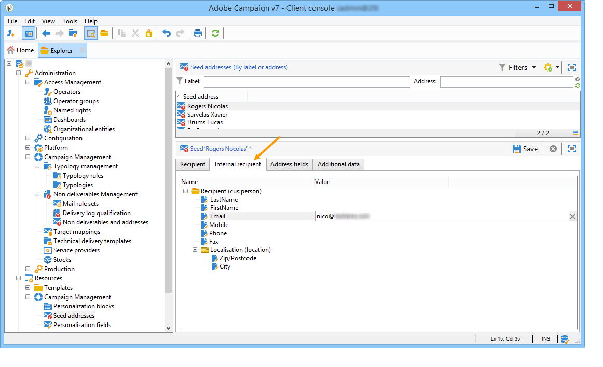

# Testadressen{#seed-addresses}


Wenn die Empfängertabelle eine benutzerdefinierte Tabelle ist, sind zusätzliche Konfigurationen erforderlich. Das **[!UICONTROL nms:seedMember]**-Schema muss erweitert werden. Zur Definition der entsprechenden Felder wird, wie unten dargestellt, eine zusätzliche Registerkarte zu den Testadressen hinzugefügt:



Weiterführende Informationen zur Verwendung von Testadressen finden Sie [diesem Abschnitt](../../delivery/using/about-seed-addresses.md).

## Implementierung {#implementation}

Das **nms:seedMember**-Schema und das verknüpfte Formular, die standardmäßig bereitgestellt werden, sollen für die Kundenkonfiguration erweitert werden, um auf alle erforderlichen Felder zu verweisen. Die Schemadefinition enthält Kommentare, die den Konfigurationsmodus detailliert beschreiben.

Definition des erweiterten Schemas der Empfängertabelle:

```
<srcSchema label="Person" name="person" namespace="cus">
  <element autopk="true" label="Person" name="person">
      <attribute label="LastName" name="lastname" type="string"/>
      <attribute label="FirstName" name="firstname" type="string"/>
    <element label="Address" name="address">
      <attribute label="Email" name="addrEnv" type="string"/>
    </element>
    <attribute label="Code Offer" name="codeOffer" type="string"/>
  </element>
</srcSchema>
```

Gehen Sie wie folgt vor:

1. Erstellen Sie eine Erweiterung des **nms:seedMember**-Schemas. Weiterführende Informationen hierzu finden Sie in [diesem Abschnitt](../../configuration/using/extending-a-schema.md).
1. Fügen Sie in dieser neuen Erweiterung ein neues Element am Stamm von **[!UICONTROL seedMember]** mit den folgenden Parametern hinzu:

   ```
   name="custom_customNamespace_customSchema"
   ```

   Dieses Element muss die Felder enthalten, die zum Exportieren der Kampagnen erforderlich sind. Diese Felder sollten denselben Namen wie die entsprechenden Felder im externen Schema haben. Wenn das Schema beispielsweise **[!UICONTROL cus:person]** lautet, sollte das **[!UICONTROL nms:seedMember]**-Schema wie folgt erweitert werden:

   ```
     <srcSchema extendedSchema="nms:seedMember" label="Seed addresses" labelSingular="Seed address" name="seedMember" namespace="cus">
     <element name="common">
       <element name="custom_cus_person">
         <attribute name="lastname" template="cus:person:person/@lastname"/>
         <attribute name="firstname" template="cus:person:person/@firstname"/>
         <attribute name="email" sqlname="myEmailField" template="cus:person:person/address/@addrEnv" xml="false"/>
       </element>
     </element>
     <element name="seedMember">
      <element aggregate="cus:seedMember:common"/>
     </element>
   </srcSchema>
   ```

   >[!NOTE]
   >
   >Die Erweiterung des **nms:seedMember**-Schemas muss den Strukturen einer Kampagne und eines Versands in Adobe Campaign entsprechen.

   >[!IMPORTANT]
   >
   >
   >    
   >    
   >    * Während der Erweiterung müssen Sie einen **SQL-Namen (@sqlname)** für das Feld „E-Mail“ angeben. Der SQL-Name muss sich von der „sEmail“ unterscheiden, die für das Empfängerschema reserviert ist.
   >    * Sie müssen die Datenbankstruktur mit dem Schema aktualisieren, das bei der Erweiterung von **nms:seedMember** erstellt wurde.
   >    * In der **nms:seedMember**-Erweiterung muss das Feld, das die E-Mail-Adresse enthält **das Attribut name=„email“** haben. Der SQL-Name muss sich von „sEmail“ unterscheiden, der bereits für das Empfängerschema verwendet wird. Dieses Attribut muss sofort unter dem **`<element name="custom_cus_person" />`** deklariert werden.
   >    
   >

1. Passen Sie das **[!UICONTROL seedMember]**-Formular entsprechend an, um eine neue Registerkarte „Interner Empfänger“ (Testadressen **[!UICONTROL im Fenster]** definieren. Weitere Informationen hierzu finden Sie auf [dieser Seite](../../configuration/using/form-structure.md).

   ```
   <container colcount="2" label="Internal recipient" name="internal"
                xpath="custom_cus_person">
       <input colspan="2" editable="true" nolabel="true" type="treeEdit">
         <container label="Recipient (cus:person)">
           <input xpath="@last name"/>
           <input xpath="@first name"/>
           <input xpath="@email"/>
         </container>
       </input>
     </container>
   ```

Wenn nicht alle Attribute der Testadresse eingegeben werden, ersetzt Adobe Campaign automatisch die Profile. Diese werden bei der Personalisierung mithilfe von Daten aus einem vorhandenen Profil automatisch eingegeben.
