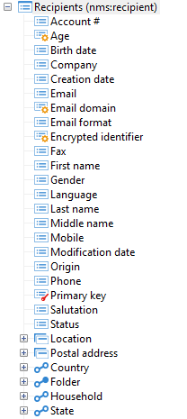

# Struktur eines Datenschemas{#structure-of-a-data-schema}

Die Struktur eines Schemas wird als Baumstruktur dargestellt. Um es grafisch in der Adobe Campaign-Client-Konsole Ansicht, wählen Sie das gewünschte Schema aus und klicken Sie auf die Unterregisterkarte **[!UICONTROL Struktur]** .

Standardmäßig werden die Felder zuerst angezeigt (Aktiv, Aktiviert usw.) und in alphabetischer Reihenfolge. Die Strukturierungselemente folgen (Postanschrift, Standort) und schließlich die Links (E-Mail-Informationen, Ordner usw.).

Primär erkannte Schlüssel werden durch einen roten Schlüssel identifiziert, Fremdschlüssel durch einen gelben Schlüssel.

Links werden grafisch unterschieden, je nachdem, ob sie zur Tabelle gehören. Diejenigen Beginn aus der Tabelle, die den Fremdschlüssel in der Tabelle enthalten, werden zuerst angezeigt (E-Mail-Informationen, Ordner, Land). Links zur Sammlung &quot;Umkehren&quot;(Abonnement, Bestellungen usw.) am Ende angezeigt.
