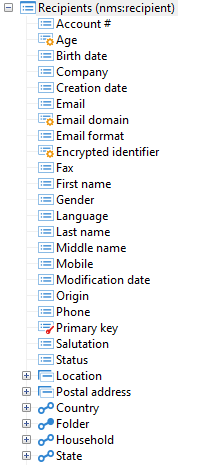

# Struktur eines Datenschemas{#structure-of-a-data-schema}

Die Struktur eines Datenschemas wird in Form einer Baumstruktur angezeigt. Um es grafisch in der Adobe Campaign-Client-Konsole anzuzeigen, wählen Sie das Zielschema aus und klicken Sie auf die Unterregisterkarte **[!UICONTROL Struktur]**.

Standardmäßig werden die Felder zuerst angezeigt (aktiv, aktiviert usw.) und in alphabetischer Reihenfolge. Als Nächstes folgen die Strukturierungselemente (Postanschrift, Standort) und schließlich die Links (E-Mail-Informationen, Ordner usw.).

Primäre Schlüssel werden durch einen roten Schlüssel und Fremdschlüssel durch einen gelben Schlüssel identifiziert.

Relationen werden grafisch danach unterschieden, ob sie zur Tabelle gehören. Diejenigen, die von der Tabelle ausgehen, d. h. die den Fremdschlüssel in der Tabelle haben, werden zuerst angezeigt (E-Mail-Informationen, Ordner, Land). Sammlungslinks für „Umkehren“ (Abonnement, Bestellungen usw.) werden am Ende angezeigt.
