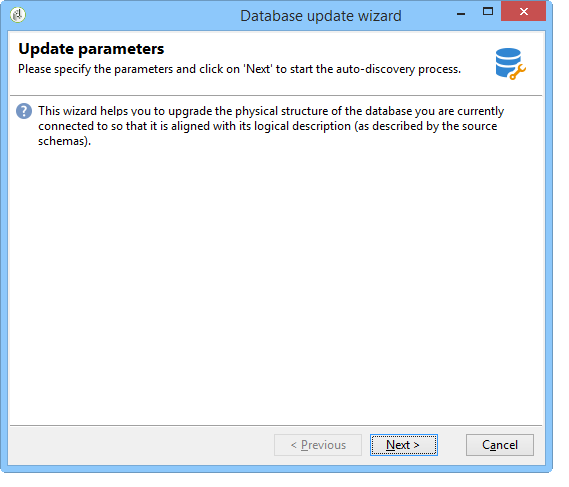
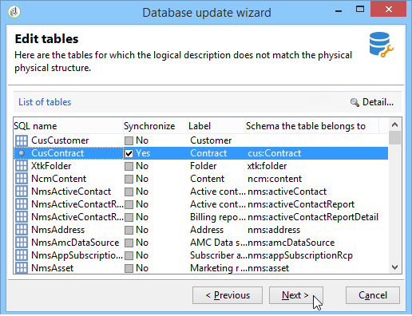
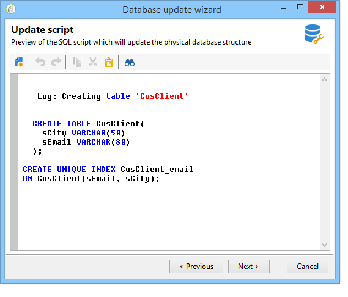
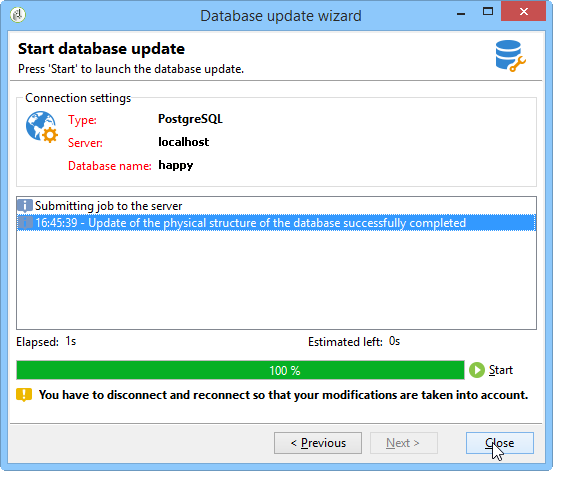

# Datenbankstruktur aktualisieren{#updating-the-database-structure}

Um die an den Schemata vorgenommenen Änderungen anzuwenden, starten Sie den Datenbankaktualisierungsassistenten. Auf diesen Assistenten kann über **[!UICONTROL Tools > Erweitert > Datenbank aktualisieren]** zugegriffen werden. Er prüft, ob die physische Struktur der Datenbank mit ihrer logischen Beschreibung übereinstimmt, und führt die SQL-Aktualisierungs-Scripts aus.

Die Module in der Datenbank werden automatisch ausgefüllt und aktiviert.

Die Optionen **[!UICONTROL Gespeicherte Prozeduren hinzufügen]** und **[!UICONTROL Initialisierungsdaten importieren]** werden verwendet, um die anfänglichen SQL-Skripte und die Datenpakete zu starten, die beim Erstellen der Datenbank ausgeführt werden.

Sie können einen Datensatz aus einem externen Datenpaket importieren. Wählen Sie dazu **[!UICONTROL Paket importieren]** und geben Sie die XML-Datei des Pakets ein.

Führen Sie die Schritte aus und sehen Sie sich das SQL-Script für Datenbank-Update an:

>[!NOTE]
>
>Es befindet sich in einem Bearbeitungsfeld und kann geändert werden, indem SQL-Code gelöscht oder hinzugefügt wird.

Starten Sie anschließend das Datenbank-Update:

