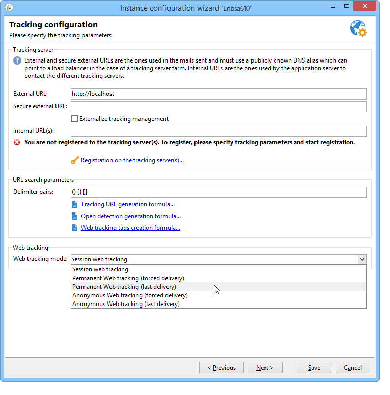

# Webtracking-Modus{#web-tracking-mode}


Mit Adobe Campaign können Sie einen Webtrackingmodus auswählen, der die Art und Weise definiert, wie Trackinglogs in der Anwendung verarbeitet werden.

Es gibt drei verfügbare Webtracking-Modi: **„Session Tracking“**,**„Permanent Tracking“** und **„Anonymes Tracking“**.



Jeder Modus hat bestimmte Eigenschaften. Der „permanente“ Webtracking-Modus umfasst die Merkmale des „Sitzungs“-Webtracking-Modus, während der „anonyme“ Modus die Merkmale des „permanenten“ und „Sitzungs“-Modus umfasst.

>[!IMPORTANT]
>
>Der Webtracking-Modus „Anonym“ ist standardmäßig aktiviert, wenn das Lead-Paket aktiviert ist. In allen anderen Fällen ist der Webtracking-Modus „Sitzung“ standardmäßig aktiviert.
>
>Der Standardmodus kann jederzeit im Bereitstellungsassistenten der Instanz geändert werden.

Beachten Sie, dass Sie bei Verwendung des **permanenten Web**- oder **anonymen**-Tracking-Modus der Spalte „sourceID“ (uuid230) in den Tracking-Tabellen (trackingLogXXX) einen Index hinzufügen müssen:

1. Identifizieren Sie die Tracking-Tabelle(n), die von der permanenten Verfolgung betroffen sind.
1. Erweitern Sie die Schemata, die diesen Tabellen entsprechen, indem Sie die folgenden Zeilen hinzufügen:

```
<dbindex name="sourceId">
 <keyfield xpath="@sourceId"/>
</dbindex>
```

**Dauerhaft** und **Anonym** umfassen zwei Optionen: **Forcierter Versand** und **Letzter Versand**.

Mit **Option** Forcierter Versand“ können Sie die Versandkennung (@jobid) beim Tracking angeben.

Mit **Option „Letzter Versand** können Sie das aktuelle Trackinglog mit dem zuletzt verfolgten Versand verknüpfen.

**Merkmale des Sitzungs-Webtrackings:**

Dieser Modus erstellt ein Trackinglog für Benutzer mit einem Sitzungs-Cookie. Hierbei handelt es sich um Personen, die auf eine URL in einer von Adobe Campaign gesendeten E-Mail geklickt haben, sodass wir die folgenden Informationen verfolgen können:

* Versandkennung
* Kontakt-ID
* Versandlog
* Permanentes Cookie (UUID230)
* Tracking-URL
* Datum des Trackinglogs

Bei diesem Webtracking-Modus wird im Programm kein Trackinglog erstellt, wenn ein Teil der Informationen fehlt.

Dieser Modus ist hinsichtlich Volumen (begrenzte Anzahl von Datensätzen in der trackingLog-Tabelle) und Berechnung (keine Abstimmung) kostengünstig.

**Merkmale des permanenten Webtracking-Modus:**

Mit diesem Webtracking-Modus können Sie ein Trackinglog erstellen, das auf dem Vorhandensein des permanenten Cookies uuid230 basiert. Wenn ein Besucher seine Sitzung schließt, verwendet Adobe Campaign das permanente Cookie, um Informationen aus früheren Trackinglogs abzurufen. Adobe Campaign fügt ein Trackinglog erneut ein, wenn die UUID230 der aktuellen Sitzung denselben Wert wie eine bereits in der Trackingtabelle gespeicherte UUID230 aufweist.

Das bedeutet, dass der Besucher zuvor in Adobe Campaign identifiziert worden sein muss (über einen Versand), um die Abstimmung über uuid230-Werte zu ermöglichen.

Standardmäßig werden Suchvorgänge in früheren Trackinglogs in der Tabelle „trackingLog“ durchgeführt. Wenn das Leads-Paket aktiviert ist, durchsucht Adobe Campaign vor der Suche in der Tabelle „trackingLog“ die Tabelle „incomingLead“ nach früheren Trackinglog-Einträgen.

Dieser Modus ist mit hohen Rechenkosten bei der Protokollabstimmung verbunden.

**Merkmale des anonymen Webtracking-Modus:**

Mit diesem Webtracking-Modus können Sie ein Trackinglog abrufen, das mit dem anonymen Browsen in Adobe Campaign verknüpft ist. Für jeden Klick auf eine getrackte URL wird automatisch ein Trackinglog erstellt. Dieses Protokoll hat nur den Wert von uuid230. Während einer Marketing-Kampagne wird automatisch ein Trackinglog mit allen Identifizierungsinformationen erstellt (siehe Sitzungs-Tracking). Adobe Campaign durchsucht automatisch vorherige Protokolle nach einem „uuid230“-Wert, der dem Wert aus dem Trackinglog für diese Marketing-Kampagne entspricht. Wenn identische Werte gefunden werden, werden alle vorherigen Trackinglogs mit allen Informationen aus dem Marketing-Kampagnen-Trackinglog eingegeben.

Dieser Modus ist in Bezug auf Berechnung und Volumen am aufwändigsten.

>[!NOTE]
>
>Wenn das **[!UICONTROL Leads]**-Paket installiert ist, müssen Sie dasselbe für die Aktivitätstabelle tun (**crm:incomingLead**)

Das folgende Schema fasst die Funktionen aller drei Webtracking-Modi zusammen:


**Beispiel für permanentes Webtracking basierend auf dem letzten Versand:**

Florence erhält einen Versand, öffnet die E-Mail, klickt auf den Link, surft auf der Einzelhandels-Website, tätigt aber keine Käufe. Am nächsten Tag kehrt Florence zur Einzelhandelsseite zurück, durchsucht und tätigt einen Kauf. Da permanentes Webtracking (letzter Versand) aktiviert ist, werden alle Protokolle für ihren zweiten Besuch mit dem Versand verknüpft, der ihr am Vortag gesendet wurde.
