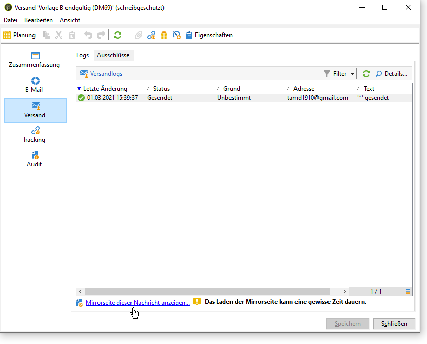
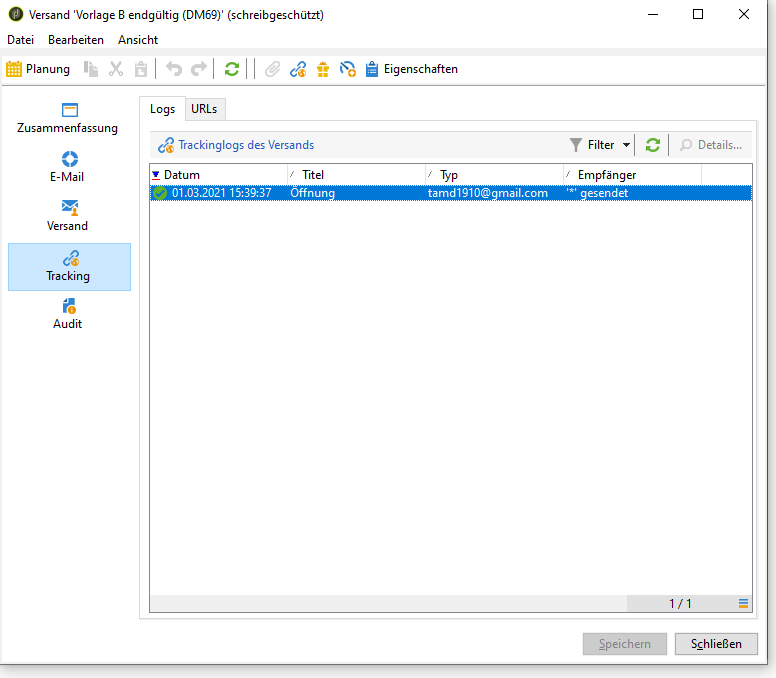
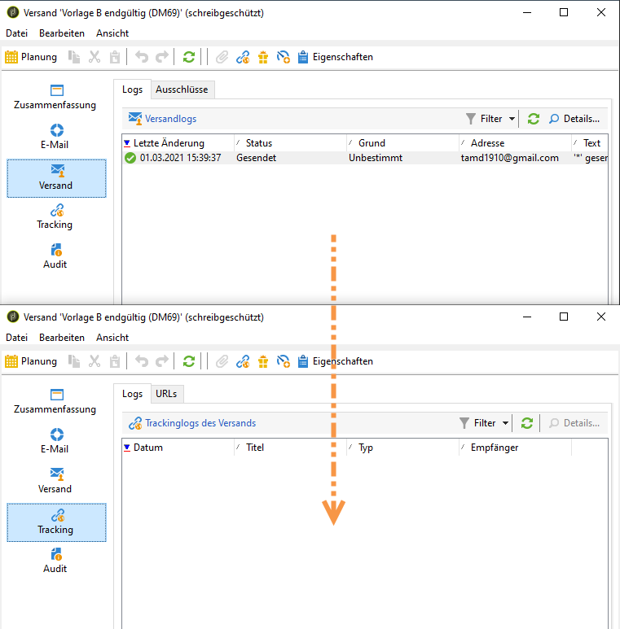
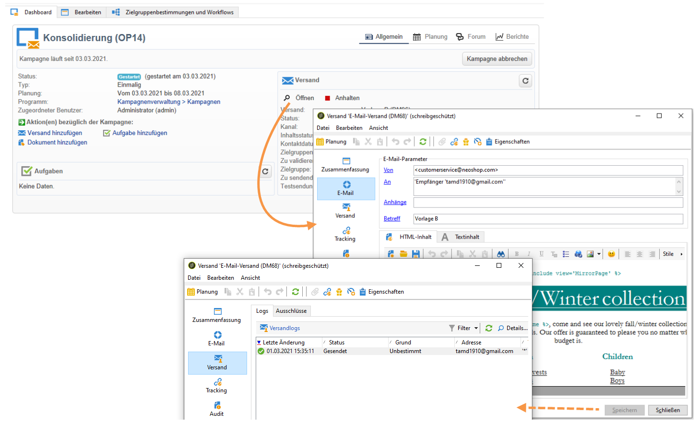

# Analysieren des Ergebnisses {#step-8--analyzing-the-result}

Nach Verarbeitung der Testsendungen besteht die Möglichkeit im Kampagnen-Dashboard zu prüfen, welche Empfänger welche Version erhalten und ob sie die Sendungen geöffnet haben. Klicken Sie auf den Link einer der Sendungen:

* Im **[!UICONTROL Versand]**-Tab wird angezeigt, welche Empfänger den Versand erhalten haben.

   

* Im **[!UICONTROL Tracking]**-Tab wird angezeigt, welche Empfänger den Versand geöffnet haben.

   

* Vergleichen Sie die Ergebnisse beider Sendungen miteinander.

   

Im vorliegenden Beispiel hat der Versand A die besseren Öffnungsraten erzielt. Daher wurde der Inhalt A für den endgültigen Versand ausgewählt.

