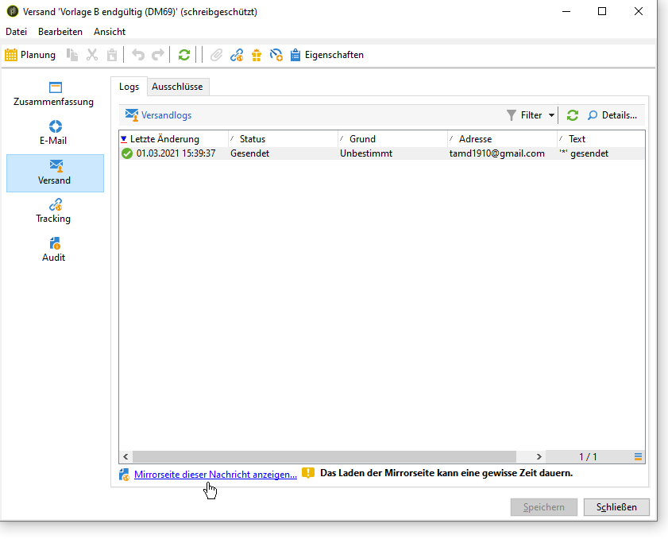
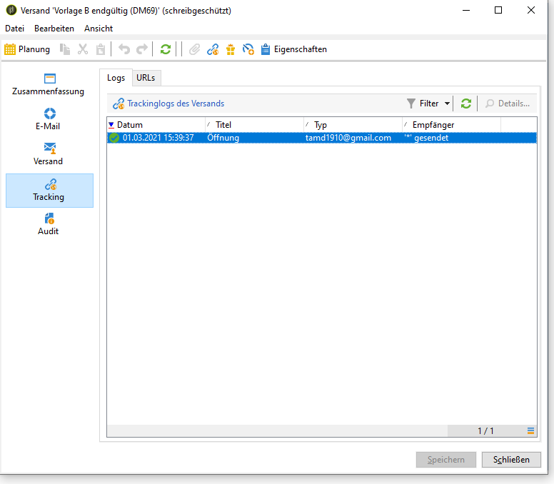
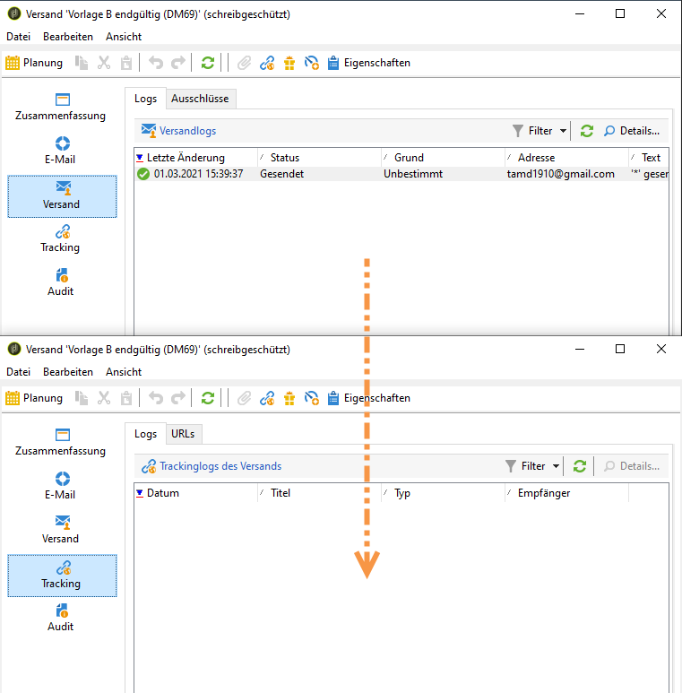
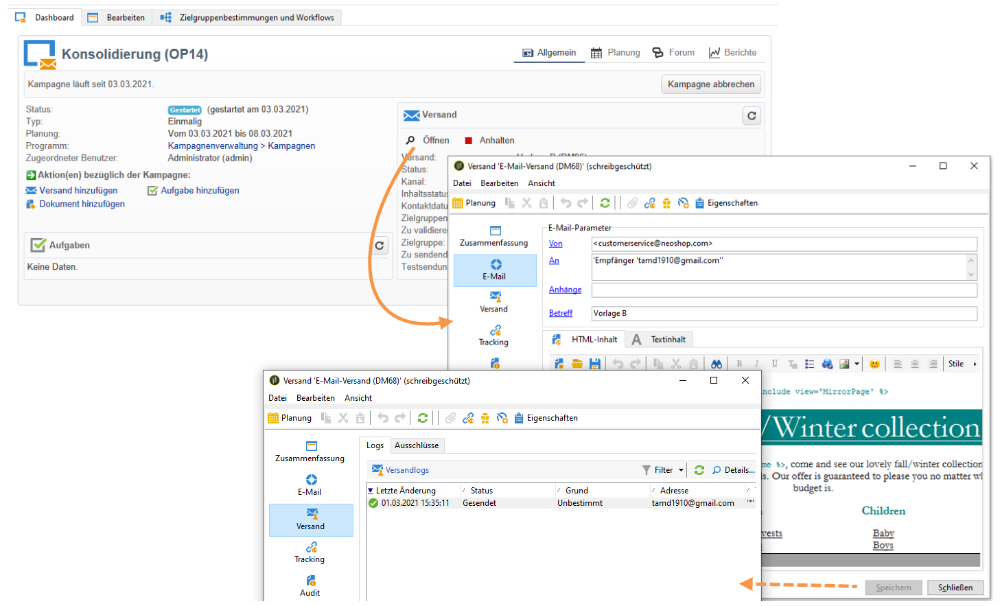

# A/B-Tests: Analysieren des Ergebnisses {#step-8--analyzing-the-result}

Nach Verarbeitung der Testsendungen besteht die Möglichkeit im Kampagnen-Dashboard zu prüfen, welche Empfänger welche Version erhalten und ob sie die Sendungen geöffnet haben. Klicken Sie auf den Link einer der Sendungen:

* Im **[!UICONTROL Versand]**-Tab wird angezeigt, welche Empfänger den Versand erhalten haben.

  

* Im **[!UICONTROL Tracking]**-Tab wird angezeigt, welche Empfänger den Versand geöffnet haben.

  

* Vergleichen Sie die Ergebnisse beider Sendungen miteinander.

  

In unserem Beispiel erzielte Versand B die höchste Öffnungsrate. Das bedeutet, dass Inhalt B für den endgültigen Versand verwendet wird.

