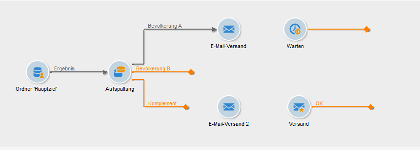
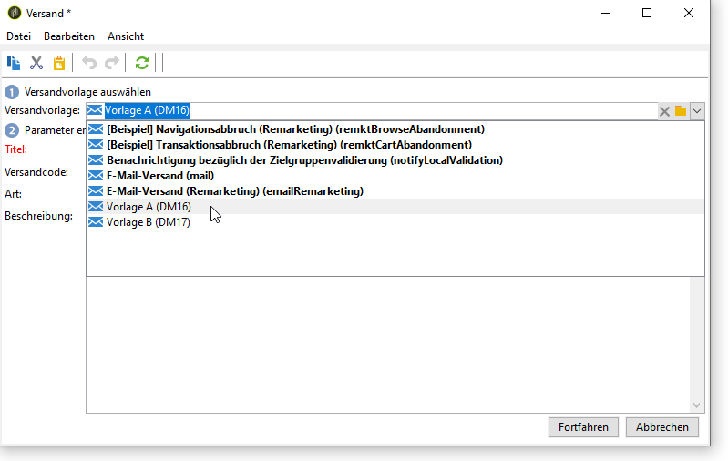
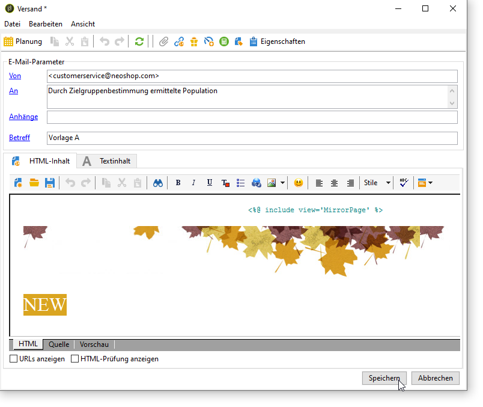
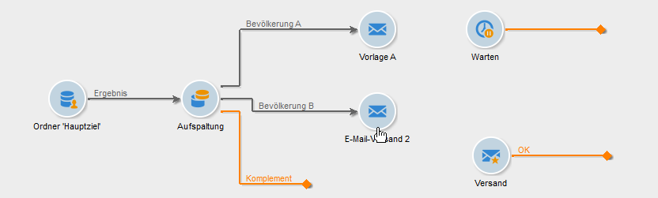
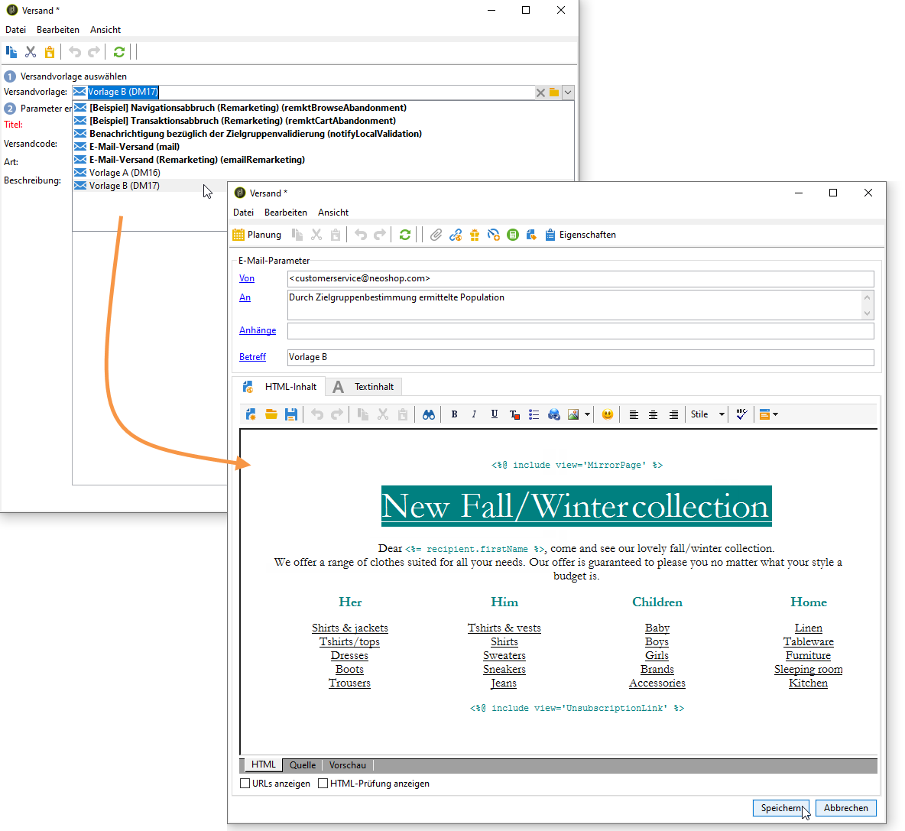
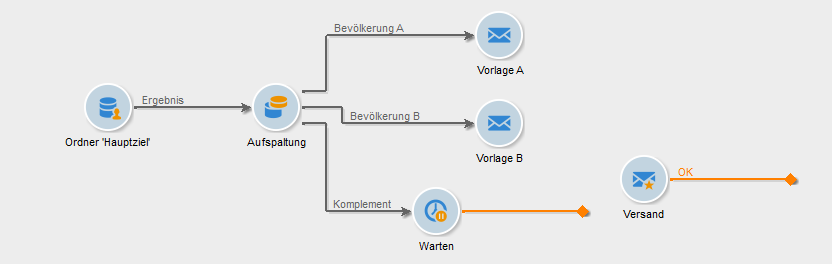
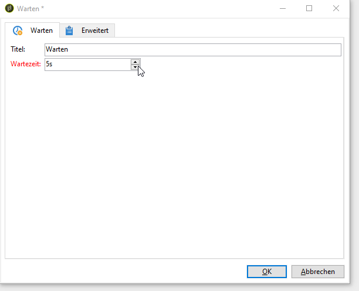
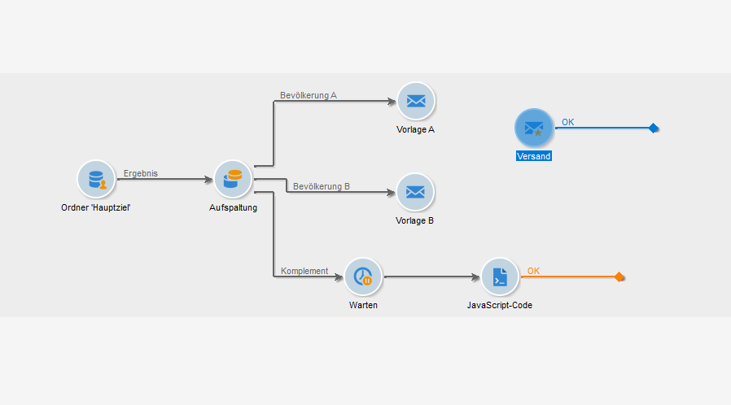

# Konfigurieren der Versand im Workflow {#step-4--configuring-the-deliveries-in-the-workflow}

Der nächste Schritt besteht aus der Konfiguration der Sendungen. Sie sind für die drei Populationen bestimmt, die im vorherigen Schritt [Schritt 2: Konfiguration der Testpopulation](#step-2--configuring-population-samples) erstellt wurden. Die ersten beiden Sendungen ermöglichen es Ihnen, verschiedene Inhalte an Population A und B zu senden. Die dritte Sendung ist für jene Population bestimmt, die weder A noch B erhalten hat. Der Inhalt wird durch ein Skript berechnet und ist entweder mit A oder B identisch, je nachdem, welcher Versand die höchste Öffnungsrate erzielt hat. Wir müssen eine Wartezeit für die dritte Sendung konfigurieren, um das Ergebnis der Sendungen A und B zu ermitteln. Aus diesem Grund beinhaltet die dritte Sendung eine Aktivität vom Typ **[!UICONTROL Warten]**.

1. Verbinden Sie ausgehend von der Aufspaltung die Transition der Population A mit einer der **[!UICONTROL E-Mail-Versand]**-Aktivitäten.

   

1. Öffnen Sie den Versand per Doppelklick.
1. Wählen Sie aus der Dropdown-Liste die Versandvorlage A aus.

   

1. Klicken Sie auf **[!UICONTROL Fortfahren]** und anschließend auf .

   

1. Verbinden Sie ausgehend von der Aufspaltung die Transition der Population B mit der zweiten **[!UICONTROL E-Mail-Versand]**-Aktivität.

   

1. Öffnen Sie den Versand, wählen Sie die Vorlage B und speichern Sie den Versand.

   

1. Verbinden Sie ausgehend von der Aufspaltung die Transition der verbleibenden Population mit der **[!UICONTROL Warten]**-Aktivität.

   

1. Öffnen Sie die **[!UICONTROL Warten]**-Aktivität und legen Sie die Wartezeit auf 5 Tage fest.

   

1. Verbinden Sie die **[!UICONTROL Warten]**-Aktivität mit der **[!UICONTROL JavaScript-Code]**-Aktivität.

   

Sie können jetzt das Skript erstellen (siehe Schritt 5: Erstellen Sie das Skript](../../delivery/using/a-b-testing-uc-script.md)).[
