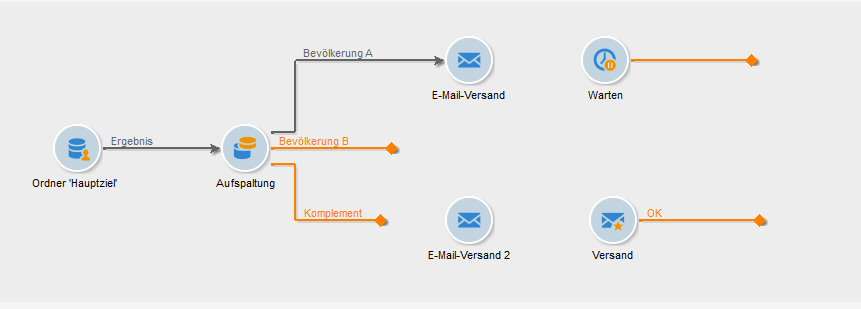
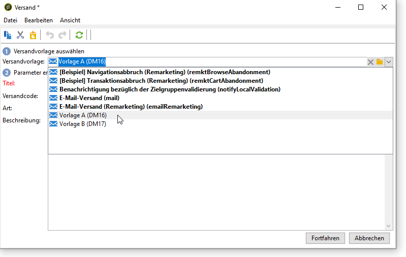
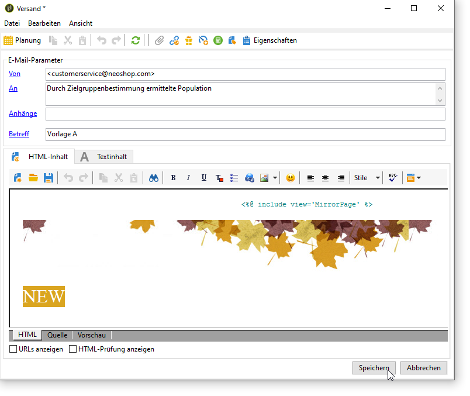
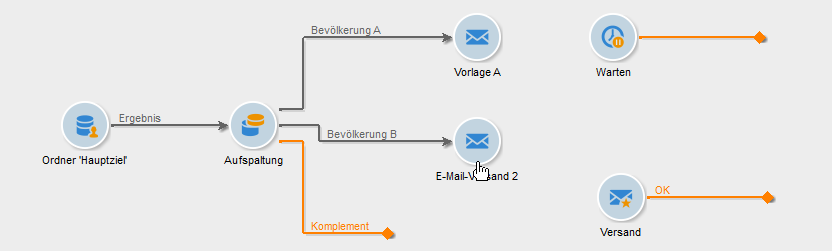
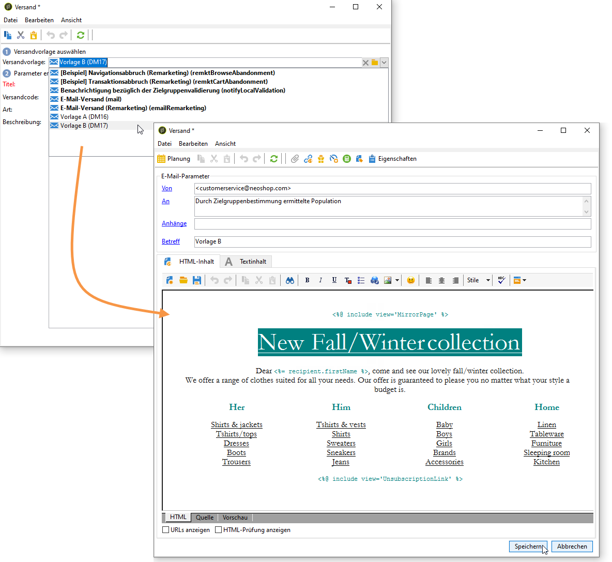
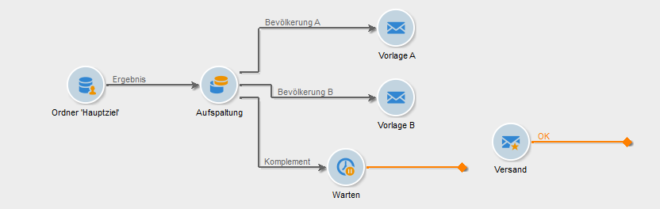
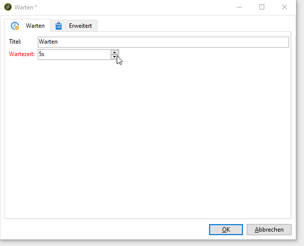
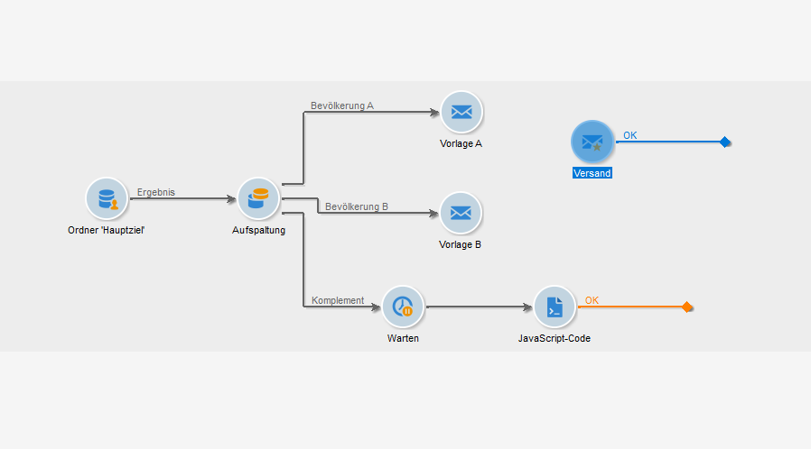

# A/B-Tests: Konfigurieren der Sendungen im Workflow {#step-4--configuring-the-deliveries-in-the-workflow}

Sobald die [Populationen erstellt wurden](a-b-testing-uc-population-samples.md), können Sie die Sendungen konfigurieren. In diesem Anwendungsfall ermöglichen es die ersten beiden Sendungen, verschiedene Inhalte an die Populationen A und B zu senden. Der dritte Versand ist der Fallback-Versand: Er wird an die Empfänger gesendet, die weder zu A noch zu B gehören. Der Inhalt wird durch ein Script erstellt und ist entweder mit A oder B identisch, je nachdem, welcher Empfänger die höchste Öffnungsrate erzielt hat. Wir müssen eine Wartezeit für die dritte Sendung konfigurieren, um das Ergebnis der Sendungen A und B zu ermitteln. Aus diesem Grund beinhaltet die dritte Sendung eine Aktivität vom Typ **[!UICONTROL Warten]**.

1. Gehen Sie zur Aktivität **[!UICONTROL Aufspalten]**  und verknüpfen Sie den für Population A bestimmten Übergang mit einer der E-Mail-Sendungen, die bereits im Workflow enthalten sind.

   

1. Öffnen Sie den Versand per Doppelklick.
1. Wählen Sie aus der Dropdown-Liste die Versandvorlage A aus.

   

1. Klicken Sie auf **[!UICONTROL Fortfahren]** und anschließend auf .

   

1. Verbinden Sie ausgehend von der Aufspaltung die Transition der Population B mit der zweiten **[!UICONTROL E-Mail-Versand]**-Aktivität.

   

1. Öffnen Sie den Versand, wählen Sie die Vorlage B und speichern Sie den Versand.

   

1. Verbinden Sie ausgehend von der Aufspaltung die Transition der verbleibenden Population mit der **[!UICONTROL Warten]**-Aktivität.

   

1. Öffnen Sie die **[!UICONTROL Warten]**-Aktivität und legen Sie die Wartezeit auf 5 Tage fest.

   

1. Verbinden Sie die **[!UICONTROL Warten]**-Aktivität mit der **[!UICONTROL JavaScript-Code]**-Aktivität.

   

Jetzt können Sie das Script erstellen. [Weitere Informationen](a-b-testing-uc-script.md).
