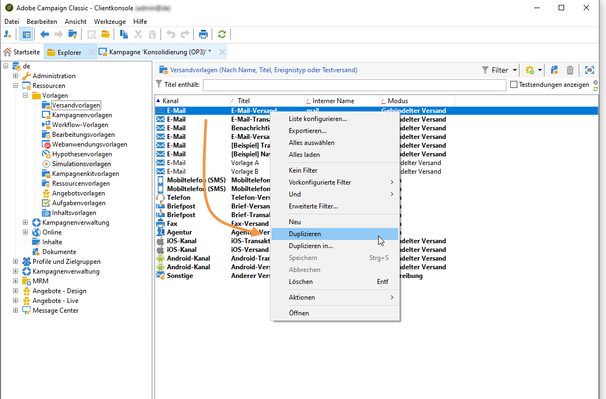
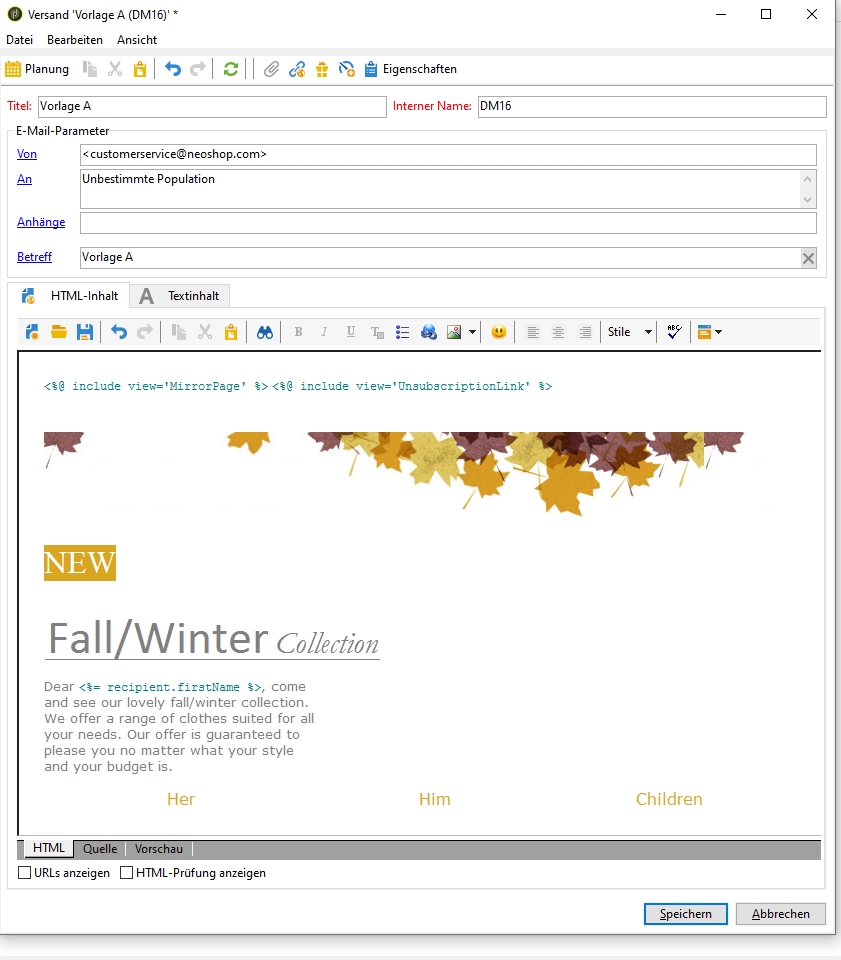
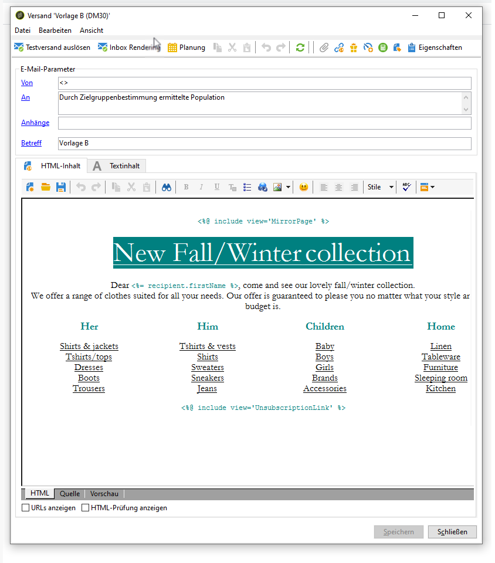

# Erstellen der Versandvorlagen {#step-3--creating-two-delivery-templates}

Erstellen Sie nun zwei Versandvorlagen, die jeweils in einem an die **[!UICONTROL Aufspaltung]** angeschlossenen **[!UICONTROL E-Mail-Versand]** verwendet werden. Weiterführende Informationen finden Sie in diesem [Abschnitt](../../delivery/using/about-templates.md). Gehen Sie wie folgt vor:

1. Gehen Sie im Navigationsbaum in den Knoten **[!UICONTROL Ressourcen > Versandvorlagen]**.
1. Duplizieren Sie die Vorlage **[!UICONTROL E-Mail]**.

   

1. Erstellen Sie den Inhalt Ihres Versands A.

   

1. Wiederholen Sie den Vorgang zur Erstellung des Versands B.

   
