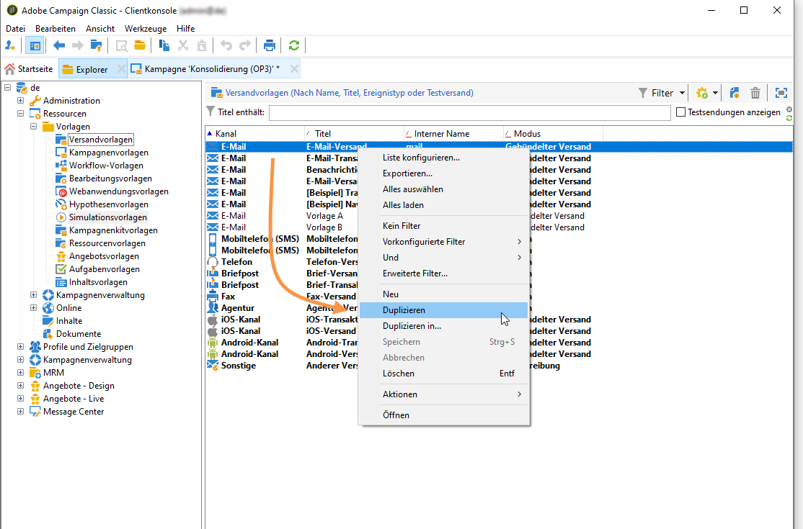
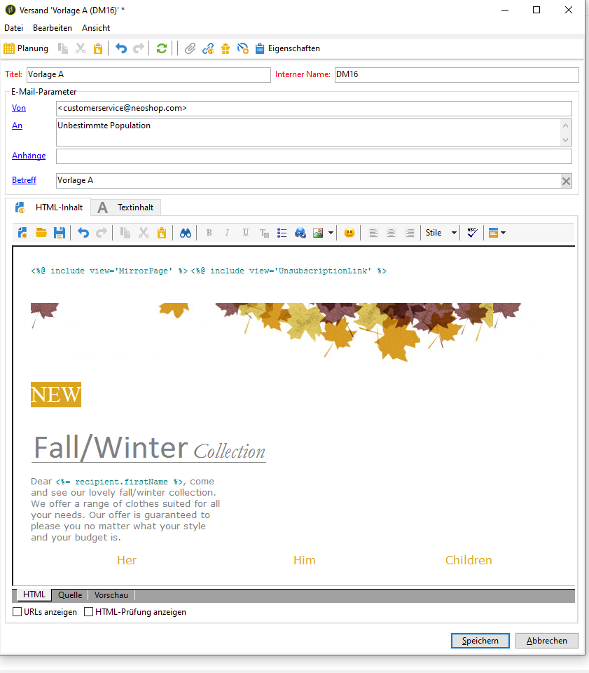
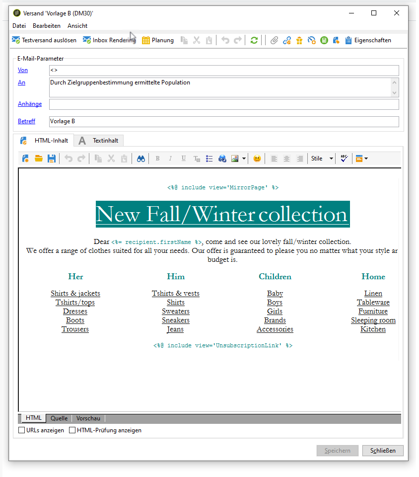

# A/B-Tests: Versandvorlagen erstellen {#step-3--creating-two-delivery-templates}

Jetzt erstellen wir zwei Versandvorlagen. Jede Vorlage wird in einer mit der Aktivität **[!UICONTROL Aufspaltung]** verknüpften Aktivität **[!UICONTROL E-Mail-Versand]** referenziert. Weitere Informationen finden Sie in der [Dokumentation zu Campaign v8](https://experienceleague.adobe.com/docs/campaign/campaign-v8/send/create-templates.html?lang=de){target="_blank"}.

1. Gehen Sie im Navigationsbaum in den Ordner **[!UICONTROL Ressourcen > Versandvorlagen]**.
1. Duplizieren Sie die Vorlage **[!UICONTROL E-Mail]**.

   

1. Erstellen Sie den Inhalt Ihres Versands A.

   

1. Wiederholen Sie den Vorgang zur Erstellung des Versands B.

   

Jetzt können Sie die Sendungen im Workflow konfigurieren. [Weitere Informationen](a-b-testing-uc-configuring-deliveries.md).
