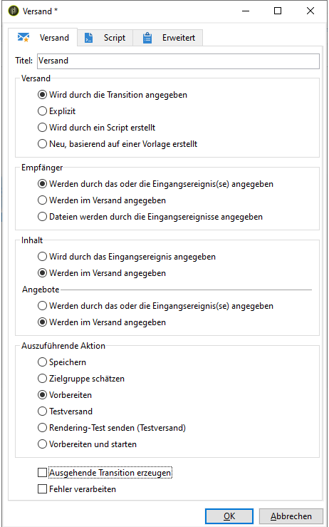

# Definieren des endgültigen Versands {#step-6--defining-the-final-delivery}

Nachdem das Script zur Ermittlung des Gewinners des A/B-Tests erstellt wurde, können Sie die Parameter des endgültigen Versands definieren.

1. Verbinden Sie die Aktivität **[!UICONTROL JavaScript-Code]** mit der restlichen **[!UICONTROL Versand]**-Aktivität.
1. Öffnen Sie die **[!UICONTROL Versand]**-Aktivität.
1. Deaktivieren Sie die Option **[!UICONTROL Ausgehende Transition erzeugen]**, um den Workflow mit dieser Aktivität abzuschließen.
1. Lassen Sie die Standardwerte der anderen Optionen unverändert.

   

Durch die Vorbereitung des in der Transition spezifizierten Versands (definiert durch die **[!UICONTROL Javascript-Code]**-Aktivität), können Sie sie im Anschluss validieren und den Versand starten, wie im nächsten Schritt beschrieben wird.

Sie können jetzt den Workflow Beginn haben (siehe [Schritt 7: Beginn des Workflows](../../delivery/using/a-b-testing-uc-start-workflow.md)).
