# Populationsmuster konfigurieren {#step-2--configuring-population-samples}

## Konfiguration der Abfrage {#configuring-the-query-activity}

* Öffnen Sie die **[!UICONTROL Abfrage]** per Doppelklick.

   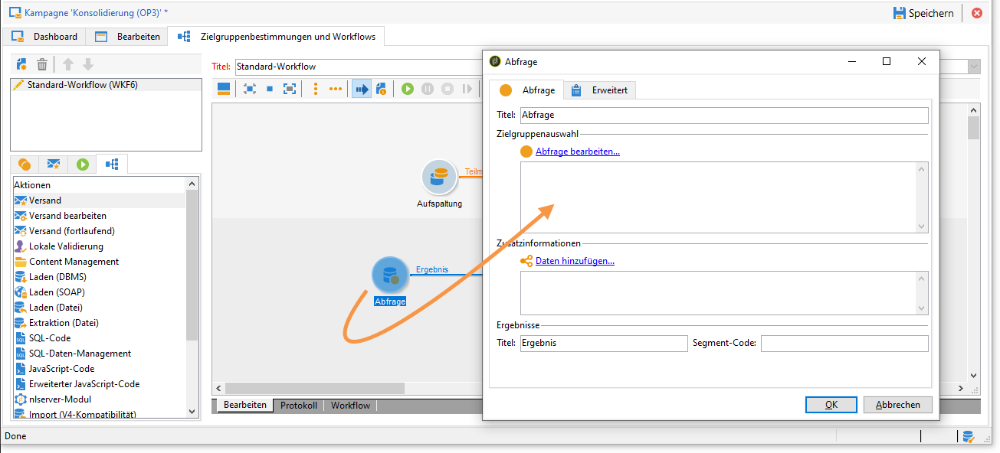

* Klicken Sie auf den Link **[!UICONTROL Abfrage bearbeiten]** und wählen Sie die Empfänger aus, die die Zielgruppe enthalten soll.

   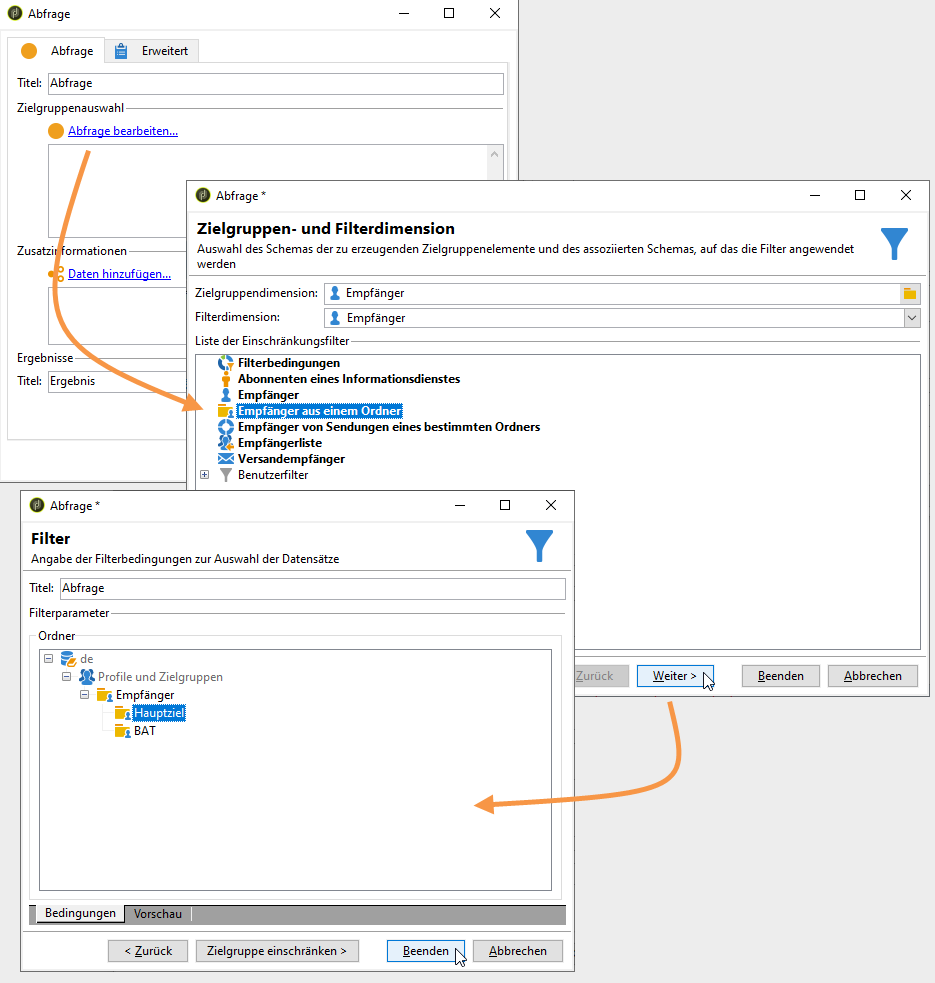

* Verbinden Sie die **[!UICONTROL Abfrage]** mit der **[!UICONTROL Aufspaltung]**.

   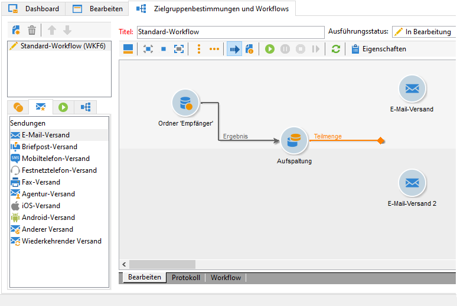

## Konfiguration der Aufspaltung {#configuring-the-split-activity}

Mithilfe dieser Aktivität werden die drei Populationen erstellt: A, B und Rest. Dank der Zufallsauswahl erhält jeweils nur ein Teil jeder Population den entsprechenden Versand.

1. Erstellung der Testpopulation A:

   * Öffnen Sie die **[!UICONTROL Aufspaltung]** per Doppelklick.

      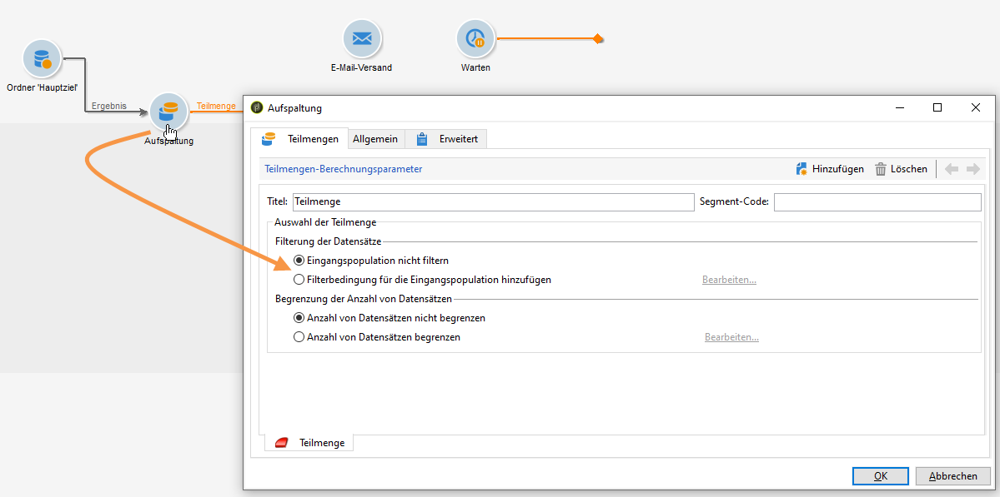

   * Ändern Sie den Titel für die Testpopulation A entsprechend ab.

      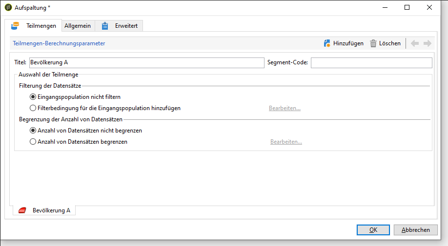

   * Aktivieren Sie die Option **[!UICONTROL Anzahl von Datensätzen begrenzen]**.

      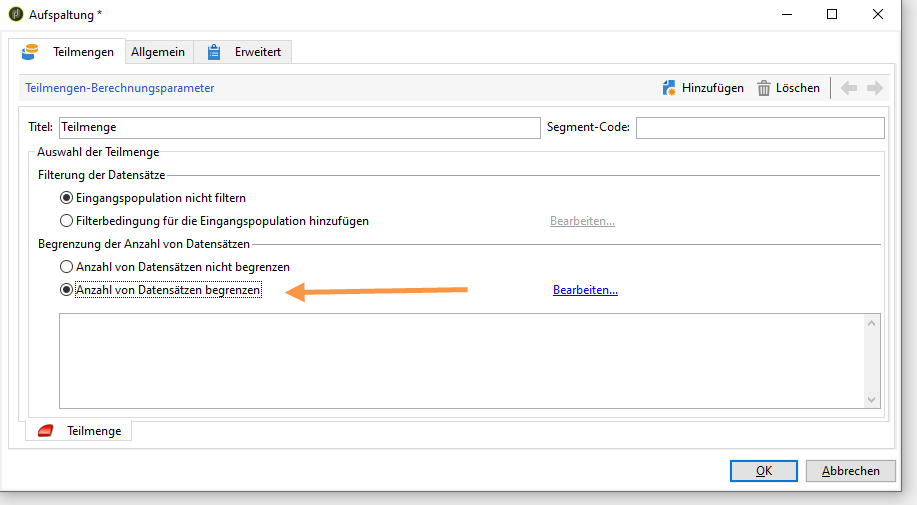

   * Klicken Sie auf den Link **[!UICONTROL Bearbeiten]**, kreuzen Sie **[!UICONTROL Zufallsauswahl aktivieren]** an und klicken Sie auf **[!UICONTROL Weiter]**.

      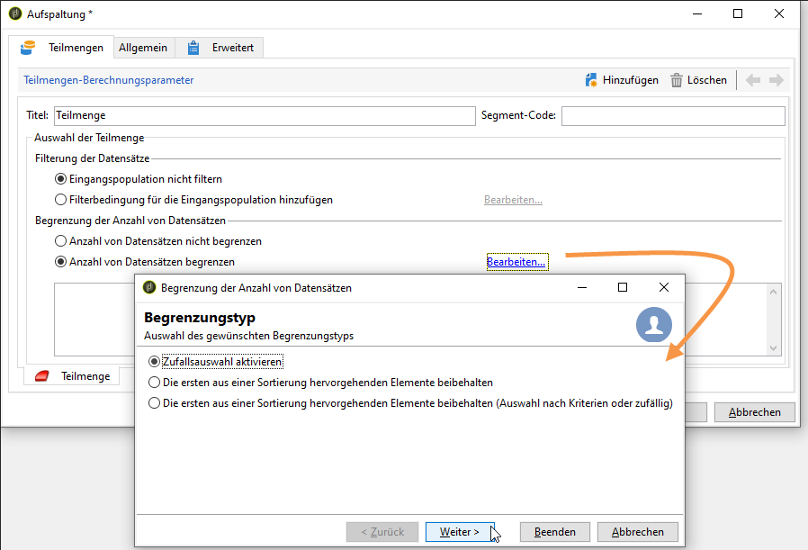

   * Begrenzen Sie die Testpopulation auf 10 % und klicken Sie auf **[!UICONTROL Beenden]**.

      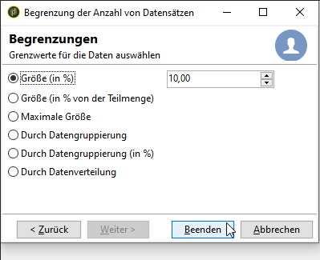

1. Erstellung der Testpopulation B:

   * Klicken Sie auf **[!UICONTROL Hinzufügen]**, um einen zweiten Tab für die Testpopulation B zu erstellen.

      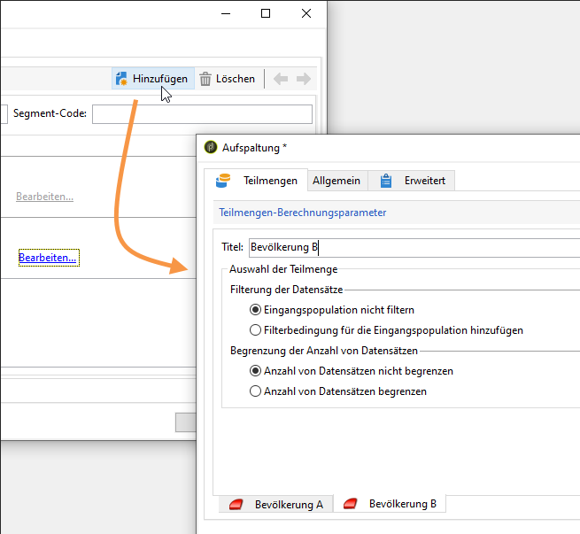

   * Begrenzen Sie wie zuvor die Testpopulation auf 10 %.

      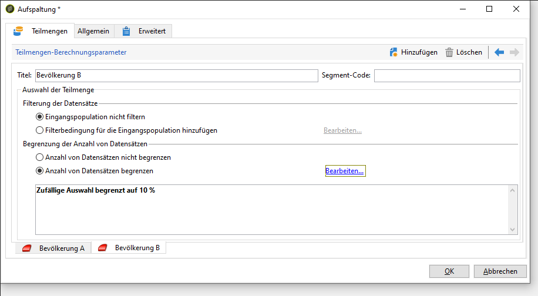

1. Erstellung der verbleibenden Population:

   * Gehen Sie in den **[!UICONTROL Allgemein]**-Tab.

      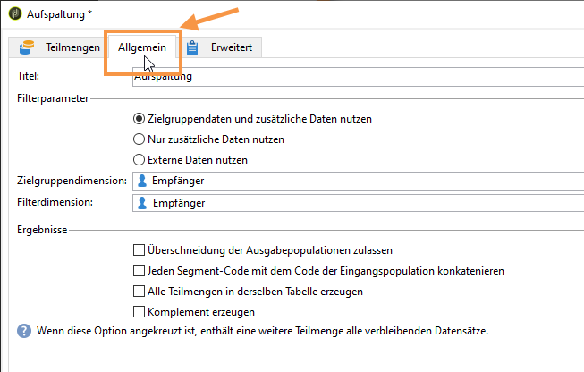

   * Aktivieren Sie die Option **[!UICONTROL Komplement erzeugen]**.

      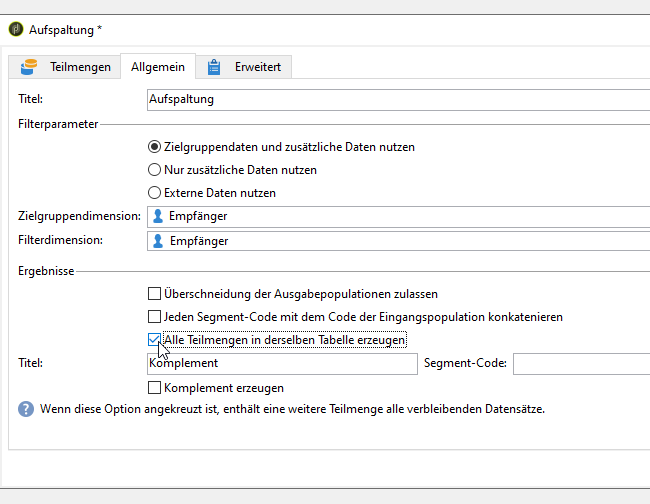

   * Benennen Sie die verbleibende Population und klicken Sie auf **[!UICONTROL OK]**, um die Aktivität zu schließen.

      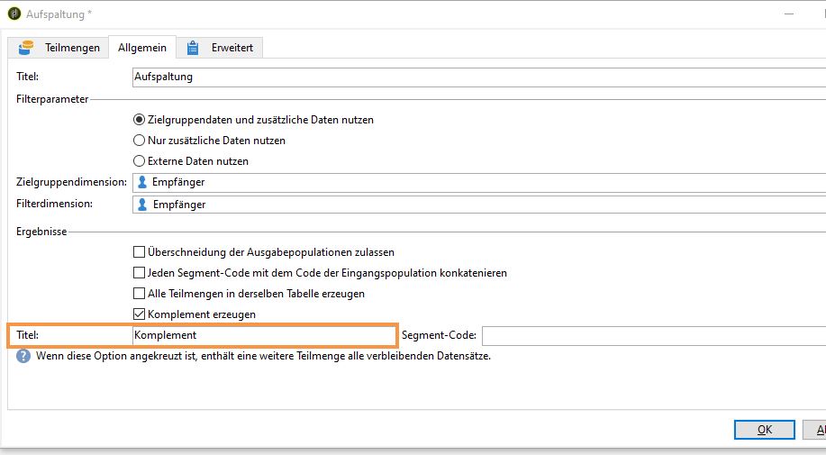
