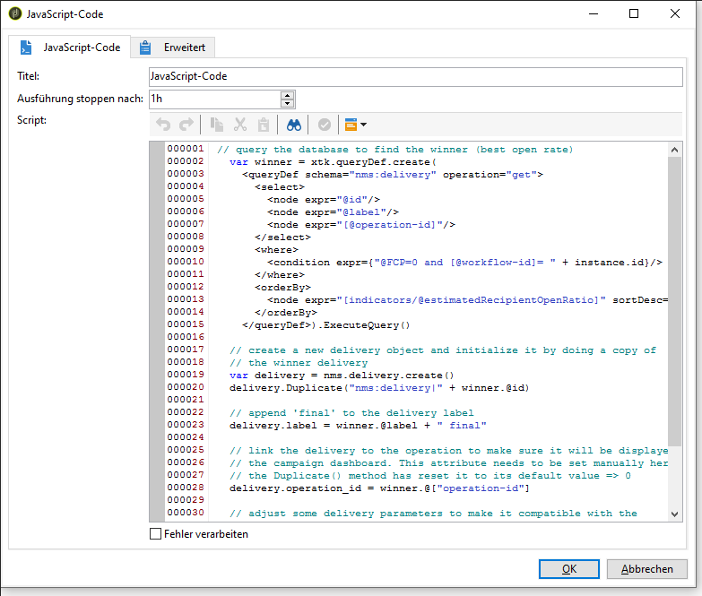
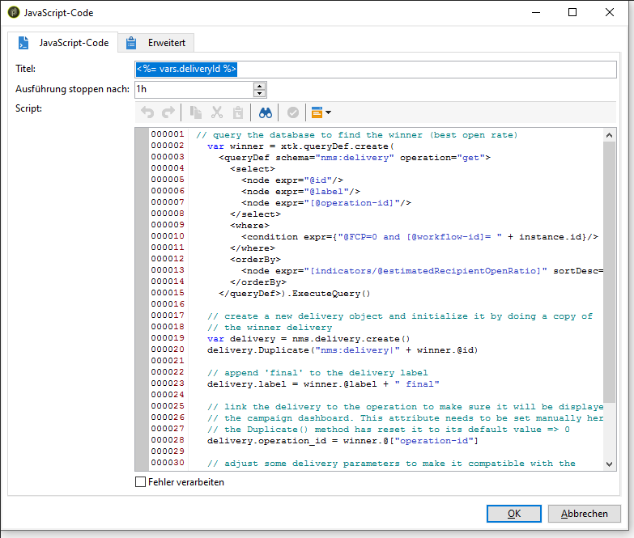

# Erstellen des Skripts {#step-5--creating-the-script}

Die Auswahl der Inhaltsversion, die an die verbleibende Population gesendet wird, erfolgt mithilfe eines Scripts. Das Script ruft die Information bezüglich der höchsten Öffnungsrate ab und kopiert den Inhalt der Siegerversion in den endgültigen Versand.

## Script-Beispiel {#example-of-a-script}

Das folgende Script kann wie im Zielgruppenbestimmungs-Workflow verwendet werden. Weitere Informationen hierzu finden Sie im Abschnitt [Implementierung](#implementation).

```
 // query the database to find the winner (best open rate)
   var winner = xtk.queryDef.create(
     <queryDef schema="nms:delivery" operation="get">
       <select>
         <node expr="@id"/>
         <node expr="@label"/>
         <node expr="[@operation-id]"/>
         <node expr="[@workflow-id]"/>
       </select>
       <where>
         <condition expr={"@FCP=0 and [@workflow-id]= " + instance.id}/>
       </where>
       <orderBy>
         <node expr="[indicators/@estimatedRecipientOpenRatio]" sortDesc="true"/>
       </orderBy>
     </queryDef>).ExecuteQuery()
   
   // create a new delivery object and initialize it by doing a copy of
   // the winner delivery
   var delivery = nms.delivery.create()
   delivery.Duplicate("nms:delivery|" + winner.@id)

   // append 'final' to the delivery label
   delivery.label = winner.@label + " final"

   // link the delivery to the operation to make sure it will be displayed in
   // the campaign dashboard. This attribute needs to be set manually here since 
   // the Duplicate() method has reset it to its default value => 0
   delivery.operation_id = winner.@["operation-id"]
   delivery.workflow_id = winner.@["workflow-id"]

   // adjust some delivery parameters to make it compatible with the 
   // "Prepare and start" option selected in the Delivery tab of this activity
   delivery.scheduling.validationMode = "manual"
   delivery.scheduling.delayed = 0
 
   // save the delivery in database
   delivery.save()
 
   // store the new delivery Id in event variables
   vars.deliveryId = delivery.id
```

Eine ausführliche Erläuterung des Scripts finden Sie unter [Script-Details](#details-of-the-script).

## Umsetzung {#implementation}

1. Öffnen Sie die **[!UICONTROL JavaScript-Code]**-Aktivität.
1. Kopieren Sie das in [Script-Beispiel](#example-of-a-script) angebotene Script in das Fenster **[!UICONTROL JavaScript-Code]**.

   

1. Geben Sie im **[!UICONTROL Titel]**-Feld den Script-Titel ein, d. h.

   ```
   <%= vars.deliveryId %>
   ```

   

1. Schließen Sie die **[!UICONTROL JavaScript-Code]**-Aktivität.
1. Speichern Sie den Workflow.

## Script-Details {#details-of-the-script}

Im Folgenden werden die verschiedenen Script-Abschnitte und deren Funktionsweise erläutert.

* Der erste Abschnitt des Scripts ist eine Abfrage. Mit dem **queryDef**-Befehl werden aus der Tabelle **NmsDelivery** die durch die Ausführung des Workflows erstellten Sendungen abgerufen und nach ihren geschätzten Öffnungsraten geordnet. Im Anschluss werden die Informationen des Versands abgerufen, der die beste Öffnungsrate erzielt hat.

   ```
   // query the database to find the winner (best open rate)
      var winner = xtk.queryDef.create(
        <queryDef schema="nms:delivery" operation="get">
          <select>
            <node expr="@id"/>
            <node expr="@label"/>
            <node expr="[@operation-id]"/>
          </select>
          <where>
            <condition expr={"@FCP=0 and [@workflow-id]= " + instance.id}/>
          </where>
          <orderBy>
            <node expr="[indicators/@estimatedRecipientOpenRatio]" sortDesc="true"/>
          </orderBy>
        </queryDef>).ExecuteQuery()
   ```

* Der Versand mit der besten Öffnungsrate wird dupliziert.

   ```
    // create a new delivery object and initialize it by doing a copy of
    // the winner delivery
   var delivery = nms.delivery.create()
   delivery.Duplicate("nms:delivery|" + winner.@id)
   ```

* Der Titel des duplizierten Versands wird durch Hinzufügung von **final** angepasst.

   ```
   // append 'final' to the delivery label
   delivery.label = winner.@label + " final"
   ```

* Der Versand wird in das Kampagnen-Dashboard kopiert.

   ```
   // link the delivery to the operation to make sure it will be displayed in
   // the campaign dashboard. This attribute needs to be set manually here since 
   // the Duplicate() method has reset it to its default value => 0
   delivery.operation_id = winner.@["operation-id"]
   delivery.workflow_id = winner.@["workflow-id"]
   ```

   ```
   // adjust some delivery parameters to make it compatible with the 
   // "Prepare and start" option selected in the Delivery tab of this activity
   delivery.scheduling.validationMode = "manual"
   delivery.scheduling.delayed = 0
   ```

* Der Versand wird in der Datenbank gespeichert.

   ```
   // save the delivery in database
   delivery.save()
   ```

* Die eindeutige Kennung des duplizierten Versands wird in der Workflow-Variable gespeichert.

   ```
   // store the new delivery Id in event variables
   vars.deliveryId = delivery.id
   ```

## Andere Auswahlkriterien {#other-selection-criteria}

Im zuvor dargestellten Beispiel wird die endgültige Version anhand der Öffnungsraten der Testversionen bestimmt. Es besteht jedoch die Möglichkeit, andere Kriterien zu verwenden und das Script entsprechend anzupassen:

* Höchste Klickrate: `[indicators/@recipientClickRatio]`,
* Höchste Reaktionsrate (Öffnung der E-Mail und Klicks in der Nachricht): `[indicators/@reactivity]`,
* Niedrigste Beschwerderate: `[indicators/@refusedRatio]` (Attribut sortDesc auf „false“ setzen),
* Höchste Konversionsrate: `[indicators/@transactionRatio]`,
* Höchste Anzahl an besuchten Webseiten nach Erhalt der Nachricht: `[indicators/@totalWebPage]`,
* Niedrigste Abmelderate: `[indicators/@optOutRatio]`,
* Höchster Gesamtumsatz infolge des Erhalts der Nachricht: `[indicators/@amount]`.

Sie können jetzt den endgültigen Versand definieren (siehe [Schritt 6: Definieren Sie den endgültigen Versand](../../delivery/using/a-b-testing-uc-final-delivery.md)).
