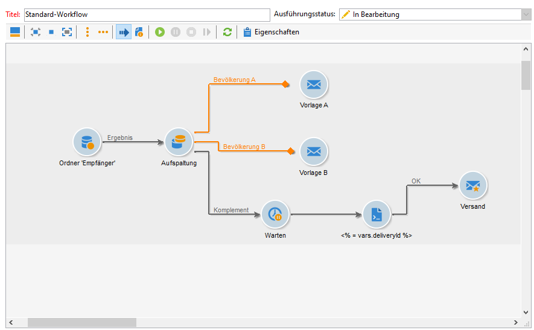
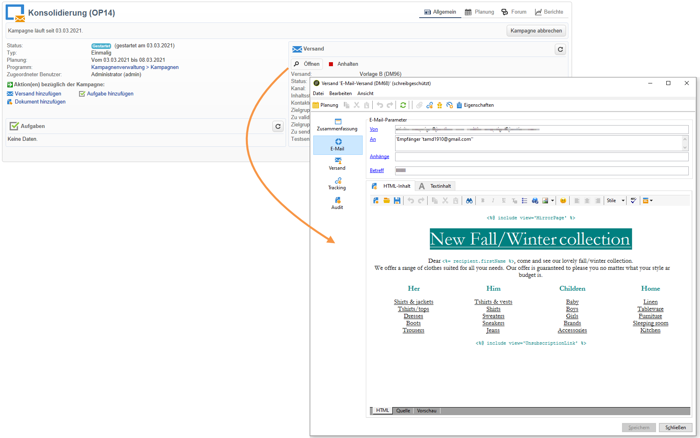

# Workflow starten {#step-7--starting-the-workflow}

1. Klicken Sie in der Workflow-Symbolleiste auf **[!UICONTROL Start]**.

   

1. Gehen Sie in das Kampagnen-Dashboard und validieren Sie die Zielgruppen und Inhalte der Sendungen A und B.
1. Bestätigen Sie die Absendung der Nachrichten.
1. Lassen Sie die Wartezeit von fünf Tagen verstreichen, um die erfolgreichste Versandversion zu ermitteln.

   

   Im vorliegenden Beispiel handelt es sich um die Version A.

1. Validieren Sie Zielgruppe und Inhalt der endgültigen Version und bestätigen Sie die Absendung.
