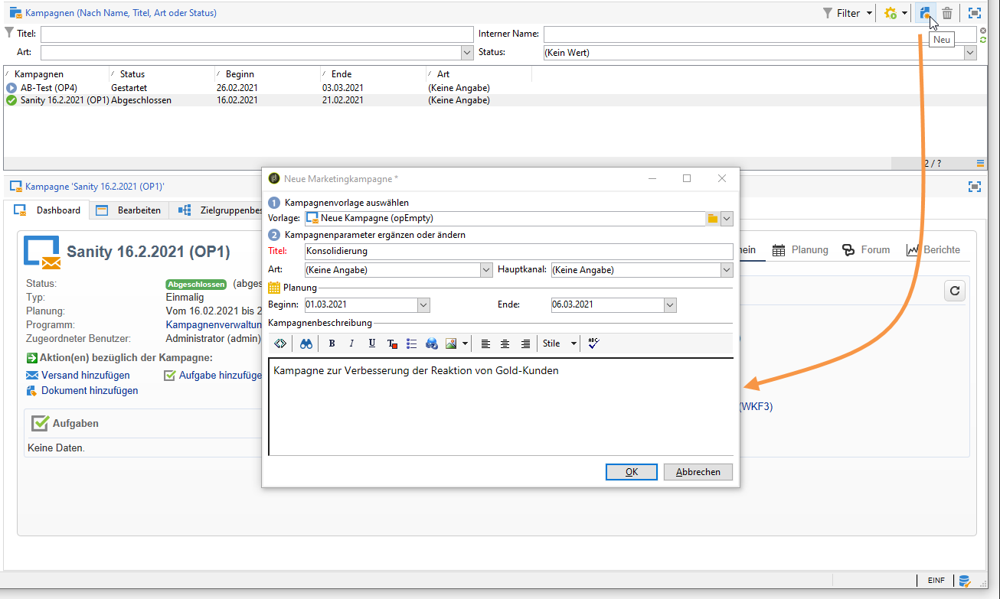
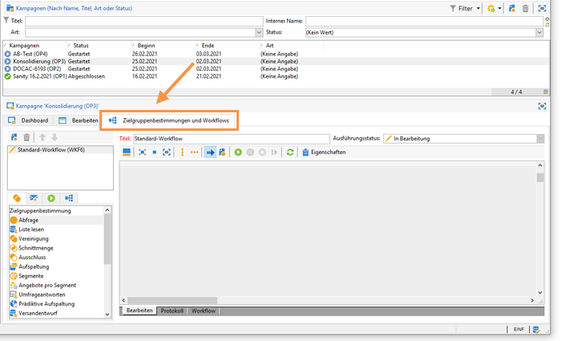
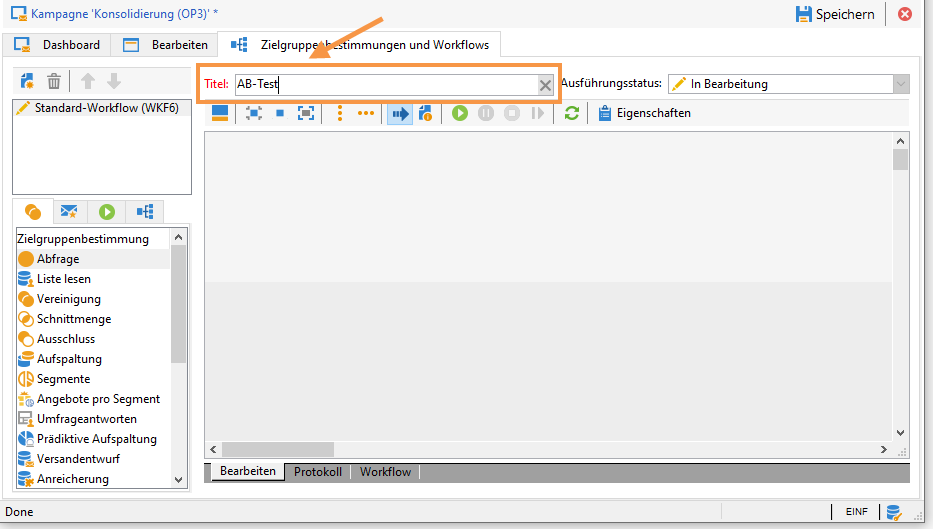
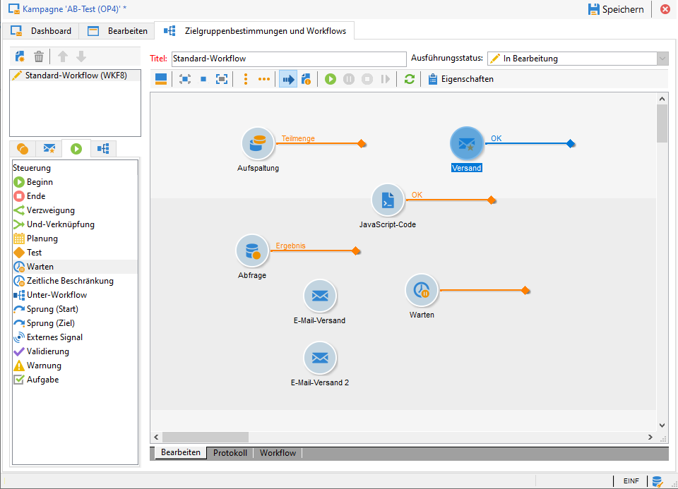

# A/B-Tests: Erstellen eines Zielgruppenbestimmungs-Workflows {#step-1--creating-a-targeting-workflow}

Zielgruppen-Workflows werden im Rahmen von Kampagnen auf der Registerkarte **[!UICONTROL Zielgruppenbestimmungen und Workflows]** erstellt. Im vorliegenden Beispiel enthält der Workflow eine **[!UICONTROL Abfrage]**, eine **[!UICONTROL Aufspaltung]** mit je einem angeschlossenen **[!UICONTROL E-Mail-Versand]**, eine **[!UICONTROL Warten]**-Aktivität, eine **[!UICONTROL JavaScript-Code]**-Aktivität und einen **[!UICONTROL Versand]**.

1. Öffnen Sie eine existierende Kampagne oder erstellen Sie eine neue (siehe diesen [Abschnitt](../../campaign/using/setting-up-marketing-campaigns.md#creating-a-campaign)).

   

1. Gehen Sie auf die Registerkarte **[!UICONTROL Zielgruppenbestimmungen und Workflows]**.

   

1. Klicken Sie auf **[!UICONTROL Hinzufügen]**, um einen neuen Workflow zu erstellen oder verwenden Sie den bestehenden Workflow und benennen Sie ihn um. Lesen Sie diesbezüglich auch diesen [Abschnitt](../../campaign/using/marketing-campaign-deliveries.md#selecting-the-target-population).

   

1. Ziehen Sie mit der Maus die Aktivitäten in das Workflow-Diagramm und zwar aus der Registerkarte **[!UICONTROL Zielgruppenbestimmung]** eine **[!UICONTROL Abfrage]** und eine **[!UICONTROL Aufspaltung]**, aus der Registerkarte **[!UICONTROL Sendungen]** zwei **[!UICONTROL E-Mail-Versand]**-Aktivitäten, aus der Registerkarte **[!UICONTROL Steuerung]** eine **[!UICONTROL Warten]**-Aktivität und aus der Registerkarte **[!UICONTROL Aktionen]** eine **[!UICONTROL JavaScript-Code]**-Aktivität sowie einen **[!UICONTROL Versand]**.********

Jetzt können Sie die Beispielpopulationen konfigurieren. [Weitere Informationen](a-b-testing-uc-population-samples.md).
