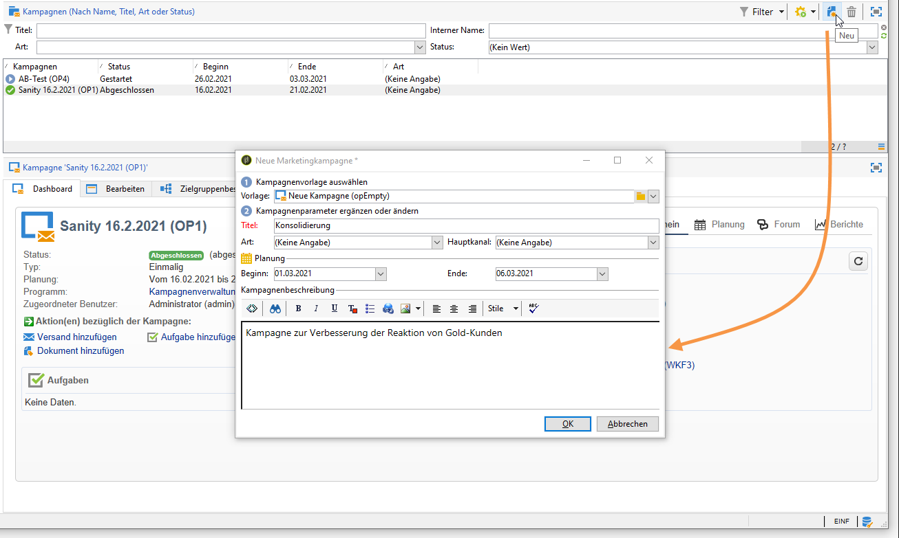
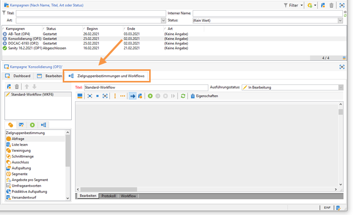
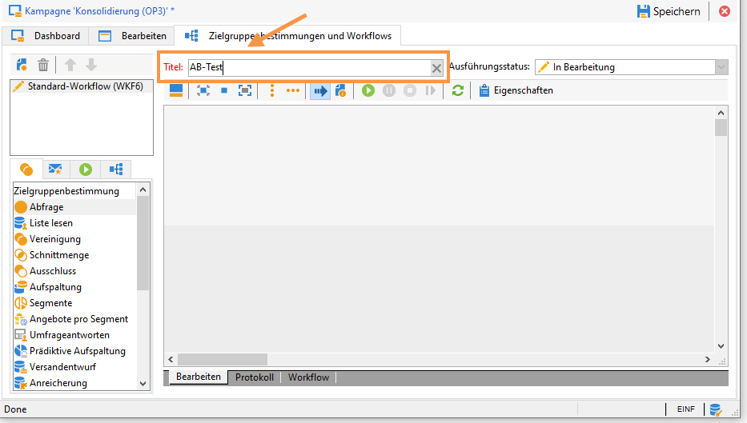
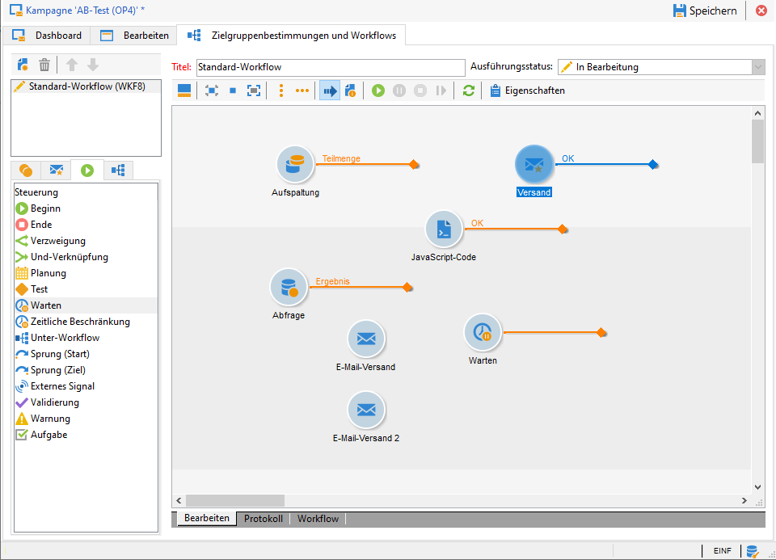

# A/B-Tests: Erstellen eines Zielgruppenbestimmungs-Workflows {#step-1--creating-a-targeting-workflow}

Sie müssen in der Registerkarte **[!UICONTROL Zielgruppenbestimmungen und Workflows]** einer Kampagne einen Workflow erstellen. Er besteht aus einer **[!UICONTROL Abfrage]**-Aktivität, einer **[!UICONTROL Aufspaltung]**-Aktivität, die mit zwei **[!UICONTROL E-Mail-Versand]**-Aktivitäten verknüpft ist, einer **[!UICONTROL Warten]**-Aktivität, einer **[!UICONTROL JavaScript-Code]**-Aktivität und einer **[!UICONTROL Versand]**-Aktivität.

1. Erstellen Sie eine Kampagne, falls noch nicht geschehen. Weiterführende Informationen finden Sie in der [Dokumentation zu Campaign v8](https://experienceleague.adobe.com/docs/campaign/automation/campaign-orchestration/set-up-campaigns.html?lang=de){target=_blank}.

   

1. Gehen Sie auf die Registerkarte **[!UICONTROL Zielgruppenbestimmungen und Workflows]**.

   

1. Ändern Sie den Titel eines vorhandenen Workflows oder klicken Sie auf **[!UICONTROL Hinzufügen]**, um einen neuen zu erstellen. Weitere Informationen finden Sie in der [Dokumentation zu Campaign v8](https://experienceleague.adobe.com/docs/campaign/automation/campaign-orchestration/marketing-campaign-target.html?lang=de){target="_blank"}.

   

1. Ziehen Sie mit der Maus die Aktivitäten in das Workflow-Diagramm und zwar aus der Registerkarte **[!UICONTROL Zielgruppenbestimmung]** eine **[!UICONTROL Abfrage]** und eine **[!UICONTROL Aufspaltung]**, aus der Registerkarte **[!UICONTROL Sendungen]** zwei **[!UICONTROL E-Mail-Versand]**-Aktivitäten, aus der Registerkarte **[!UICONTROL Steuerung]** eine **[!UICONTROL Warten]**-Aktivität und aus der Registerkarte **[!UICONTROL Aktionen]** eine **[!UICONTROL JavaScript-Code]**-Aktivität sowie einen **[!UICONTROL Versand]**.********

Jetzt können Sie die Beispielpopulationen konfigurieren. [Weitere Informationen](a-b-testing-uc-population-samples.md).
