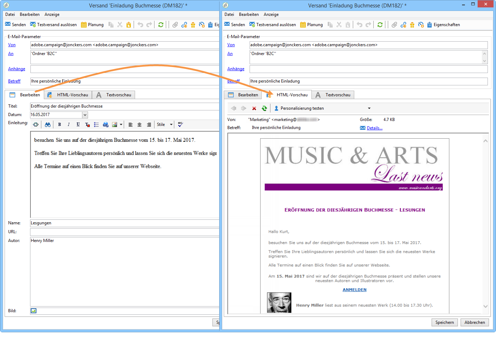

# Über Content Management{#about-content-management}

Das Adobe Campaign-Modul Inhaltsverwaltung (Content Manager) ist ein spezifisches Campaign Classic-[Standard-Package](../../installation/using/installing-campaign-standard-packages.md), das Sie installieren können, um wiederkehrende Newsletter oder Websites zu erstellen. Das Modul unterstützt Sie in der Erstellung, Validierung und Publikation Ihrer Nachrichten:

>[!NOTE]
>
>Dieser Abschnitt bezieht sich auf das Content Management-Modul. Weitere Informationen zum Entwerfen von Inhalten für den E-Mail-Versand finden Sie in [diesem Abschnitt](../../delivery/using/defining-the-email-content.md).

Das Content Management-Modul umfasst Funktionen für Arbeitsgruppen, Workflows und Inhaltsaggregationen. Damit können Nachrichten automatisch formatiert werden: E-Mail, Post, SMS, Web usw.

Die Verwendung des Content-Manager-Moduls ermöglicht es Ihnen, den für die Inhaltserstellung zuständigen Benutzern Eingabe- und Auswahlfelder zur Verfügung zu stellen. Das Layout der Inhalte wird automatisch über ein Stylesheet gesteuert.

>[!CAUTION]
>
>Jede Änderung am Stylesheet schlägt sich automatisch auf die Sendungen nieder, deren Inhaltsvorlagen auf dem betroffenen Stylesheet beruhen.

Das Content Management bietet folgende Vorteile:

* Strukturierte Redaktion von Inhalten dank der Eingabe-Schnittstellen,
* Trennung von Daten und ihrer Darstellung (werden im XML-Format erzeugt),
* Erzeugung von Dokumenten in diversen Formaten (HTML, TXT, XML usw.) basierend auf Stylesheets, die die Einhaltung des Corporate Designs gewährleisten,
* Abruf und Zusammenstellung von externen Inhalten,
* Teamwork mit Validierungs-Workflows und Datenkontrolle.

Trotz allem bringt diese Art der Inhaltserstellung gewisse Einschränkungen mit sich:

* Weniger Freiheit bei der Gestaltung der Dokumente,
* Notwendigkeit einer genauen Anforderungsanalyse, um Endanwender nicht durch das Fehlen benötigter Funktionen zu behindern.

