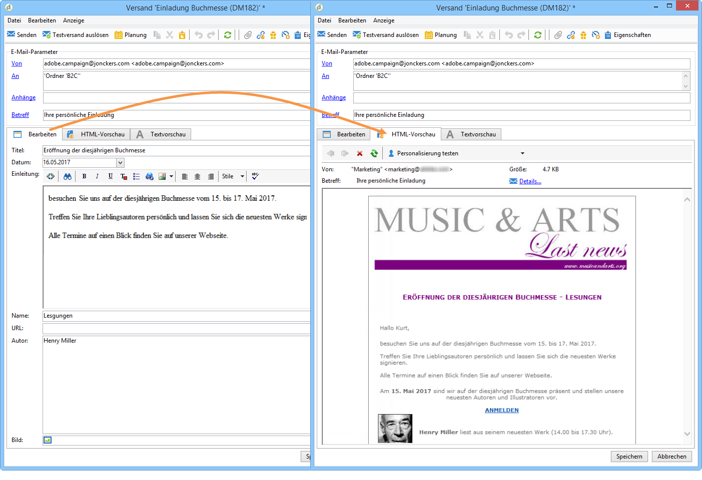

# Über Content-Management{#about-content-management}

Das Adobe Campaign-Modul Inhaltsverwaltung (Content Manager) ist in für Campaign Classic spezifisches [natives Package](../../installation/using/installing-campaign-standard-packages.md), das Sie installieren können, um wiederkehrende Newsletter oder Websites zu erstellen. Das Modul unterstützt Sie in der Erstellung, Validierung und Veröffentlichung Ihrer Nachrichten:

>[!NOTE]
>
>Dieser Abschnitt bezieht sich auf das Content-Management-Modul. Weitere Informationen zum Entwerfen von Inhalten für den E-Mail-Versand finden Sie in der [Dokumentation zu Campaign v8](https://experienceleague.adobe.com/docs/campaign/campaign-v8/send/emails/defining-the-email-content.html?lang=de){target="_blank"}.

Das Content-Management-Modul umfasst Funktionen für Arbeitsgruppen, Workflows und Inhaltsaggregationen. Damit können Nachrichten automatisch formatiert werden: E-Mail, Post, SMS, Web usw.

Mithilfe des Content Managers in einem Versand können Sie den für die Inhaltserstellung zuständigen Benutzerinnen und Benutzern Eingabe- oder Auswahlfelder anbieten. Das Layout und die Anzeige dieses Inhalts sowie alle vorgenommenen Änderungen werden automatisch über das Stylesheet verwaltet.

>[!CAUTION]
>
>Jede Änderung am Stylesheet schlägt sich automatisch auf die Sendungen nieder, deren Inhaltsvorlagen auf dem betroffenen Stylesheet beruhen.

Das Content-Management bietet folgende Vorteile:

* Strukturierte Redaktion von Inhalten dank der Eingabe-Schnittstellen,
* Trennung von Daten und ihrer Darstellung (werden im XML-Format erzeugt),
* Dokumenterstellung in verschiedenen Formaten (HTML, TXT, XML usw.) basierend auf Stylesheets, um die Einhaltung grafischer Charts zu gewährleisten,
* Abruf und Zusammenstellung von externen Inhalten,
* Teamwork mit Validierungs-Workflows und Datenkontrolle.

Trotz allem bringt diese Art der Inhaltserstellung gewisse Einschränkungen mit sich:

* Weniger Freiheit bei der Gestaltung der Dokumente,
* Notwendigkeit einer genauen Anforderungsanalyse, um Endanwender nicht durch das Fehlen benötigter Funktionen zu behindern.
