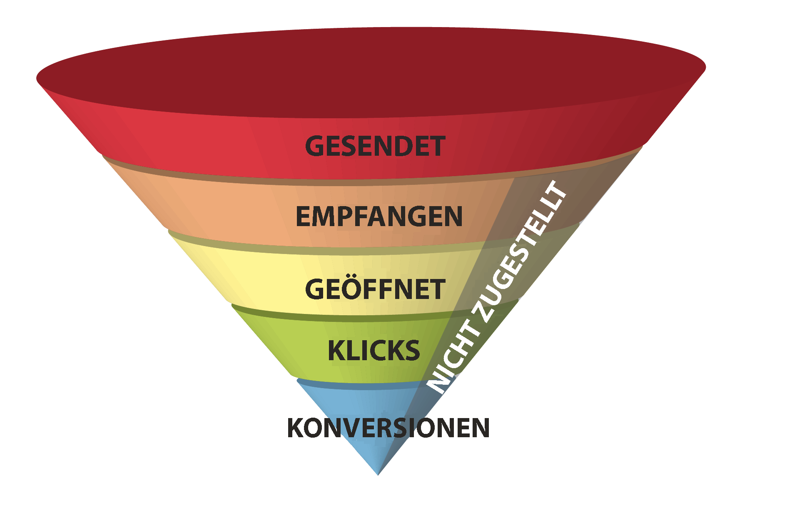
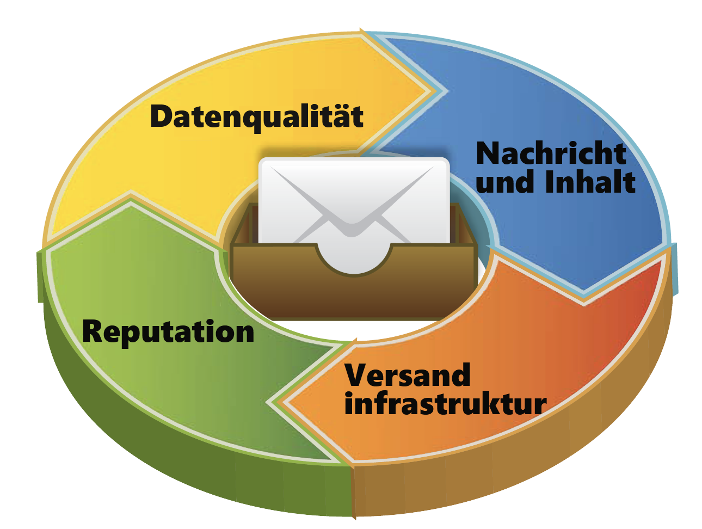

# Über die Zustellbarkeit{#about-deliverability}

Adobe Campaign bietet eine Reihe von Tools zur Verfolgung der Zustellbarkeitsleistung Ihrer Plattform. In diesem Abschnitt werden auch die wichtigsten Grundsätze hervorgehoben, die Sie bei der Verwaltung und Optimierung der Zustellbarkeit beachten sollten.

## Konfiguration {#configuration}

Diese Funktion ist über ein dediziertes Package in Adobe Campaign verfügbar. Damit Sie es verwenden können, muss dieses Package installiert sein. Starten Sie nach Abschluss des Vorgangs den Server neu, damit das Package berücksichtigt wird.
* Für gehostete und hybride Clients wird das **Zustellbarkeits-Monitoring** auf Ihrer Instanz vom technischen Support und von Beratern von Adobe konfiguriert. Weiterführende Informationen dazu erhalten Sie von Ihrem Adobe-Kundenbetreuer.

* Bei On-Premise-Installationen müssen Sie das Package **[!UICONTROL Zustellbarkeits-Monitoring (Email Deliverability)]** über das Menü **[!UICONTROL Tools]** > **[!UICONTROL Erweitert]** > **[!UICONTROL Package-Import]** installieren. Weitere Informationen hierzu finden Sie unter [Installieren von Campaign Classic-Standardpaketen](../../installation/using/installing-campaign-standard-packages.md).

In Adobe Campaign Classic wird das **Zustellbarkeits-Monitoring** über den Workflow **[!UICONTROL Zustellbarkeit]** verwaltet. Er wird standardmäßig auf allen Instanzen installiert und ermöglicht es Ihnen, die Liste der Regeln für die Bounce-Message-Qualifizierung, die Liste der Domains und die Liste der MXs zu initialisieren. Sobald das Package **[!UICONTROL Zustellbarkeits-Monitoring (Email Deliverability)]** installiert ist, wird dieser Workflow nächtlich ausgeführt, um die Regelliste regelmäßig zu aktualisieren und die Zustellbarkeit der Plattform aktiv zu verwalten.

## Hintergrund {#background}

Die Zustellbarkeit von E-Mails stellt eine große Herausforderung für Marketingspezialisten dar – egal, ob sie ein paar tausend Nachrichten oder mehrere Milliarden senden. Jede fünfte Nachricht erreicht nie den Posteingang oder den gewünschten Empfänger.

Einst als &quot;technisches Problem&quot; abgetan und der IT-Abteilung überlassen, wird heute im Marketing immer stärkeres Augenmerk auf die E-Mail-Zustellbarkeit gelegt. Clevere Marketer haben nämlich erkannt, dass zwar viele Aspekte technischer Natur sind, Zustellbarkeit aber letztlich ein geschäftliches Problem ist, das bedeutende Auswirkungen auf die Umsatzzahlen hat.

Betrachten wir einmal den E-Mail-Marketing-Trichter. Die Zustellbarkeit bezeichnet die Anzahl der empfangenen Nachrichten, die sich wiederum auf jede darauf folgende Phase des Trichters auswirkt. Wenn weniger E-Mails empfangen werden, werden weniger geöffnet, weniger angeklickt und weniger Konversionen erzielt. **Für Unternehmen mit einer großen Datenbank könnte die Differenz zwischen einer durchschnittlichen und einer hervorragenden Zustellbarkeit hunderttausende bis Millionen von Dollar Umsatz bedeuten.**

Wenn sich Marketer mit einer durchschnittlichen Zustellbarkeit (80 %) zufrieden geben, verzichten sie auf eine enorme Menge von Konversionen – und Einnahmen.

Was genau ist E-Mail-Zustellbarkeit? Und wie können Marketer die Zustellbarkeitsraten steigern, um den Trichtermund zu vergrößern und aus ihren E-Mail-Kampagnen höhere Gewinne zu erzielen?

Die Zustellbarkeit von E-Mails hängt von verschiedenen Faktoren ab, die bestimmen, ob eine Nachricht innerhalb kurzer Zeit über eine persönliche E-Mail-Adresse ihr Ziel in der erwarteten Qualität bezüglich Inhalt und Format erreicht. Diese Faktoren können in vier Bereiche zusammengefasst werden: Datenqualität, Nachricht und Inhalt, Versandinfrastruktur und Reputation. Gemeinsam bilden sie die Grundlage für ein erfolgreiches E-Mail-Zustellprogramm. Im Folgenden werden diese vier Grundelemente erläutert und Best Practices beschrieben, mit denen sichergestellt werden kann, dass E-Mails den gewünschten Posteingang erreichen und E-Mail-Marketing-Programme profitabel sind.

<!---->
