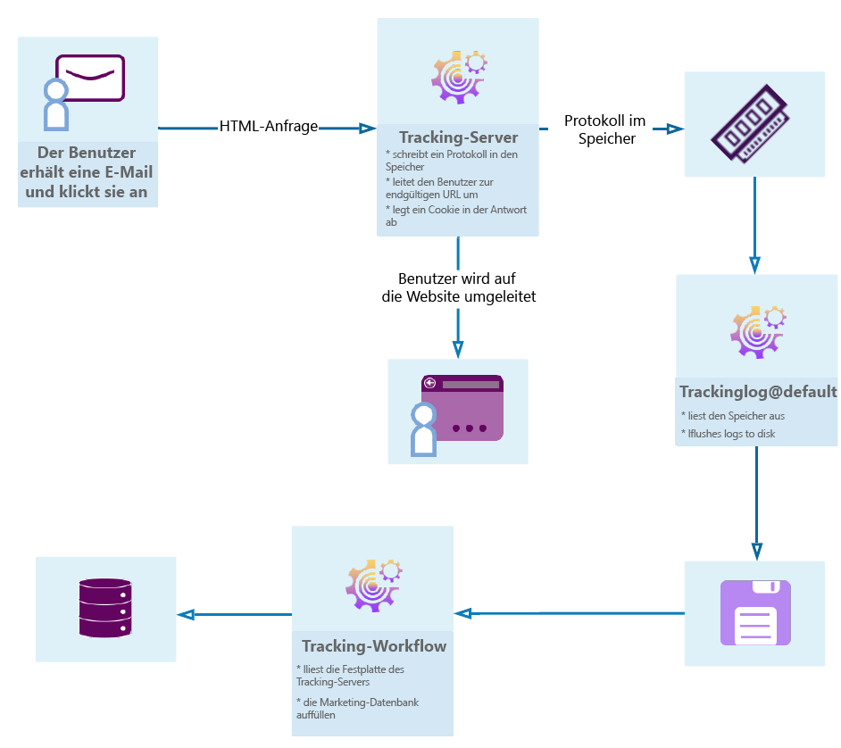

# Erste Schritte mit der Meldungsverfolgung {#get-started-tracking}

Dank der Tracking-Funktionen ermöglicht Ihnen Adobe Campaign, die gesendeten Nachrichten zu verfolgen und das Verhalten von Empfängern zu überprüfen: Öffnen, Klicks auf Links, Abmeldung usw.

Diese Informationen werden auf der Registerkarte **[!UICONTROL Verfolgung]** des Profils jedes Empfängers des Versands abgerufen. Auf dieser Registerkarte werden alle URL-Links angezeigt, die vom Empfänger verfolgt und angeklickt wurden, der in der Liste ausgewählt wurde. Dies ist die Akkumulation aller URLs, die in den Versänden verfolgt werden, die noch im Bildschirm &quot;Versand&quot;vorhanden sind. Die Liste kann konfiguriert werden und enthält in der Regel Folgendes: die angeklickte URL, das Datum und die Uhrzeit des Klicks und das Dokument, in dem die URL gefunden wurde. Weiterführende Informationen hierzu finden Sie in [diesem Abschnitt](../../platform/using/editing-a-profile.md#tracking-tab).

Das **Versand-Dashboard** ist ebenfalls wichtig, um Ihre Versand und eventuelle Probleme beim Senden von Nachrichten zu überwachen. Weitere Informationen hierzu finden Sie in [diesem Abschnitt](../../delivery/using/delivery-dashboard.md).

Das folgende Diagramm zeigt die Phasen des Dialogs zwischen dem Benutzer und den verschiedenen Servern.

## Konfigurieren der Verfolgung {#configure-tracking}

**Grundprinzip**

Bevor Sie die Verfolgung verwenden, müssen Sie sie zunächst für Ihre Instanz konfigurieren. [Mehr dazu](../../installation/using/deploying-an-instance.md#operating-principle)

**Trackingserver**

Zur Konfiguration der Verfolgung muss Ihre Instanz deklariert und bei den Tracking-Servern registriert sein. [Mehr dazu](../../installation/using/deploying-an-instance.md#tracking-server)

**Speichern der Verfolgung**

Sobald die Verfolgung konfiguriert und die URLs ausgefüllt sind, muss der Tracking-Server registriert werden. [Mehr dazu](../../installation/using/deploying-an-instance.md#tracking-configuration#saving-tracking)

## Nachrichten-Tracking {#message-tracking}

**Verfolgte Links**

Sie können den Empfang von Nachrichten und die Aktivierung der Links verfolgen, die in den Inhalt der Nachricht eingefügt wurden, um das Verhalten der Empfänger besser zu verstehen. [Mehr dazu](../../delivery/using/how-to-configure-tracked-links.md)

**URL-Verfolgung**

Verfolgungsoptionen können durch Aktivieren oder Deaktivieren von verfolgten URLs konfiguriert werden. [Mehr dazu](../../delivery/using/personalizing-url-tracking.md)

**Personalisierung nachverfolgter Links**

Mit den Campaign Classic-Verfolgungsfunktionen können Sie Links in E-Mails hinzufügen, die personalisiert werden können und die Verfolgung unterstützen. [Mehr dazu](https://helpx.adobe.com/campaign/kb/tracking-personnalized-links.html)

**Trackinglogs**

Der technische Arbeitsablauf zur Verfolgung ruft die Verfolgungsdaten ab, sobald der Versand gesendet und die Verfolgung aktiviert wurde. Diese Daten finden Sie auf der Registerkarte &quot;Verfolgung&quot;Ihres Versands. [Mehr dazu](../../delivery/using/accessing-the-tracking-logs.md)

**Tracking testen**

Bevor Sie Ihre Nachrichten mit Ihrer Verfolgung senden, können Sie die Verfolgung auf Ihrer Mirrorseite, in Ihren E-Mail-Protokollen und Links testen. [Mehr dazu](../../delivery/using/testing-tracking.md)

## Webanwendung Verfolgung {#web-application-tracking}

**Webanwendung tracken**

Sie können Besuche auf Webanwendung Seiten mit Trackingtagen auch verfolgen und messen. Diese Funktion kann für alle Webanwendung Typen wie Formulare und Online-Umfragen verwendet werden. [Mehr dazu](../../web/using/tracking-a-web-application.md)

**Opt-out vom Webanwendungs-Tracking**

Mit der Webanwendung Rückverfolgungs-Abmeldung können Sie das Verfolgen von Webverhalten von Endbenutzern, die die verhaltensbasierte Verfolgung abwählen, beenden. Sie können die Möglichkeit einschließen, ein Banner in Webanwendungen oder Landingpages anzuzeigen, um Benutzern das Abwählen zu ermöglichen. [Mehr dazu](../../web/using/web-application-tracking-opt-out.md)

## Verfolgungsberichte {#tracking-reports}

**Trackingstatistiken**

Dieser Bericht enthält Statistiken zu Öffnen, Klicks und Transaktionen und ermöglicht Ihnen die Verfolgung der Marketingauswirkungen des Versands. [Mehr dazu](../../reporting/using/delivery-reports.md#tracking-statistics)

**URLs und Clickstreams**

Dieser Bericht zeigt die Rangfolge der infolge eines Versands besuchten Webseiten. [Mehr dazu](../../reporting/using/delivery-reports.md#urls-and-click-streams)

**Personen und Empfänger**

Verstehen Sie den Unterschied zwischen einer Person/Person und einem Empfänger im Adobe Campaign mit diesem Beispiel besser. [Mehr dazu](../../reporting/using/person-people-recipients.md)

**Trackingindikatoren**

Dieser Bericht kombiniert die Schlüsselindikatoren zur Verfolgung des Verhaltens von Empfängern beim Empfang des Versands, z. B. offene Clickthrough-Raten und Clickstreams. [Mehr dazu](../../reporting/using/delivery-reports.md#tracking-indicators)

**Indikatorberechnung**

Die verschiedenen Tabellen geben Ihnen die Liste der in den verschiedenen Berichten verwendeten Indikatoren und ihre Berechnungsformel je nach Versand-Typ. [Mehr dazu](../../reporting/using/indicator-calculation.md)

## Tracking-Fehlerbehebung {#tracking-troubleshooting}

Die folgenden Tipps zur Fehlerbehebung helfen Ihnen bei der Lösung der häufigsten Probleme, die bei der Verwendung der Verfolgung in Adobe Campaign Classic auftreten. Eine weiter gehende Fehlerbehebung finden Sie in [diesem Abschnitt](../../delivery/using/tracking-troubleshooting.md).

* Überprüfen Sie, ob der TrackingLogd-Prozess ausgeführt wird

   Dieser Prozess liest aus dem gemeinsamen Arbeitsspeicher des IIS/Webservers und schreibt die Umleitungsprotokolle.

   Sie können von der Homepage aus darauf zugreifen, indem Sie die Registerkarte Überwachung in Ihrer Instanz auswählen. Sie können auch den folgenden Befehl für die Instanz ausführen: `<user>@<instance>:~$ nlserver pdump`

   Wenn der TrackingLogd-Prozess nicht in der Liste angezeigt wird, starten Sie ihn mit dem folgenden Befehl in der Instanz: `<user>@<instance>:~$ nlserver start trackinglogd`

* Vergewissern Sie sich, dass der technische Arbeitsablauf zur Verfolgung kürzlich ausgeführt wurde.

   Den technischen Arbeitsablauf zur Verfolgung finden Sie in den Ordnern Administration > Produktion > Technischen Workflows.
