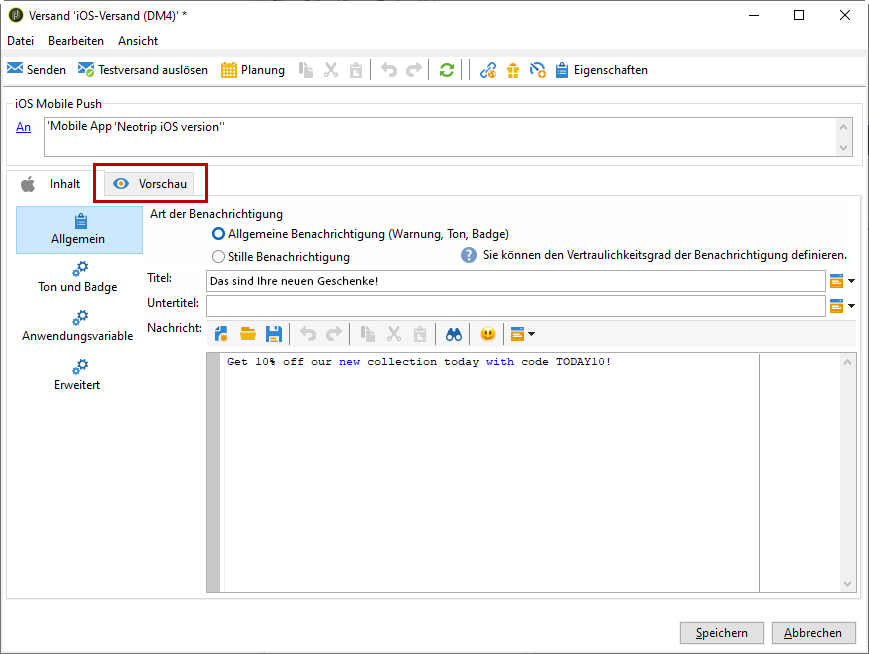
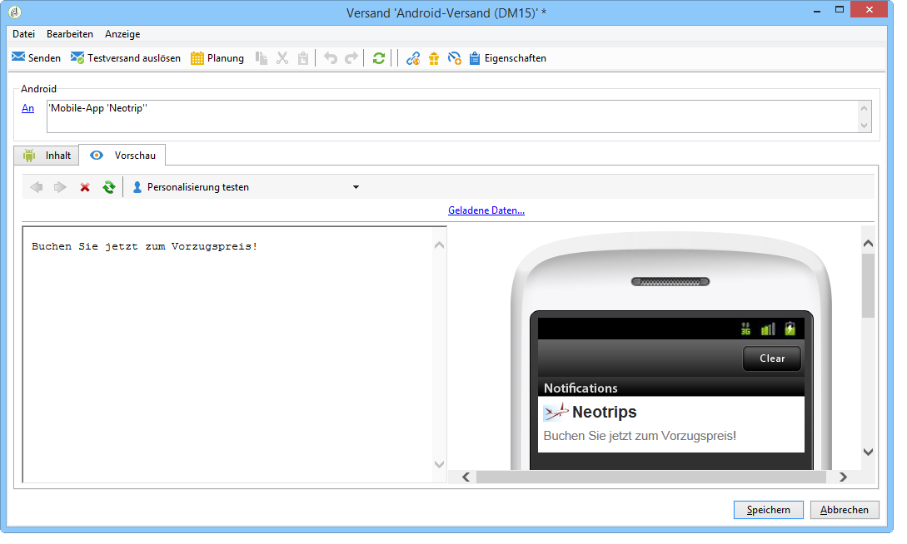
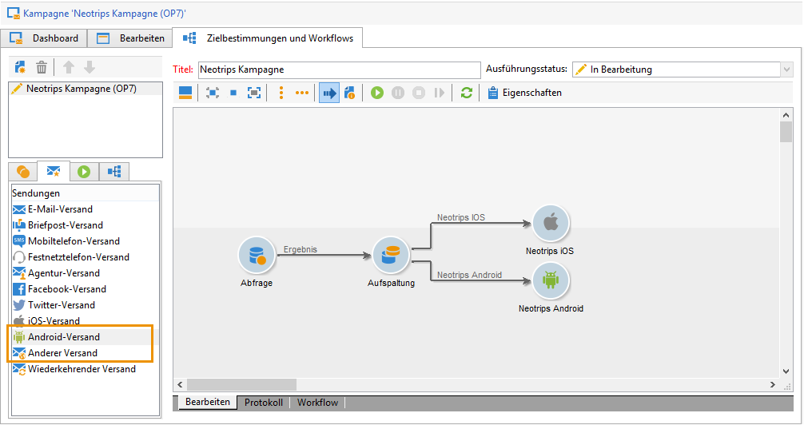
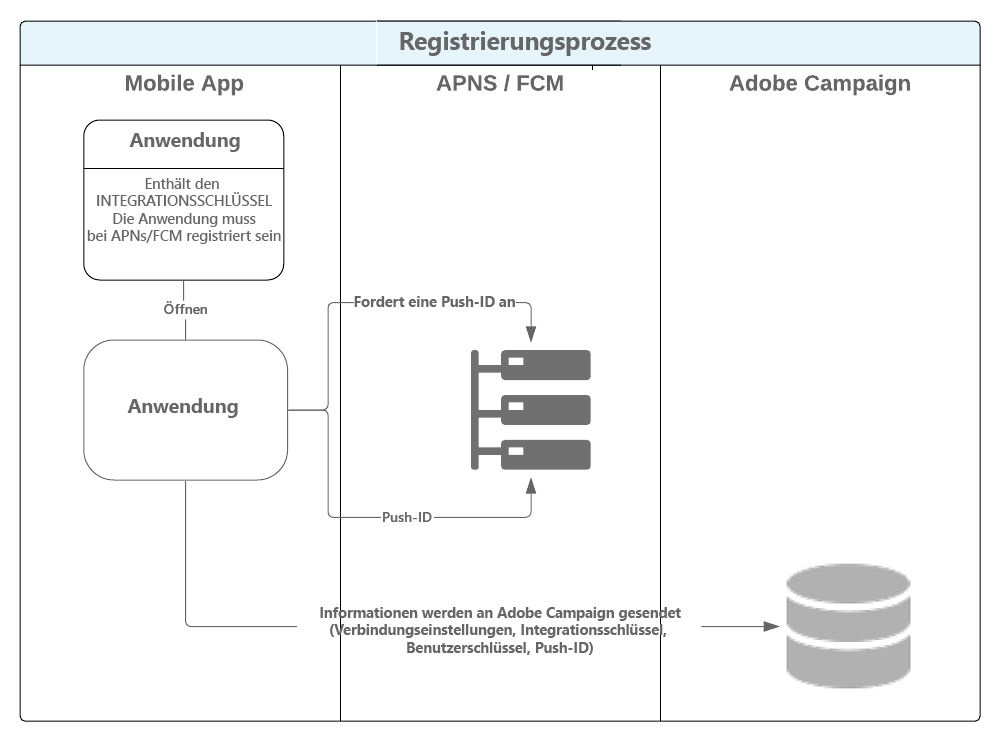
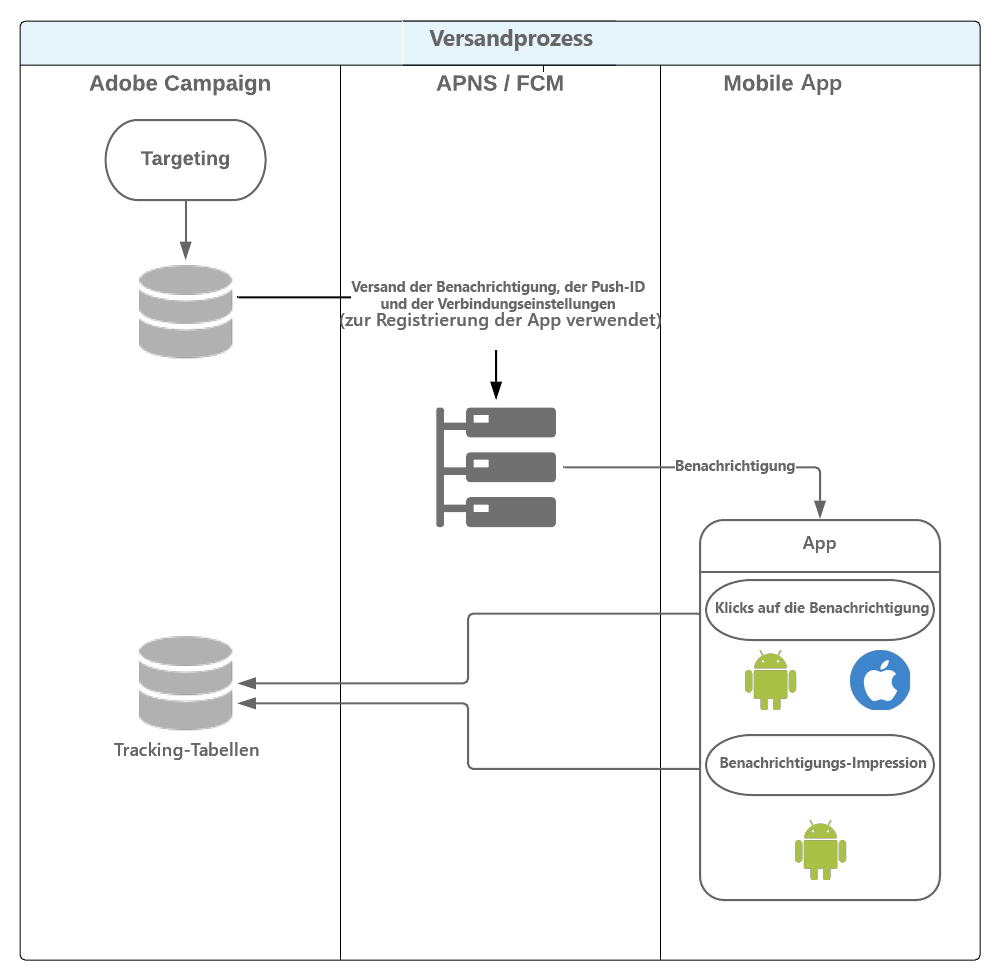

# Über den Mobile-App-Kanal{#about-mobile-app-channel}

>[!CAUTION]
>
>In diesem Dokument wird beschrieben, wie Sie Ihre Mobile App mit der Adobe Campaign-Plattform integrieren können. Es enthält weder Informationen zum Erstellen der Mobile App noch zum Konfigurieren der Anwendung für die Verwaltung von Benachrichtigungen. Weitere Informationen finden Sie in der offiziellen Apple-[Dokumentation](https://developer.apple.com/) sowie der offiziellen Android-[Dokumentation](https://developer.android.com/index.html).

Die folgenden Abschnitte enthalten Informationen, die sich speziell auf den Mobile-App-Kanal beziehen.

Allgemeine Informationen zum Erstellen eines Versands finden Sie in [diesem Abschnitt](../../delivery/using/steps-about-delivery-creation-steps.md).

Der Mobile-Kanal (**Mobile App Channel**) bietet die Möglichkeit, mithilfe von Apps aus Adobe Campaign personalisierte Benachrichtigungen auf iOS- und Android-Geräte zu senden. Zwei Kanäle stehen zur Auswahl:

* iOS-Kanal zum Versand von Mitteilungen an Mobilgeräte mit Apple--Betriebssystem.

   

* Android-Kanal zum Versand von Nachrichten an Mobilgeräte mit Android-Betriebssystem.

   

Diesen Kanälen entsprechen zwei Versandaktivitäten in den Kampagnen-Workflows:



>[!NOTE]
>
>Zwei Transaktionsnachrichten-Vorlagen stehen auch für den Transaktionsnachrichtenversand zur Verfügung.

Sie können das Verhalten der Anwendung dahingehend konfigurieren, dass dem Empfänger beim Antippen der Benachrichtigung der zum jeweiligen Anwendungskontext passende Bildschirm angezeigt wird. Zum Beispiel:

* Im Falle einer Lieferbenachrichtigung wird bei Klick auf die Mitteilung eine Seite mit Informationen zur Sendungsverfolgung angezeigt.
* Im Falle eines Warenkorbs, für den der Kunde schließlich keine Bestellung aufgegeben hat, kann eine Mitteilung versendet werden, die den Empfänger durch Antippen direkt auf das entsprechende Produkt weiterleitet.

>[!CAUTION]
>
>* Stellen Sie sicher, dass die an Mobile Apps gesendeten Benachrichtigungen den von Apple (Apple Push Notification Service) bzw. Google (Firebase Cloud Messaging) gestellten Anforderungen entsprechen.
>* In manchen Ländern ist es gesetzlich vorgeschrieben, die Benutzer Ihrer Mobile Apps über die Natur und den Zweck der erhobenen Daten zu unterrichten. Prüfen Sie die jeweiligen gesetzlichen Regelungen.


Der Workflow **[!UICONTROL NMAC-Opt-outs]** (mobileAppOptOutMgt) aktualisiert die Abmeldungen von Benachrichtigungen auf Mobile-Geräten. Weiterführende Informationen zu diesem Workflow finden Sie im [Workflows](../../workflow/using/mobile-app-channel.md)-Handbuch.

Adobe Campaign ist sowohl mit binärem als auch HTTP/2-basiertem APNs kompatibel. Weitere Informationen zu den Konfigurationsschritten finden Sie im Abschnitt [Konfiguration einer Mobile App in Adobe Campaign](../../delivery/using/configuring-the-mobile-application.md).

## Datenfluss {#data-path}

Die unten stehenden Schemata verdeutlichen den Austausch von Daten zwischen Mobile Apps und Adobe Campaign. Drei Akteure sind an diesem Prozess beteiligt:

* Mobile App
* Benachrichtigungsdienst - APNS (Apple Push Notification Service) bei iOS und FCM (Firebase Cloud Messaging) bei Android
* Adobe Campaign

Der Benachrichtigungsprozess besteht aus drei großen Schritten: Speicherung der App in Adobe Campaign (Abonnement-Erhebung), Versand und Tracking.

### 1. Schritt: Abonnement-Erhebung {#step-1--subscription-collection}

Die Mobile App wird vom Nutzer im App Store oder bei Google Play heruntergeladen. Die App enthält u. a. die Verbindungsparameter (Zertifikat bei iOS und Projektschlüssel bei Android) sowie den Integrationsschlüssel. Beim ersten Start der App werden je nach Konfiguration vom Benutzer gewisse Registrierungsdaten abgefragt (@userKey, beispielsweise eine E-Mail-Adresse oder eine Kundennummer). Gleichzeitig ruft die App beim Benachrichtigungsdienst eine Benachrichtigungskennung (Push-ID) ab. Alle diese Daten (Verbindungsparameter, Integrationsschlüssel, Benachrichtigungskennung, userKey) werden an Adobe Campaign übermittelt.



### 2. Schritt: Versand {#step-2--delivery}

Die Marketingabteilung erstellt einen Versand mit den jeweiligen App-Abonnenten als Zielgruppe. Der Versandprozess übermittelt dem Benachrichtigungsdienst die Verbindungsparameter (Zertifikat bei iOS und Projektschlüssel bei Android), die Benachrichtigungskennung (Push-ID) und den Inhalt der Benachrichtigung. Der Benachrichtigungsdienst sendet die Benachrichtigungen an die Mobilgeräte der Zielgruppenempfänger.

Folgende Informationen werden an Adobe Campaign gemeldet:

* Nur Android: Anzahl an Geräten, auf denen die Benachrichtigung angezeigt wurde (Impressions);
* Android und iOS: Anzahl an Klicks auf die Benachrichtigung.



Der Adobe-Campaign-Server muss den APNS auf folgenden Ports kontaktieren können:

* 2195 (Sendung) und 2186 (Feedback-Service) für den binären iOS-Connector
* 443 für den iOS-HTTP/2-Connector

Verwenden Sie folgende Befehle, um die korrekte Funktionsweise zu testen:

* Für Tests:

   ```
   telnet gateway.sandbox.push.apple.com
   ```

* In Produktion:

   ```
   telnet gateway.push.apple.com
   ```

Wenn ein binärer iOS-Connector verwendet wird, muss der APNS vom MTA und Webserver auf dem Port 2195 (Sendung) und vom Workflow-Server auf dem Port 2196 (Feedback-Service) kontaktiert werden können.

Wenn ein iOS-HTTP/2-Connector verwendet wird, muss der APNS vom MTA, Webserver und Workflow-Server auf dem Port 443 kontaktiert werden können.

