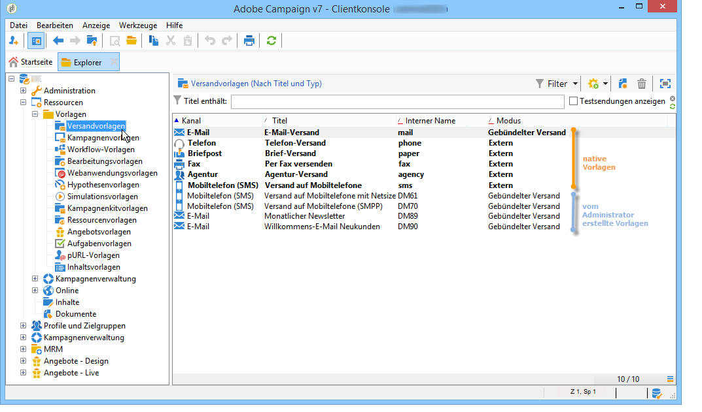

# Über Vorlagen{#about-templates}

Eine Versandkonfiguration kann in einer Vorlage gespeichert werden, um zu einem späteren Zeitpunkt erneut verwendet zu werden. Dabei kann die Vorlage eine partielle oder komplette Konfiguration aufweisen.

Die Ausführung von Versandvorlagen geschieht entweder manuell - wie nachfolgend beschrieben - oder wird durch ein Ereignis ausgelöst (Start zu einer festen Uhrzeit, bei Eingang einer bestimmten Datei auf dem Server usw.). Der Zugriff auf Versandvorlagen geschieht im Navigationsbaum über den Knoten **[!UICONTROL Ressourcen > Vorlagen > Versandvorlagen]**.

Es gibt zwei Arten von Vorlagen:

1. Native Versandvorlagen, d. h. in Adobe Campaign werksmäßig vorhandene Vorlagen.

   Man spricht von nativen Vorlagen, da sie UNTER KEINEN UMSTÄNDEN aus der Anwendung gelöscht werden dürfen. Sie enthalten für jeden Kanal die notwendige Minimalkonfiguration. Ein Administrator hat jedoch die Möglichkeit, gewisse Funktionen zu beschränken oder den Benutzern Standardwerte vorzugeben (Tracking-Aktivierung, Absender-Adresse usw.). Native Versandvorlagen erscheinen fettgedruckt in der Vorlagenliste. Änderungen können nur an Kopien dieser Vorlagen vorgenommen werden.

1. Vorkonfigurierte Versandvorlagen

   Adobe-Campaign-Administratoren können neue Versandvorlagen erstellen. Diese werden dann von den anderen Benutzern (vorausgesetzt sie verfügen über die entsprechenden Berechtigungen) oder auch von automatischen Adobe-Campaign-Serverprozessen verwendet. So ist es einem Administrator beispielsweise möglich, eine E-Mail-Vorlage vollständig zu parametrieren, sodass ein Benutzer bei Verwendung der Vorlage nur noch den Inhalt des Versand im Text- oder HTML-Format einzugeben hat.

>[!NOTE]
>
>Welche Vorlagen Ihnen zur Verfügung stehen, hängt von Ihren Benutzerrechten, der Konfiguration Ihrer Instanz und dem jeweiligen Anwendungskontext ab. Wenn Sie beispielsweise einen Informationsdienst erstellen, können Sie eine Vorlage zum Versand von Bestätigungsnachrichten verwenden. In diesem Kontext werden nur Vorlagen mit dem Zielgruppen-Mapping „Abonnements“ angezeigt. Weitere Informationen hierzu finden Sie unter [Zielgruppen-Mapping wählen](../../delivery/using/selecting-a-target-mapping.md) und [Über Dienste und Abonnements](../../delivery/using/about-services-and-subscriptions.md).
