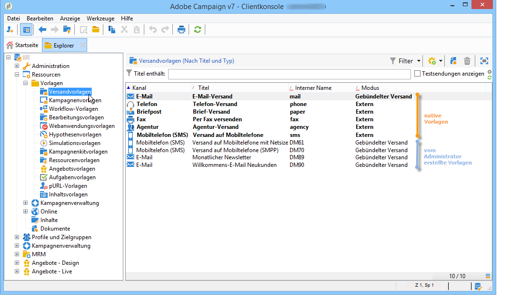

# Arbeiten mit Versandvorlagen {#about-templates}

Eine Versandkonfiguration kann in einer Vorlage gespeichert werden, um zu einem späteren Zeitpunkt erneut verwendet zu werden. Der Versand in Vorlagen kann vollständig oder nur teilweise konfiguriert sein.

Es gibt zwei Arten von Vorlagen:

1. Native Adobe Campaign-Versandvorlagen – Native Vorlagen dürfen NICHT aus dem System gelöscht werden. Sie enthalten für jeden Versandkanal die notwendige Minimalkonfiguration. Ein oder eine Admin hat jedoch die Möglichkeit, gewisse Funktionen zu beschränken oder den Benutzenden Standardwerte vorzugeben (Tracking-Aktivierung, Absender-Adresse usw.). Native Versandvorlagen erscheinen fettgedruckt in der Vorlagenliste. Änderungen können nur an Kopien dieser Vorlagen vorgenommen werden.

1. Vordefinierte Versandvorlagen – Der oder die Adobe Campaign-Admin kann neue Versandvorlagen erstellen. Sie können von Benutzern (mit entsprechenden Zugriffsrechten) oder automatisch von Server-Prozessen wiederverwendet werden. Sie können beispielsweise eine E-Mail-Versandvorlage konfigurieren. Wenn Benutzende einen Versand mithilfe dieser Vorlage erstellen, müssen sie lediglich den Text oder den HTML-Inhalt eingeben und ihn dann versenden. Die anderen Optionen wurden bereits von der oder dem Admin definiert.

Informationen zur Erstellung und Verwendung von Versandvorlagen finden Sie in der [Dokumentation zu Campaign v8](https://experienceleague.adobe.com/de/docs/campaign/campaign-v8/send/create-templates){target="_blank"}.