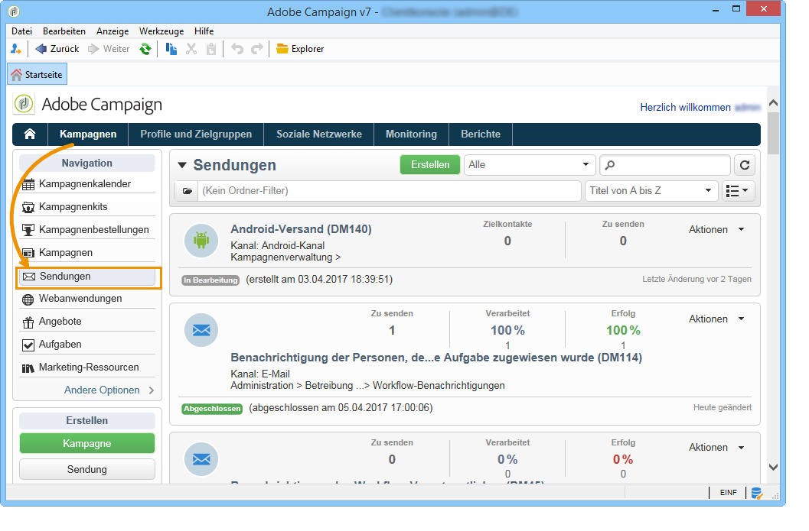
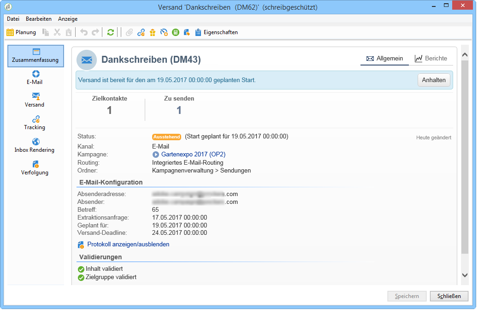
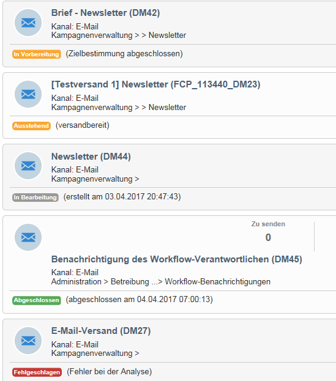
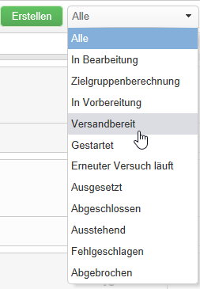
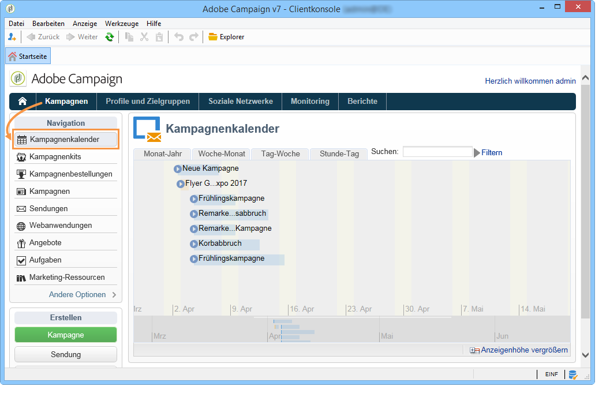
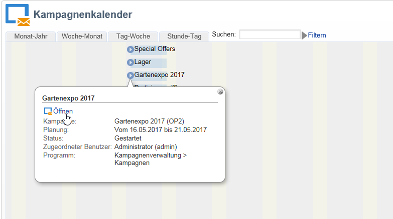
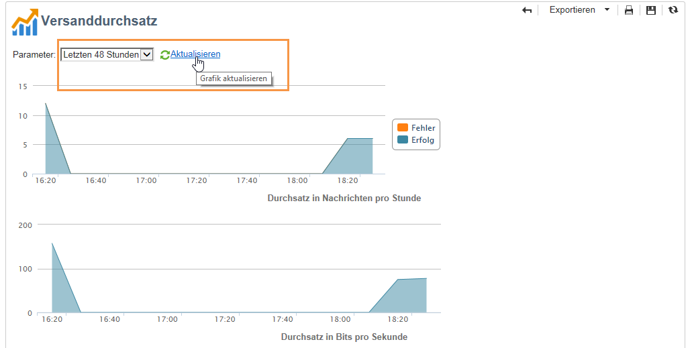

# Auf Versandinformationen zugreifen{#accessing-deliveries-information}

## Auf die Versandliste zugreifen {#accessing-the-list-of-deliveries}

Begeben Sie sich in die Rubrik **[!UICONTROL Kampagnen]** und klicken Sie auf die Schaltfläche **[!UICONTROL Sendungen]**, um auf die Versandliste zuzugreifen.

Im [Explorer](../../platform/using/adobe-campaign-workspace.md#about-adobe-campaign-explorer) besteht über den Knoten **[!UICONTROL Kampagnenverwaltung > Sendungen]** Zugriff auf alle Sendungen.

>[!NOTE]
>
>Informationen zum Adobe Campaign-Arbeitsbereich finden Sie in [diesem Abschnitt](../../platform/using/adobe-campaign-workspace.md).

Auf dieser Seite werden alle in der Datenbank gespeicherten Sendungen angezeigt. Sie haben die Möglichkeit, Status, Erfolgsquoten und Änderungsdaten einzusehen.

>[!NOTE]
>
>Informationen zu den verfügbaren Filtern finden Sie in [diesem Abschnitt](../../platform/using/filtering-options.md).

Im Versand-Assistenten werden Sendungen konfiguriert, validiert und abgeschickt. Der Inhalt des Assistenten hängt vom gewählten Kommunikationskanal (E-Mail, Mobile, Push, Briefpost) und den Rechten des Benutzers ab.

Durch die Auswahl eines Versands aus der Liste gelangen Sie in ein Fenster, das Ihnen die Bearbeitung des entsprechenden Versands ermöglicht. So können Sie den Versand zum Beispiel absenden oder stoppen.

Je nach Fortschritt im Versandzyklus weisen die Sendungen verschiedene Status auf:

* Abgebrochen
* Fehlgeschlagen
* Ausstehend
* Abgeschlossen
* Ausgesetzt
* Erneuter Versuch läuft
* Gestartet
* Versandbereit
* In Vorbereitung
* Zielgruppenberechnung
* In Bearbeitung

Die Status lassen sich leicht anhand der verschiedenfarbigen Label unterscheiden:

Die Dropdown-Liste neben der Schaltfläche **[!UICONTROL Erstellen]** ermöglicht die Filterung der Versandliste nach Status.

## Auf den Versandkalender zugreifen {#accessing-the-delivery-calendar}

Durch Anklicken der Schaltfläche **[!UICONTROL Kampagnenkalender]** in der Rubrik **[!UICONTROL Kampagnen]** gelangen Sie in eine Übersicht, in der die zeitliche Verteilung der Kampagnen dargestellt wird. Sie können die Anzeige Ihren Bedürfnissen gemäß anpassen (nach Monat, Woche oder Tag) und nach verschiedenen Kampagnenelementen (nach Sendungen, Aufgaben usw.) filtern.

Durch Klick auf den Titel werden die wichtigsten Informationen angezeigt. Sie haben außerdem die Möglichkeit, die Kampagne zu **[!UICONTROL öffnen]**, indem Sie auf den entsprechenden Link klicken.

## Auf Informationen zum Versanddurchsatz zugreifen {#accessing-deliveries-throughput-information}

Die über die Rubrik Berichte zugängliche Statistik zum **[!UICONTROL Versanddurchsatz]** bezieht sich auf über die Plattform durchgeführte Sendungen. Zur Messung der Versandgeschwindigkeit von Nachrichten werden zwei Kennzahlen herangezogen: Anzahl an gesendeten Nachrichten pro Stunde und die gesendete Datenmenge in Bits pro Sekunde. Die unten stehende Grafik zeigt in Blau die Anzahl der erfolgreich versandten und in Orange die Anzahl der fehlgeschlagenen Nachrichten.

Sie haben die Möglichkeit, die der Berechnung zugrunde zu legende Zeitspanne aus der Dropdown-Liste auszuwählen. Klicken Sie zum Start der Berechnung auf **[!UICONTROL Aktualisieren]**.

>[!NOTE]
>
>Bei gehosteten oder hybriden Installationen zeigt die Seite **[!UICONTROL Versanddurchsatz]** den Durchsatz an Ihre E-Mail-Empfänger nicht mehr an, wenn Sie auf Enhanced MTA aktualisiert haben. Sie zeigt die Durchsatzgeschwindigkeit für die Weiterleitung Ihrer Nachrichten von Campaign an Enhanced MTA an.
>
>Weitere Informationen zum Adobe Campaign Enhanced MTA finden Sie in diesem [Dokument](https://helpx.adobe.com/campaign/kb/acc-campaign-enhanced-mta.html).