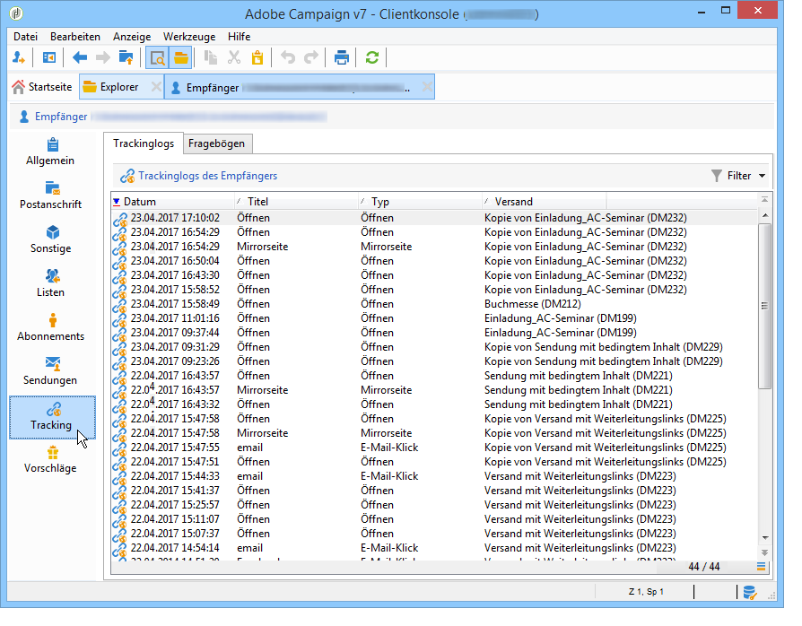
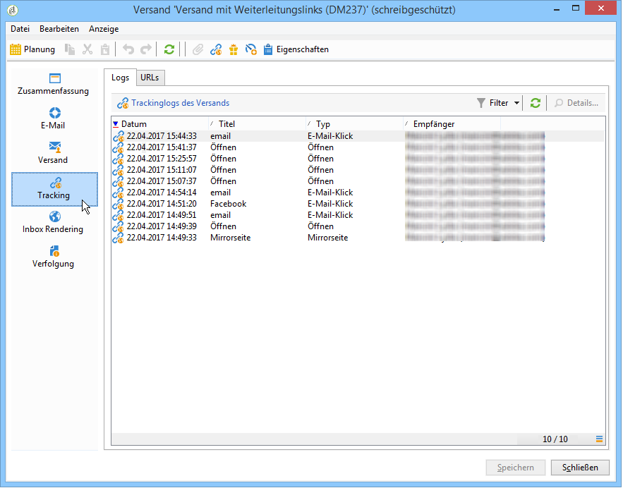

# Auf Trackinglogs zugreifen{#accessing-the-tracking-logs}

Der technische Workflow **[!UICONTROL Tracking]** hat die Aufgabe, nach dem Versand und der Aktivierung des Trackings die Tracking-Informationen abzurufen. Standardmäßig wird er stündlich ausgeführt.

Die derart gesammelten Informationen reichern die im **[!UICONTROL Tracking]**-Tab der Versandempfänger angezeigten Daten an:

Sie stehen darüber hinaus im **[!UICONTROL Tracking]**-Tab des entsprechenden Versands zur Verfügung.

>[!NOTE]
>
>Wenn der Tab **[!UICONTROL Tracking]** eines Versands nicht sichtbar ist, bedeutet dies, dass das Tracking nicht aktiviert wurde. Weiterführende Informationen dazu finden Sie in [diesem Abschnitt](../../delivery/using/how-to-configure-tracked-links.md).
