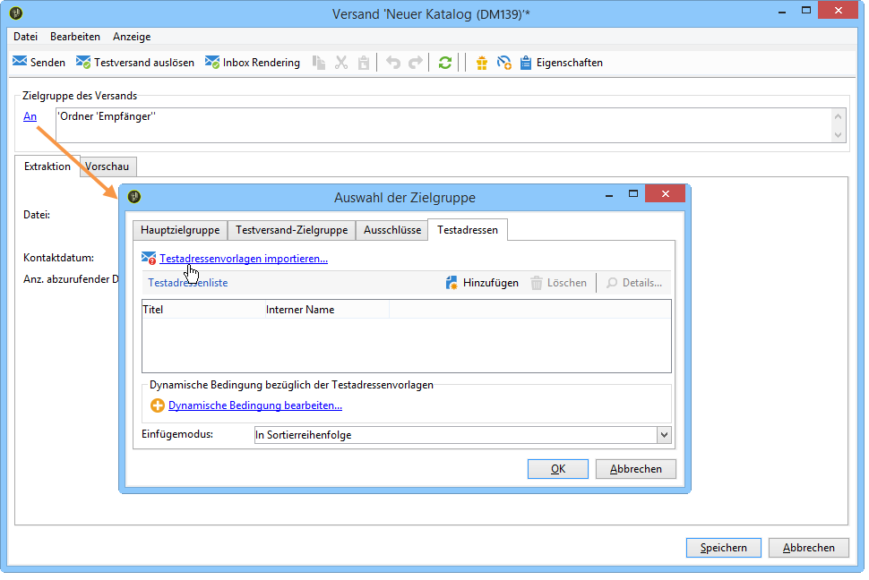
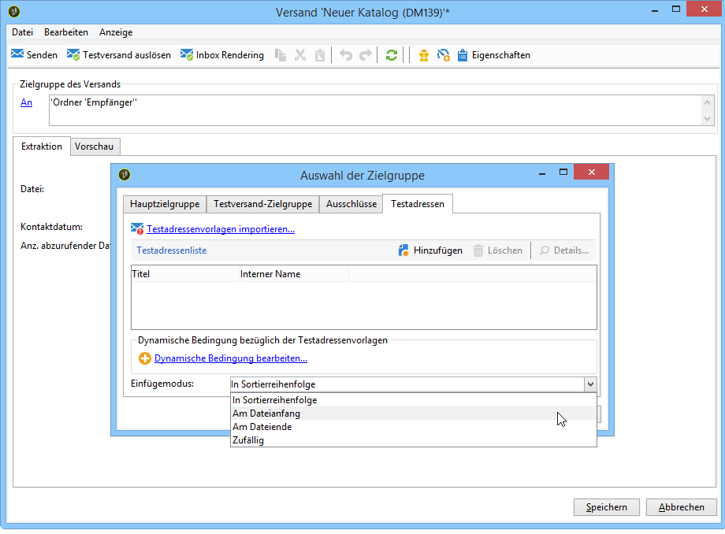
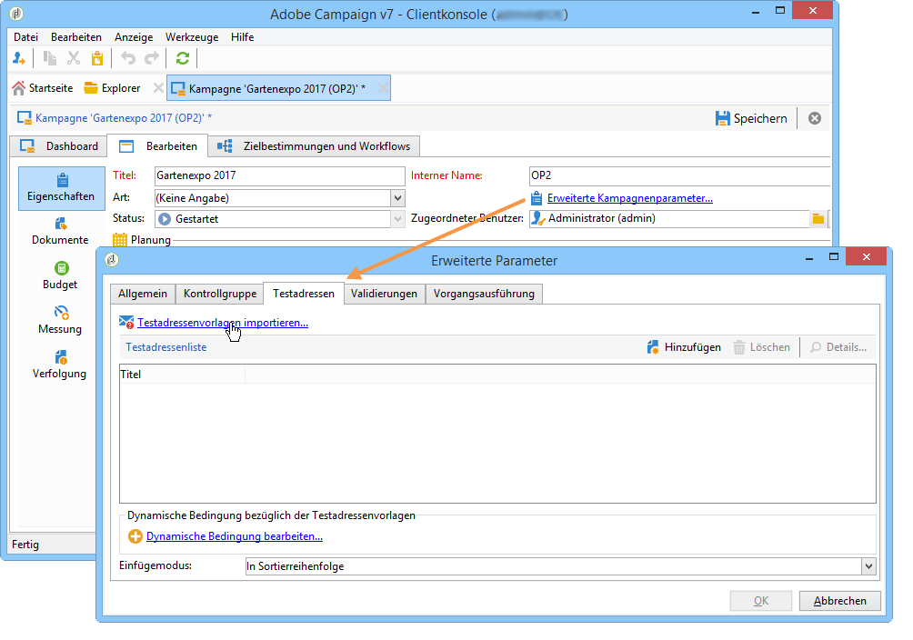

# Testadressen hinzufügen{#adding-seed-addresses}

## Testadressen in einem Versand {#seed-addresses-in-a-delivery}

Wählen Sie zum Hinzufügen spezifischer Testadressen für einen Versand den Link **[!UICONTROL An]** und danach den Tab **[!UICONTROL Testadressen]** aus.

Drei Einfügemodi stehen zur Verfügung:

1. Eingabe einzelner Testadressen.

   Klicken Sie auf die Schaltfläche **[!UICONTROL Hinzufügen]** und füllen Sie die Adressfelder aus. Dies ist für jede zu erstellende Adresse zu wiederholen. Weiterführende Informationen hierzu finden Sie in [diesem Abschnitt](../../message-center/using/managing-seed-addresses-in-transactional-messages.md#creating-a-seed-address).

1. Import von Adressenvorlagen, die je nach Bedarf angepasst werden können.

   Klicken Sie auf den Link **[!UICONTROL Testadressenvorlagen importieren...]** und wählen Sie den die Vorlagen enthaltenden Ordner. Weitere Informationen hierzu finden Sie unter [Testadressenvorlagen erstellen](../../delivery/using/creating-seed-addresses.md#creating-seed-address-templates).

   Bei Bedarf können Sie nun die Adressfelder anpassen, indem Sie entweder darauf doppelklicken oder **[!UICONTROL Details...]** auswählen.

1. Dynamische Auswahl der Testadressen durch Erstellen einer Filterbedingung.

   Klicken Sie auf den Link **[!UICONTROL Dynamische Bedingung bearbeiten...]** und geben Sie dann die Auswahlkriterien für die Testadressen an. Sie können beispielsweise alle in einem bestimmten Ordner enthaltenen Adressen oder die zu einer bestimmten Abteilung Ihres Unternehmens gehörigen Testadressen auswählen.

   Ein Beispiel hierfür finden Sie im Abschnitt [Anwendungsbeispiel: Auswahl von Testadressen nach Kriterien](../../delivery/using/use-case--selecting-seed-addresses-on-criteria.md).

>[!NOTE]
>
>Diese Option wird insbesondere dann verwendet, wenn dem Versand eine andere als die Standard-Empfängertabelle **nms:recipient** zugrunde liegt und die Inbox-Rendering-Funktion des Moduls **[!UICONTROL Zustellbarkeit]** von Adobe Campaign genutzt werden soll.
>
>Weitere Informationen hierzu finden Sie im Abschnitt [Externe Empfängertabelle verwenden](../../delivery/using/using-an-external-recipient-table.md) und in der Dokumentation zum [Inbox Rendering](../../delivery/using/inbox-rendering.md).

Bei Briefsendungen können Sie die Art der Adresseneinfügung in die Extraktionsdatei anpassen. Standardmäßig werden sie der Sortierreihenfolge der Ausgabedatei entsprechend eingeordnet. Sie haben jedoch die Möglichkeit, sie am Anfang oder am Ende der Datei bzw. zufällig inmitten der Empfänger der Hauptzielgruppe einzufügen.

## Testadressen in einer Kampagne {#seed-addresses-in-a-campaign}

Um Testadressen auf Kampagnenniveau in die Zielgruppe einzuschließen, wählen Sie den Tab **[!UICONTROL Bearbeiten]** aus.

Wählen Sie nun **[!UICONTROL Erweiterte Kampagnenparameter...]** und anschließend den Tab **[!UICONTROL Testadressen]** aus, wie unten dargestellt:

Die auf diese Weise angegebenen Testadressen werden bei jedem Versand dieser Kampagne zur Zielgruppe hinzugefügt.
