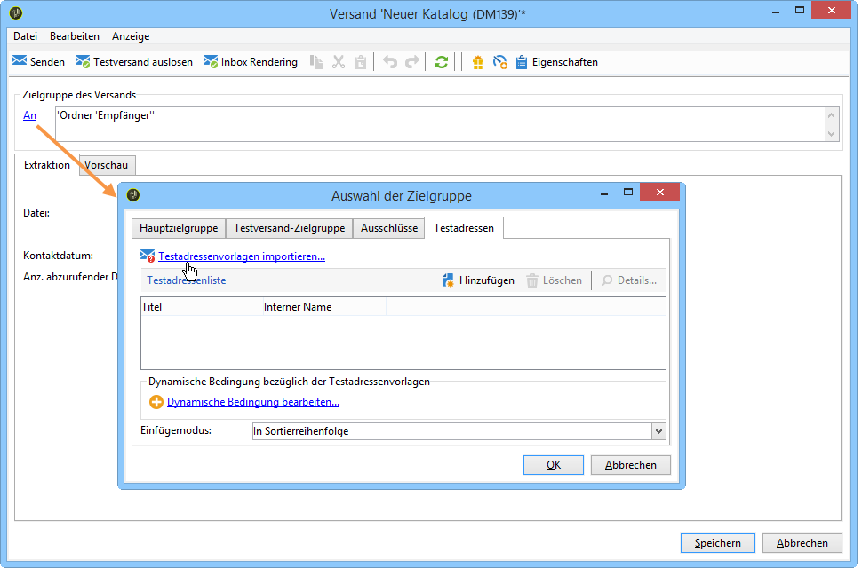
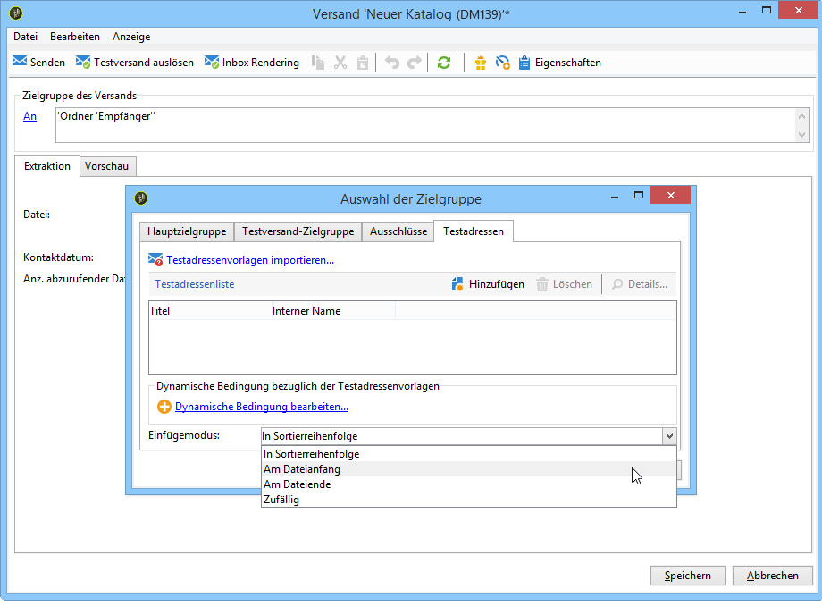
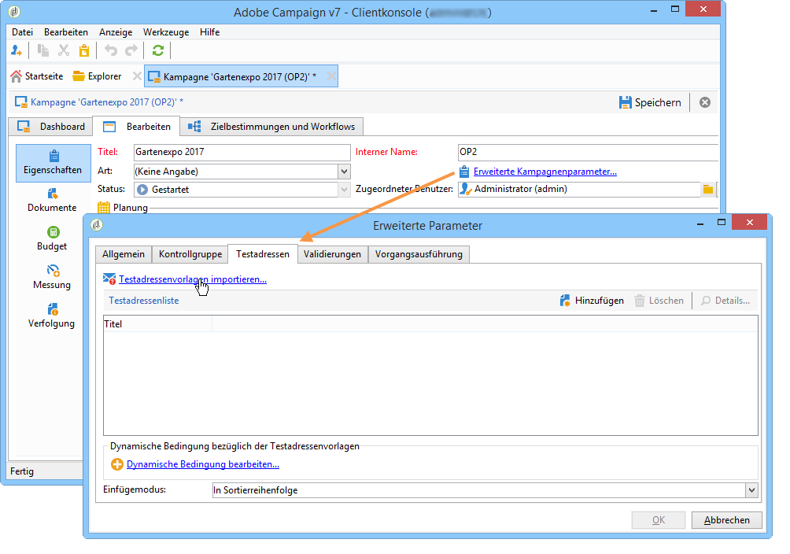

# Testadressen hinzufügen{#adding-seed-addresses}

## Testadressen in einem Versand {#seed-addresses-in-a-delivery}

Wählen Sie zum Hinzufügen spezifischer Testadressen für einen Versand den Link **[!UICONTROL An]** und danach den Tab **[!UICONTROL Testadressen]** aus.

Drei Einfügemodi stehen zur Verfügung:

1. Eingabe einzelner Testadressen.

   Klicken Sie dazu auf die Schaltfläche **[!UICONTROL Hinzufügen]** und definieren Sie den Inhalt der Adressfelder. Für jede Adresse wiederholen.

1. Import von Adressenvorlagen, die je nach Bedarf angepasst werden können.

   Klicken Sie auf den Link **[!UICONTROL Testadressenvorlagen importieren...]** und wählen Sie den die Vorlagen enthaltenden Ordner. Weiterführende Informationen hierzu finden Sie in [diesem Abschnitt](creating-seed-addresses.md#creating-seed-address-templates).

   Bei Bedarf können Sie nun die Adressfelder anpassen, indem Sie entweder darauf doppelklicken oder **[!UICONTROL Details...]** auswählen.

1. Dynamische Auswahl der Testadressen durch Erstellen einer Filterbedingung.

   Klicken Sie auf den Link **[!UICONTROL Dynamische Bedingung bearbeiten…]** und geben Sie dann die Auswahlkriterien für die Testadressen an. Sie können beispielsweise alle in einem bestimmten Ordner enthaltenen Testadressen oder die zu einer bestimmten Abteilung Ihres Unternehmens gehörigen Testadressen auswählen.

   Ein Beispiel hierfür finden Sie im Abschnitt [Anwendungsbeispiel: Auswahl von Testadressen nach Kriterien](use-case-selecting-seed-addresses-on-criteria.md).

>[!NOTE]
>
>Diese Option wird verwendet, wenn es sich bei der verwendeten Empfängertabelle nicht um die standardmäßige **nms:recipient**-Tabelle handelt und Sie die im Adobe Campaign-Modul **[!UICONTROL Zustellbarkeit]** bereitgestellte Inbox Rendering-Funktion verwenden.
>
>Weitere Informationen hierzu finden Sie im Abschnitt [Externe Empfängertabelle verwenden](using-an-external-recipient-table.md) und in der Dokumentation zum [Inbox Rendering](inbox-rendering.md).

Bei Sendungen können Sie auch die Art und Weise anpassen, wie Adressen in die Extraktionsdatei eingefügt werden. Standardmäßig werden sie in der Sortierreihenfolge der Ausgabedatei eingefügt. Sie können sie jedoch auch am Ende oder am Anfang der Datei oder nach dem Zufallsprinzip zwischen den Empfängerinnen und Empfängern der Hauptzielgruppe einfügen.

## Testadressen in einer Kampagne {#seed-addresses-in-a-campaign}

Um Testadressen auf Kampagnenniveau in die Zielgruppe einzuschließen, wählen Sie den Tab **[!UICONTROL Bearbeiten]** aus.

Wählen Sie nun **[!UICONTROL Erweiterte Kampagnenparameter...]** und anschließend den Tab **[!UICONTROL Testadressen]** aus, wie unten dargestellt:

Die auf diese Weise angegebenen Testadressen werden bei jedem Versand dieser Kampagne zur Zielgruppe hinzugefügt.
