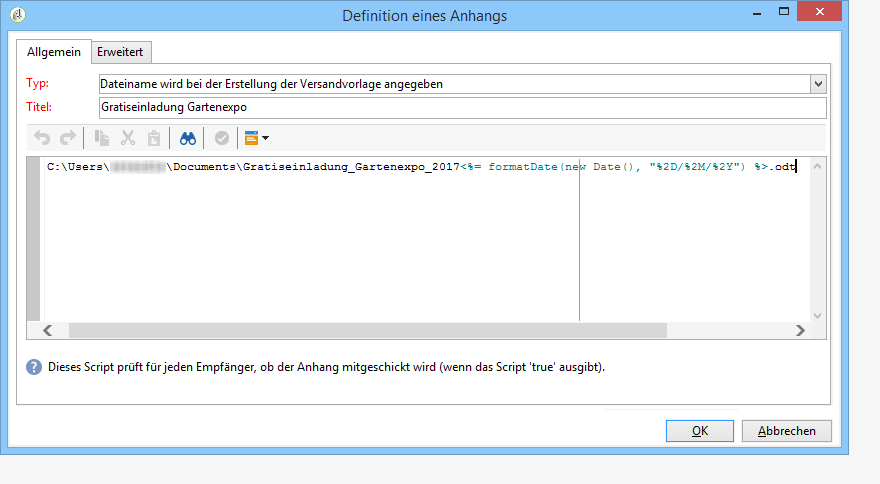

# Anhänge erstellen{#attaching-files}

## Über E-Mail-Anhänge {#about-email-attachments}

Ein E-Mail-Versand kann einen oder mehrere Anhänge aufweisen. Zwei Varianten stehen zur Auswahl:

* Datei unverändert anhängen.
* Personalize the content of the attachment for each recipient. In this case, you need to create a **calculated attachment**: the name of the attachment is computed at the time of delivery for each message depending on the recipient. The content can also be personalized and converted into PDF format at the time of delivery, if you have the **Variable Digital Printing** option.

>[!NOTE]
>
>Diese Konfiguration wird in der Regel in den Bereitstellungsvorlagen durchgeführt. For more on this, refer to [About templates](../../delivery/using/about-templates.md).

## Lokale Datei anhängen {#attaching-a-local-file}

Gehen Sie wie folgt vor, um eine lokale Datei an eine Auslieferung anzuhängen.

>[!NOTE]
>
>Sie können mehrere Dateien an eine Bereitstellung anhängen. Die Anlagen können in jedem beliebigen Format, im Zip-Format, vorliegen.

1. Klicken Sie auf den **[!UICONTROL Attachments]** Link.
1. Klicken Sie auf die **[!UICONTROL Add]** Schaltfläche und dann auf **[!UICONTROL File...]** , um die Datei auszuwählen, die an die Bereitstellung angehängt werden soll.

Sie können die Datei auch direkt in das **[!UICONTROL Attachments]** Lieferfeld ziehen und ablegen oder das **[!UICONTROL Attach]** Symbol in der Symbolleiste des Auslieferungs-Assistenten verwenden.

1. Nach Auswahl der Datei wird sie sofort auf den Server hochgeladen, damit sie zum Zeitpunkt der Bereitstellung verfügbar ist. Es wird im **[!UICONTROL Attachments]** Feld aufgeführt.

## Berechneten Anhang erstellen {#creating-a-calculated-attachment}

Bei berechneten Anhängen ist es möglich, den Titel des Anhangs zum Zeitpunkt der Analyse oder des Versandstarts zu berechnen. Außerdem können so Empfänger-spezifische Titel erstellt werden. Darüber hinaus besteht die Möglichkeit, die Anhänge als personalisierte PDF-Dateien zu versenden.

Gehen Sie wie folgt vor, um eine personalisierte Anlage zu erstellen:

1. Klicken Sie auf den **[!UICONTROL Attachments]** Link.
1. Klicken Sie auf die **[!UICONTROL Add]** Schaltfläche und wählen Sie **[!UICONTROL Calculated attachment]**.
1. Select the type of calculation from the **[!UICONTROL Type]** drop-down list:

Folgende Optionen stehen zur Verfügung:

* **Dateiname wird bei der Erstellung der Versandvorlage angegeben**
* **Dateiinhalt wird zum Zeitpunkt der Absendung für jede Nachricht personalisiert und in PDF konvertiert**
* **Dateiname wird bei der Versandanalyse berechnet (unabhängig vom Empfänger)**
* **Dateiname wird bei der Absendung für jede Nachricht berechnet (kann vom Empfänger abhängen)**

### Lokale Datei anhängen {#attach-a-local-file}

Wenn die Anlage eine lokale Datei ist, wählen Sie die Option aus: **[!UICONTROL File name is specified when creating the delivery template]**. Die Datei wird lokal ausgewählt und auf den Server hochgeladen. Gehen Sie wie folgt vor:

1. Select the file to upload in the **[!UICONTROL Local file]** field.
1. Vergeben Sie gegebenenfalls einen Titel. Der Titel ersetzt den Dateinamen bei der Anzeige in Messaging-Systemen. Wenn nicht anders angeben, wird standardmäßig der Dateiname verwendet.

   

1. Wählen Sie ggf. **[!UICONTROL Upload file on the server]** und klicken Sie dann auf **[!UICONTROL Update on server]** , um die Übertragung zu starten.

   

   Nun kann die Datei als Anhang der auf dieser Vorlage beruhenden Sendungen verwendet werden.

### Anhängen einer personalisierten Nachricht {#attach-a-personalized-message}

Mit dieser Option **[!UICONTROL The file content is personalized and converted into PDF format at the time of delivery for each message]** können Sie eine Feineinstellung mit Personalisierungsfeldern wie Nachname und Vorname des vorgesehenen Empfängers auswählen.

Gehen Sie wie folgt vor, um diese Art von Anhang zu konfigurieren:

1. Wählen Sie die hochzuladende Datei aus.

   >[!NOTE]
   >
   >Bitte beachten Sie, dass nur in LibreOffice erstellte Quelldateien unterstützt werden und dass die Konfiguration der Instanz wie in [diesem Abschnitt](../../installation/using/before-starting.md) beschrieben vorgenommen werden muss.

1. Vergeben Sie gegebenenfalls einen Titel.
1. Wählen Sie **[!UICONTROL Upload file on the server]** und klicken Sie dann auf **[!UICONTROL Update on server]** , um die Übertragung zu starten.
1. Sie können eine Vorschau erstellen, indem Sie auf einen Empfänger klicken.

   

1. Analysieren und starten Sie den Versand.

   Jeder Empfänger enthält eine personalisierte PDF-Datei im E-Mail-Anhang.

   

### Anhängen einer berechneten Datei {#attach-a-calculated-file}

Sie können den Anlagennamen während der Bereitstellungsvorbereitung berechnen. Wählen Sie dazu die Option **[!UICONTROL The file name is calculated during delivery analysis (it cannot depend on the recipient)]**.

>[!NOTE]
>
>Diese Option ist nur für Sendungen vorgesehen, die durch einen externen Vorgang oder einen Workflow abgeschickt werden.

1. Geben Sie den Titel an, der für den Anhang verwendet werden soll.
1. Geben Sie den Pfad und den genauen Namen der Datei im Eingabefenster an.

   >[!CAUTION]
   >
   >Die Datei muss sich auf dem Server befinden.

   

1. Analysieren und starten Sie den Versand.

   Im Analyseprotokoll können Sie die Berechnung des Dateinamens nachvollziehen.

   

### Anhängen einer personalisierten Datei {#attach-a-personalized-file}

Wenn Sie die Anlage auswählen, können Sie die Option auswählen **[!UICONTROL The file name is calculated during delivery for each recipient (it can depend on the recipient)]**. Anschließend können Sie Personalisierungsdaten von Empfängern mit dem Namen der zu sendenden Datei zuordnen.

>[!NOTE]
>
>Diese Option ist nur für Sendungen vorgesehen, die durch einen externen Vorgang oder einen Workflow abgeschickt werden.

1. Geben Sie den Titel an, der für den Anhang verwendet werden soll.
1. Geben Sie den Pfad und den genauen Namen der Datei im Editor an. Wenn der Dateiname je nach Empfänger angepasst werden soll, können Sie die entsprechenden Personalisierungsfelder einfügen.

   

   >[!CAUTION]
   >
   >Die Datei muss sich auf dem Server befinden.

1. Analysieren und starten Sie den Versand.

   In unten stehendem Beispiel wurde die angehängte Datei über den mithilfe der Personalisierungsfelder konfigurierten Namen gewählt.

   

### Einstellungen für den Anhang {#attachment-settings}

Für die ersten beiden Optionen können Sie **[!UICONTROL Upload file on the server]** die entsprechende Option auswählen. Über den **[!UICONTROL Update the file on the server]** Link können Sie mit dem Hochladen beginnen.

Eine Nachricht bestätigt, dass die Datei erfolgreich hochgeladen wurde:

Ein Warnhinweis erscheint, wenn die Datei geändert wurde:

The **[!UICONTROL Advanced]** tab lets you define advanced options on attached files:

* Sie können Filteroptionen definieren, um zu vermeiden, dass die angehängte Datei an alle Empfänger gesendet wird. Die Option **[!UICONTROL Enable filtering of recipients who will receive the attachment]** aktiviert ein Eingabefeld, das zum Definieren eines Skripts für die Empfängerauswahl verwendet wird, das in JavaScript eingegeben werden muss.
* Erstellung eines Scripts, um den Dateinamen zu personalisieren.

   Geben Sie unter Verwendung der Dropdown-Liste mit den Personalisierungsfeldern im Eingabefenster den gewünschten Text ein. In unten stehendem Beispiel wurde der Dateiname mit dem Tagesdatum und dem Nachnamen des Empfängers personalisiert.

   
