# Automatisieren mit Workflows{#automating-via-workflows}

## Content-Management-Aktivitäten {#content-management-activity}

Die Erstellung, Bearbeitung und Veröffentlichung von Inhalten kann mithilfe eines in der Adobe Campaign-Clientkonsole konfigurierten Workflows automatisiert werden.

Die Aktivität **Content-Management** ist in der **[!UICONTROL Werkzeug]**-Symbolleiste des Workflow-Diagramms enthalten.

Vier Aktivitätseigenschaften sind zu konfigurieren:

* **[!UICONTROL Inhalt]** - Auswahl eines existierenden oder Erstellung eines neuen Inhalts;
* **[!UICONTROL Inhalt aktualisieren]** - Änderung des Betreffs oder Aktualisierung des Inhalts mit einem XML-Stream;
* **[!UICONTROL Auszuführende Aktion]** - Speicherung oder Erzeugung des Inhalts;
* **[!UICONTROL Transition]** - Erzeugung und Benennung einer ausgehenden Transition.

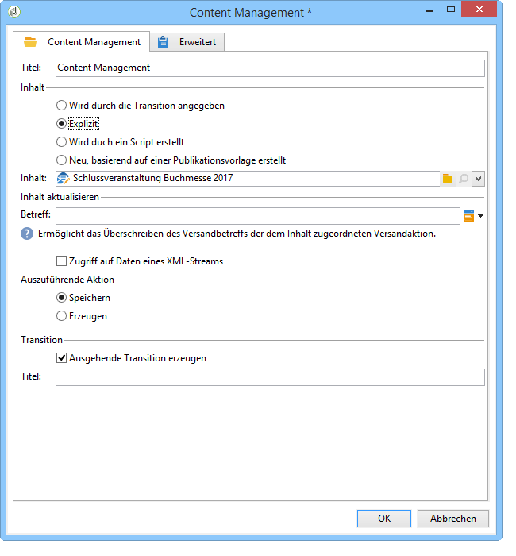

### Content {#content}

* **Wird durch die Transition angegeben**

  Der zu verwendende Inhalt wurde zuvor erstellt. Die Prozesse beziehen sich auf die vom eingehenden Ereignis übernommene Inhaltsinstanz. Auf die Inhaltskennung kann über die Variable „contentId“ des Ereignisses zugegriffen werden.

* **Explizit**

  Ermöglicht die Auswahl eines zuvor erstellten Inhalts.

* **Wird durch ein Script erstellt**

  Wählt eine auf einer JavaScript-Vorlage basierende Inhaltsinstanz aus. Mit dem auszuwertenden Code können Sie die Inhaltskennung abrufen.

* **Neu, basierend auf einer Veröffentlichungsvorlage erstellt**

  Erstellt neue Inhalte über eine Publikationsvorlage. Die Inhaltsinstanz wird im angegebenen Ordner „String“ gespeichert.

### Inhalt aktualisieren {#update-the-content}

* **Betreff**

  Ermöglicht bei der Veröffentlichung die Anpassung des Versandbetreffs.

* **Zugriff auf Daten eines XML-Streams**

  Der Inhalt wird mit einem XML-Stream aktualisiert, der aus einer externen Quelle stammt. Um Daten herunterzuladen, muss eine URL eingegeben werden.

  Mithilfe eines XSL-Stylesheets können dann die eingehenden XML-Daten umgewandelt werden.

### Auszuführende Aktion {#action-to-execute}

* **Speichern**

  Speichert den erstellten oder geänderten Inhalt. Die Kennung des gespeicherten Inhalts wird in die Variable „contentId“ des ausgehenden Ereignisses übernommen.

* **Erzeugen**

  Erzeugt die Ausgabedateien für jede Umwandlungsvorlage mit einer Veröffentlichung vom Typ „Datei“. In diesem Fall wird die ausgehende Transition für jede erzeugte Datei mit folgenden Parametern aktiviert: die Kennung des gespeicherten Inhalts in der Variablen „contentId“ und der Dateiname in der Variablen „filename“.

### Transition {#transition}

Mit der Option **Ausgehende Transition erzeugen** können Sie eine ausgehende Transition zur Aktivität **[!UICONTROL Content-Management]** hinzufügen, um eine neue Aktivität mit der Workflow-Ausführung zu verknüpfen. Geben Sie nach Aktivierung dieser Option einen Titel für die Transition ein.

## Beispiele {#examples}

### Inhaltserstellung und -versand automatisieren {#automating-content-creation-and-delivery}

Folgender Workflow automatisiert die Erstellung und den Versand eines Inhalts:

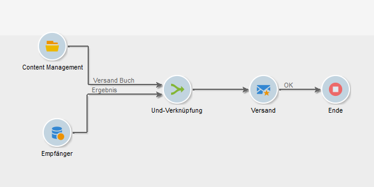

Der Inhalt wird in der Aktivität &quot;Content-Management&quot; konfiguriert:

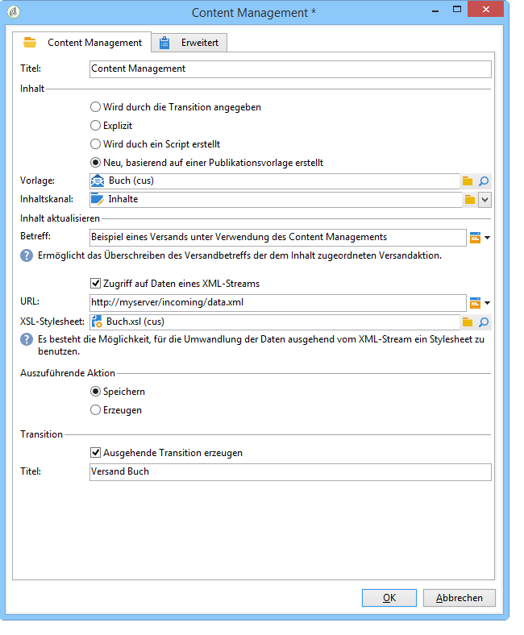

Ausgehend von der Veröffentlichungsvorlage wird im Inhaltskanal-Ordner eine neue Inhaltsinstanz erstellt.

Im vorliegenden Beispiel wurde der Versandbetreff überschrieben. Er ersetzt den in der Versandvorlage der **[!UICONTROL Versand]**-Aktivität angegebenen Betreff.

Der Inhalt wird automatisch durch den von der angegebenen URL heruntergeladenen XML-Stream ergänzt:

```
<?xml version='1.0' encoding='ISO-8859-1'?>
<book name="Content automation test" date="2008/06/08" language="eng" computeString="Content automation test">
  <section id="1" name="Introduction">
    <page>Introduction to input forms.</page>
  </section>
</book>
```

Das Datenformat stimmt nicht mit dem Datenschema überein, das in der Veröffentlichungsvorlage eingegeben wurde (**cus:book** in unserem Beispiel); das Element „**`<section>`**“ muss durch das Element „**`<chapter>`**“ ersetzt werden. Sie müssen das Stylesheet „cus:book-workflow.xsl“ anwenden, um die notwendigen Änderungen vorzunehmen.

Quellcode des verwendeten XSLT-Stylesheets:

```
<?xml version="1.0" encoding="utf-8"?>
<xsl:stylesheet version="1.0" xmlns:xsl="http://www.w3.org/1999/XSL/Transform">
 <xsl:output indent="yes" method="xml"  encoding="ISO-8859-1"/>

 <xsl:template match="text()|@*"/>

  <xsl:template match="*">
    <xsl:variable name="element.name" select="name(.)"/>
    <xsl:element name="{$element.name}">
      <xsl:copy-of select="text()|@*"/>
      <xsl:apply-templates/>
    </xsl:element>
  </xsl:template>

  <xsl:template match="book">
  <book name="test">
     <xsl:apply-templates/>
    <book>
 </xsl:template>

  <xsl:template match="section">
    <chapter>
      <xsl:for-each select="@*">
        <xsl:copy-of select="."/>
      </xsl:for-each>
       <xsl:apply-templates/>
    </chapter>
  </xsl:template>
  
</xsl:stylesheet>
```

Die Content-Management-Aktivität endet mit der Speicherung der Inhaltsinstanz und dem Übergang zur nächsten Aktivität.

Die Zielgruppenbestimmung erfolgt mithilfe der **Abfrage**-Aktivität.

Damit der Versand erst gestartet wird, wenn die Zielgruppenabfrage und die Aktualisierung des Inhalts abgeschlossen sind, wurde eine **Und-Verknüpfung** hinzugefügt.

Die Konfiguration des Versands erfolgt in der **Versand**-Aktion:

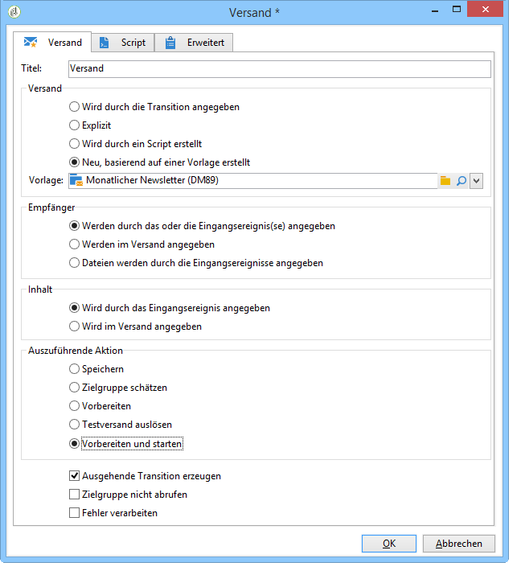

Bei Erstellung eines neuen Versands ist die Angabe der Vorlage erforderlich.

Die Versandvorlage der Aktivität wird zum Auswählen der Umwandlungsvorlagen der Publikationsvorlage verwendet. Die Inhaltsgenerierung berücksichtigt alle HTML- und Textvorlagen ohne Versandvorlagen oder jene, die mit derselben Vorlage wie die Aktivität referenziert werden.

Empfänger und Inhalt des Versands

werden im eingehenden Ereignis angegeben.

Die Aktivität endet mit der Vorbereitung und dem Start des Versands.

### Inhalte für spätere Veröffentlichungen erstellen {#creating-content-and-publishing-it-later}

Dieser Workflow erstellt einen Inhalt, die Datei-Veröffentlichung erfolgt jedoch zu einem späteren Zeitpunkt.

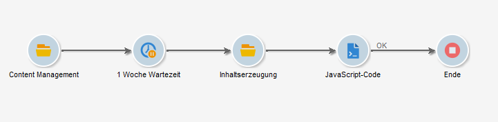

Die erste **Content-Management**-Aktivität erstellt eine Inhaltsinstanz.

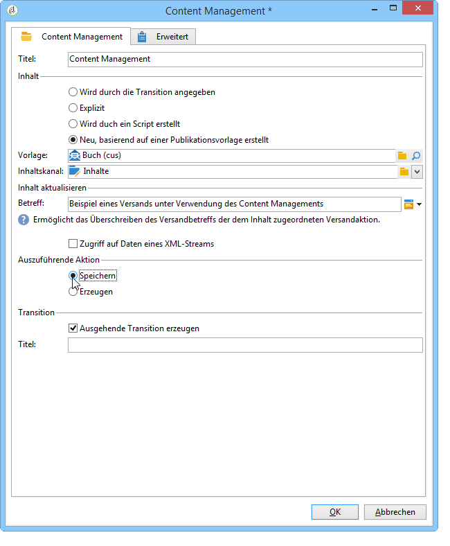

>[!NOTE]
>
>Im **[!UICONTROL Veröffentlichung]**-Tab der Umwandlungsvorlagen ist der Speicherort der zu erzeugenden Zielgruppe anzugeben.

Eine Warte-Aktivität setzt die nachfolgende Transition für die Dauer einer Woche aus.

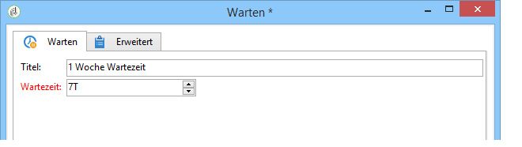

Der Inhalt wird während dieser Zeitspanne manuell angegeben.

Die nachfolgende Aktivität startet die Inhaltserzeugung.

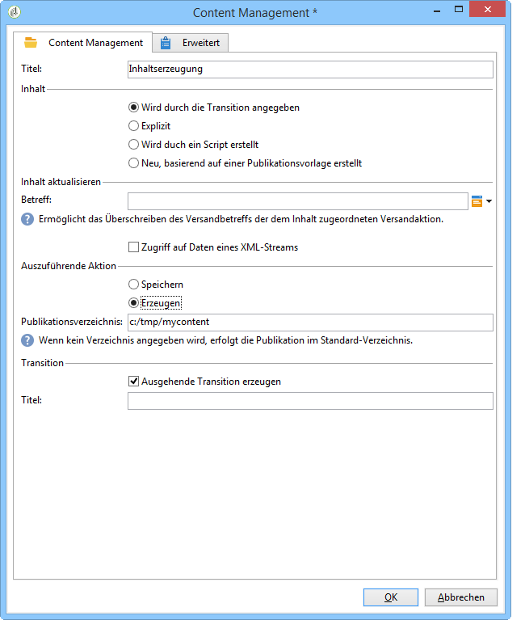

Der zu veröffentlichende Inhalt wird in der eingehenden Transition angegeben.

Die Aktivität endet mit der Erzeugung des Inhalts unter Verwendung des angegebenen Veröffentlichungsverzeichnisses.

Die Aktivität **JavaScript-Code** ruft den kompletten Namen jeder erzeugten Datei ab.

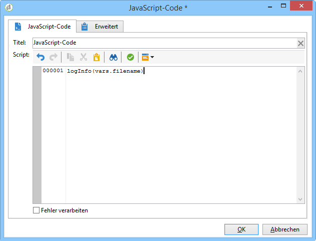

### Versand und Inhalt erstellen {#creating-the-delivery-and-its-content}

Der folgende Workflow entspricht dem ersten Beispiel, beginnt jedoch mit der Erstellung des Versands.

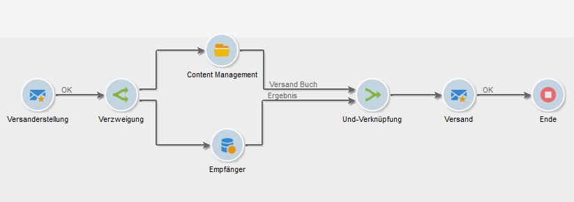

In der ersten **Versanderstellungs**-Aktivität wird der Versand konfiguriert.

Die Verzweigung ermöglicht die parallele Ausführung der Zielgruppenberechnung und der Erstellung der Inhaltsinstanz.

Nach Abschluss dieser beiden Aktivitäten aktiviert die Und-Verknüpfung die **Versand**-Aktivität mit dem Inhalt und der Zielgruppenbestimmung, die zuvor definiert wurden.

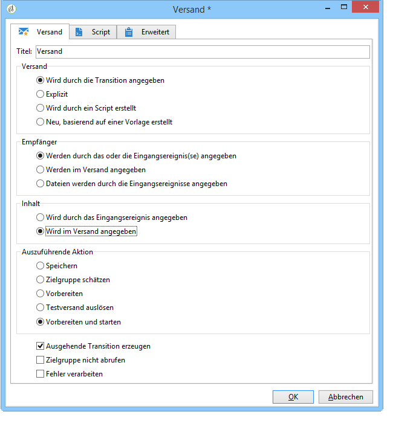

Die zu startende Versandaktion wird in der eingehenden Transition angegeben.

Empfänger und Inhalt des Versands

werden im eingehenden Ereignis angegeben.

Die Aktivität endet mit der Vorbereitung und dem Start des Versands.

### Inhalt von FTP importieren {#importing-content-from-ftp}

Wenn Ihr Versandinhalt in einer auf FTP- oder SFTP-Servern befindlichen HTML-Datei verfügbar ist, können Sie diesen Inhalt einfach in Adobe Campaign-Sendungen laden. Weitere Informationen finden Sie in der [Dokumentation zu Campaign v8](https://experienceleague.adobe.com/docs/campaign/automation/workflows/use-cases/deliveries/load-delivery-content.html?lang=de){target="_blank"}.


### Inhalt von Amazon Simple Storage Service-Connector (S3) importieren {#importing-content-from-amazon-simple-storage-service--s3--connector}

Wenn Ihr Versandinhalt in Amazon Simple Storage Service (S3) Buckets verfügbar ist, können Sie diesen Inhalt einfach in Adobe Campaign-Sendungen laden. Weitere Informationen finden Sie in der [Dokumentation zu Campaign v8](https://experienceleague.adobe.com/docs/campaign/automation/workflows/use-cases/deliveries/load-delivery-content.html?lang=de){target="_blank"}.


## Halbautomatische Aktualisierung {#semi-automatic-update}

Inhaltsdaten können im „halbautomatischen“ Modus aktualisiert werden. Die Daten werden von einem XML-Stream über eine URL abgerufen.

Die Aktivierung des Datenabrufs geschieht manuell über ein Formular.

Das Ziel besteht darin, ein **editBtn**-Feld **`<input>`** im Formular zu deklarieren. Dieses Steuerelement umfasst eine Bearbeitungszone und eine Schaltfläche zum Starten der Verarbeitung.

Die variablen Daten für die Erstellung der URL des XML-Streams der abzurufenden Daten werden im Editor erfasst.

Die Betätigung der Schaltfläche löst die **GetAndTransform**-SOAP-Methode aus, die unter dem **`<input>`**-Tag notiert ist.

Das Steuerelement wird im Formular wie folgt deklariert:

```
<input type="editbtn" xpath="<path>">
  <enter>
    <soapCall name="GetAndTransform" service="ncm:content">
      <param exprIn="<url>" type="string"/>
      <param exprIn="'xtk:xslt|<style sheet>'" type="string"/>
      <param type="DOMElement" xpathOut="<output path>"/>
    </soapCall>
  </enter>
</input>
```

Die **GetAndTransform**-Methode muss unter dem **`<enter>`**-Element des **`<input>`**-Tags deklariert werden. Dieses Tag akzeptiert als Parameter die URL der Wiederherstellung von XML-Daten aus einem dynamisch erstellten Ausdruck. Der zweite Parameter der Funktion ist optional und verweist auf ein Stylesheet, das für eine Zwischentransformation verwendet wird, wenn die eingehenden XML-Daten nicht im gleichen Format wie der Inhalt vorliegen.

Die Aktualisierung der Inhaltsinstanz geschieht ausgehend vom im letzten Parameter angegebenen Pfad.

**Beispiel**: Anhand des Schemas „cus:book“ wird diese Funktion näher erläutert.

Das Formular wird um ein Eingabefeld für die halbautomatische Aktualisierung ergänzt:

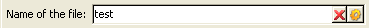

```
<input label="File name" type="editbtn" xpath="/tmp/@name">
  <enter>
    <soapCall name="GetAndTransform" service="ncm:content">
      <param exprIn="'https://myserver.adobe.com/incoming/' + [/tmp/@name] + '.xml'" type="string"/>
      <param exprIn="'xtk:xslt|cus:book-workflow.xsl'" type="string"/>
      <param type="DOMElement" xpathOut="."/>
    </soapCall>
  </enter>
</input>
```

Im Eingabefeld können Sie den Namen der abzurufenden Datei eingeben. Die URL basiert beispielsweise auf folgendem Namen: https://myserver.adobe.com/incomin/data.xml

Das Format der abzurufenden Daten ist das gleiche wie im ersten Beispiel bezüglich der Workflow-Automatisation. Es wird erneut das dort erwähnte Stylesheet „cus:book-workflow.xsl“ verwendet.

Aus der Ausführung des Auftrags resultiert die Aktualisierung der Inhaltsinstanz ausgehend vom Pfad &#39;.&#39;.
