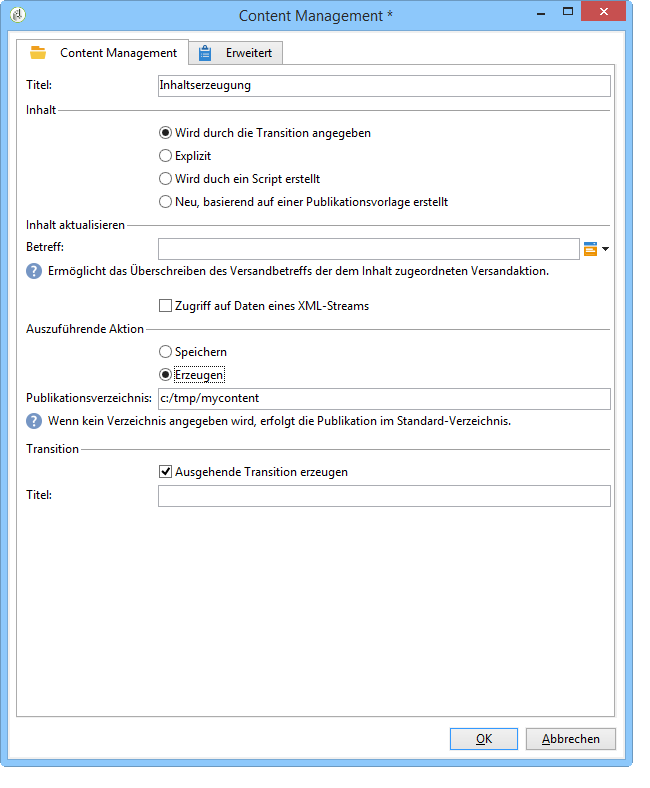

# Mit Workflows automatisieren{#automating-via-workflows}

## Inhaltsverwaltungsaktivitäten {#content-management-activity}

Die Erstellung, Bearbeitung und Veröffentlichung von Inhalten kann mithilfe eines in der Adobe-Campaign-Clientkonsole konfigurierten Workflows automatisiert werden.

Die Aktivität **Content Management** ist in der **[!UICONTROL Werkzeug]**-Symbolleiste des Workflow-Diagramms enthalten.

Vier Aktivitätseigenschaften sind zu konfigurieren:

* **[!UICONTROL Inhalt]** - Auswahl eines existierenden oder Erstellung eines neuen Inhalts;
* **[!UICONTROL Inhalt aktualisieren]** - Änderung des Betreffs oder Aktualisierung des Inhalts mit einem XML-Stream;
* **[!UICONTROL Auszuführende Aktion]** - Speicherung oder Erzeugung des Inhalts;
* **[!UICONTROL Transition]** - Erzeugung und Benennung einer ausgehenden Transition.


### Content {#content}

* **Wird durch die Transition angegeben**

   Der zu verwendende Inhalt wurde zuvor erstellt, die Bearbeitungsvorgänge beziehen sich auf die Inhaltsinstanz, welche vom Eingangsereignis übernommen wurde. Auf die Kennung des Inhalts kann über die Variable &quot;contentId&quot; des Ereignisses zugegriffen werden.

* **Explizit**

   Ermöglicht die Auswahl eines zuvor erstellten Inhalts.

* **Wird durch ein Script erstellt**

   Wählt eine Inhaltsinstanz ausgehend von einem JavaScript-Template aus. Der auszuwertende Code ermöglicht den Abruf der Inhaltskennung.

* **Neu, basierend auf einer Veröffentlichungsvorlage erstellt**

   Erstellt einen neuen Inhalt ausgehend von einer Veröffentlichungsvorlage. Die Inhaltsinstanz wird im angegebenen &quot;Inhaltskanal&quot;-Ordner gespeichert.

### Inhalt aktualisieren {#update-the-content}

* **Betreff**

   Ermöglicht bei der Veröffentlichung die Anpassung des Versandbetreffs.

* **Zugriff auf Daten eines XML-Streams**

   Der Inhalt wird mit einem XML-Stream aktualisiert, der aus einer externen Quelle stammt. Zum Download der Daten muss die entsprechende URL angegeben werden.

   Mithilfe eines XSL-Stylesheets können dann die eingehenden XML-Daten umgewandelt werden.

### Auszuführende Aktion {#action-to-execute}

* **Speichern**

   Speichert den erstellten oder geänderten Inhalt. Die Kennung des Inhalts wird in der Variablen &quot;contentID&quot; des ausgehenden Ereignisses übernommen.

* **Erzeugen**

   Erzeugt die Ausgabedateien für jede Veröffentlichungsvorlage mit Typ &quot;Datei&quot;. Die ausgehende Transition wird für jede erzeugte Datei aktiviert, wobei die in der Variablen &quot;contentID&quot; gespeicherte Inhaltskennung und der in der Variable &quot;filename&quot; gespeicherte Dateiname als Parameter übergeben werden.

### Transition {#transition}

Die Option **Ausgehende Transition erzeugen** fügt der Aktivität **[!UICONTROL Content Management]** eine Transition hinzu, damit der Workflow mit einer neuen Aktivität fortgesetzt werden kann. Wenn Sie diese Option ankreuzen, ist die Angabe eines Titels für die Transition erforderlich.

## Beispiele     {#examples}

### Automatisieren der Inhaltserstellung und des Versands {#automating-content-creation-and-delivery}

Folgender Workflow automatisiert die Erstellung und den Versand eines Inhalts:


Der Inhalt wird in der Aktivität &quot;Content Management&quot; konfiguriert:


Ausgehend von der Veröffentlichungsvorlage wird im Inhaltskanal-Ordner eine neue Inhaltsinstanz erstellt.

Im vorliegenden Beispiel wurde der Versandbetreff überschrieben. Er ersetzt den in der Versandvorlage der **[!UICONTROL Versand]**-Aktivität angegebenen Betreff.

Der Inhalt wird automatisch durch den von der angegebenen URL heruntergeladenen XML-Stream ergänzt:

```
<?xml version='1.0' encoding='ISO-8859-1'?>
<book name="Content automation test" date="2008/06/08" language="eng" computeString="Content automation test">
  <section id="1" name="Introduction">
    <page>Introduction to input forms.</page>
  </section>
</book>
```

Das Datenformat stimmt nicht mit dem Datenschema überein, das in der Veröffentlichungsvorlage eingegeben wurde (**cus:book** in unserem Beispiel); das **`<section>`**-Element muss durch das **`<chapter>`** Element ersetzt werden. Sie müssen das Stylesheet „cus:book-workflow.xsl“ anwenden, um die notwendigen Änderungen vorzunehmen.

Quellcode des verwendeten XSLT-Stylesheets:

```
<?xml version="1.0" encoding="utf-8"?>
<xsl:stylesheet version="1.0" xmlns:xsl="http://www.w3.org/1999/XSL/Transform">
 <xsl:output indent="yes" method="xml"  encoding="ISO-8859-1"/>

 <xsl:template match="text()|@*"/>

  <xsl:template match="*">
    <xsl:variable name="element.name" select="name(.)"/>
    <xsl:element name="{$element.name}">
      <xsl:copy-of select="text()|@*"/>
      <xsl:apply-templates/>
    </xsl:element>
  </xsl:template>

  <xsl:template match="book">
  <book name="test">
     <xsl:apply-templates/>
    <book>
 </xsl:template>

  <xsl:template match="section">
    <chapter>
      <xsl:for-each select="@*">
        <xsl:copy-of select="."/>
      </xsl:for-each>
       <xsl:apply-templates/>
    </chapter>
  </xsl:template>
  
</xsl:stylesheet>
```

Die Content-Management-Aktivität endet mit der Speicherung der Inhaltsinstanz und dem Übergang zur nächsten Aktivität.

Die Zielgruppe wird mithilfe der **Abfrage**-Aktivität bestimmt.

Damit der Versand erst gestartet wird, wenn die Zielgruppenabfrage und die Aktualisierung des Inhalts abgeschlossen sind, wurde eine **Und-Verknüpfung** hinzugefügt.

Die Konfiguration des Versands erfolgt in der **Versand**-Aktion:


Bei Erstellung eines neuen Versands ist die Angabe der Vorlage erforderlich.

Hier werden die Umwandlungsvorlagen aus der Veröffentlichungsvorlage als Versandvorlage verwendet. Bei der Inhaltserzeugung werden die HTML- und Text-Vorlagen genutzt, wenn sie keine verknüpfte Versandvorlage haben oder mit derselben Vorlage wie der in der Aktivität angegebenen referenziert sind.

Empfänger und Inhalt des Versands

werden im eingehenden Ereignis angegeben.

Die Aktivität endet mit der Vorbereitung und dem Start des Versands.

### Erstellen von Inhalten für spätere Veröffentlichungen {#creating-content-and-publishing-it-later}

Dieser Workflow erstellt einen Inhalt, die Datei-Veröffentlichung erfolgt jedoch zu einem späteren Zeitpunkt.


Die erste **Content-Management**-Aktivität erstellt eine Inhaltsinstanz.


>[!NOTE]
>
>Im **[!UICONTROL Veröffentlichung]**-Tab der Umwandlungsvorlagen ist der Speicherort der zu erzeugenden Zielgruppe anzugeben.

Eine Warte-Aktivität setzt die nachfolgende Transition für die Dauer einer Woche aus.


Der Inhalt wird während dieser Zeitspanne manuell angegeben.

Die nachfolgende Aktivität startet die Inhaltserzeugung.



Der zu veröffentlichende Inhalt wird in der eingehenden Transition angegeben.

Die Aktivität endet mit der Erzeugung des Inhalts unter Verwendung des angegebenen Veröffentlichungsverzeichnisses.

Die Aktivität **JavaScript-Code** speichert den kompletten Namen jeder erzeugten Datei.


### Erstellen Sie den Versand und dessen Inhalt {#creating-the-delivery-and-its-content}

Der folgende Workflow entspricht dem ersten Beispiel, beginnt jedoch mit der Erstellung des Versands.


In der ersten **Versanderstellung**-Aktivität wird der Versand konfiguriert.

Die Verzweigung ermöglicht die parallele Ausführung der Zielgruppenberechnung und der Erstellung der Inhaltsinstanz.

Nach Abschluss dieser beiden Aktivitäten aktiviert die Und-Verknüpfung die **Versand**-Aktivität mit dem Inhalt und der Zielgruppe, die zuvor definiert wurden.


Die zu startende Versandaktion wird in der eingehenden Transition angegeben.

Empfänger und Inhalt des Versands

werden im eingehenden Ereignis angegeben.

Die Aktivität endet mit der Vorbereitung und dem Start des Versands.

### Importieren von Inhalten aus FTP {#importing-content-from-ftp}

Wenn Ihr Versandinhalt in einer auf FTP- oder SFTP-Servern befindlichen HTML-Datei verfügbar ist, können Sie diesen Inhalt einfach in Adobe-Campaign-Sendungen laden. In [diesem Beispiel](../../workflow/using/loading-delivery-content.md) wird dies näher erläutert.

### Importieren von Inhalten aus Amazon Simple Datenspeicherung Service (S3) Connector {#importing-content-from-amazon-simple-storage-service--s3--connector}

Wenn Ihr Versandinhalt in Amazon Simple Storage Service (S3) Buckets verfügbar ist, können Sie diesen Inhalt einfach in Adobe-Campaign-Sendungen laden. In [diesem Beispiel](../../workflow/using/loading-delivery-content.md) wird dies näher erläutert.

## Halbautomatische Aktualisierung {#semi-automatic-update}

Inhaltsdaten können in einem halbautomatischen Modus aktualisiert werden. Die Daten der Aktualisierung stammen aus einem XML-Stream, auf den über eine URL zugegriffen wird.

Die Aktivierung des Datenabrufs geschieht manuell über ein Formular.

Das Ziel besteht darin, ein **editBtn**-Feld **`<input>`** im Formular zu deklarieren. Dieses Steuerelement umfasst eine Bearbeitungszone und eine Schaltfläche zum Starten der Verarbeitung.

Die variablen Daten für die Erstellung der URL des XML-Streams der abzurufenden Daten werden im Editor erfasst.

Die Betätigung der Schaltfläche löst die **GetAndTransform**-SOAP-Methode aus, die unter dem **`<input>`**-Tag notiert ist.

Das Steuerelement wird im Formular wie folgt deklariert:

```
<input type="editbtn" xpath="<path>">
  <enter>
    <soapCall name="GetAndTransform" service="ncm:content">
      <param exprIn="<url>" type="string"/>
      <param exprIn="'xtk:xslt|<style sheet>'" type="string"/>
      <param type="DOMElement" xpathOut="<output path>"/>
    </soapCall>
  </enter>
</input>
```

Die **GetAndTransform**-Methode muss unter dem **`<enter>`**-Element des **`<input>`**-Tags deklariert werden. Dieses Tag akzeptiert als Parameter die URL der Wiederherstellung von XML-Daten aus einem dynamisch erstellten Ausdruck. Der zweite Parameter der Funktion ist optional und verweist auf ein Stylesheet, das für eine Zwischentransformation verwendet wird, wenn die eingehenden XML-Daten nicht im gleichen Format wie der Inhalt vorliegen.

Die Aktualisierung der Inhaltsinstanz geschieht ausgehend vom im letzten Parameter angegebenen Pfad.

**Beispiel**: Anhand des Schemas &quot;cus:Buch&quot; wird diese Funktion näher erläutert.

Das Formular wird um ein Eingabefeld für die halbautomatische Aktualisierung ergänzt:


```
<input label="File name" type="editbtn" xpath="/tmp/@name">
  <enter>
    <soapCall name="GetAndTransform" service="ncm:content">
      <param exprIn="'https://myserver.adobe.com/incoming/' + [/tmp/@name] + '.xml'" type="string"/>
      <param exprIn="'xtk:xslt|cus:book-workflow.xsl'" type="string"/>
      <param type="DOMElement" xpathOut="."/>
    </soapCall>
  </enter>
</input>
```

Im Eingabefeld können Sie den Namen der abzurufenden Datei eingeben. Die URL basiert beispielsweise auf folgendem Namen: https://myserver.adobe.com/incomin/data.xml

Das Format der abzurufenden Daten ist das gleiche wie im ersten Beispiel bezüglich der Workflow-Automatisation. Es wird erneut das dort erwähnte Stylesheet &quot;cus:Buch-workflow.xsl&quot; verwendet.

Aus der Ausführung des Vorgangs resultiert die Aktualisierung der Inhaltsinstanz ausgehend vom Pfad &#39;.&#39;.
