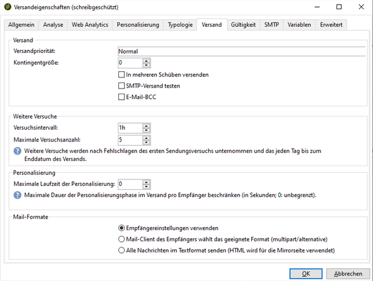

# Kommunikationskanäle{#communication-channels}

Mit Adobe Campaign können Sie Cross-Channel-Kampagnen wie E-Mails, SMS, Push-Benachrichtigungen und Briefpost senden und deren Effektivität mithilfe verschiedener dedizierter Berichte messen. Diese Nachrichten werden mittels Sendungen entworfen und gesendet und können für alle Empfangenden personalisiert werden.

Zu den Kernfunktionen zählen Zielgruppenbestimmung, Definition und Personalisierung von Nachrichten, Ausführung der Kommunikation und die damit verbundenen operativen Berichte.

Im Zuge der Umstellung von Campaign v7 auf v8 wurde der Campaign Classic-Dokumentationssatz optimiert und neu organisiert. Allgemeine Funktionen sind jetzt nur noch in der Dokumentation zu Campaign v8 verfügbar.

>[!BEGINTABS]

>[!TAB Dokumentation zu Kommunikationskanälen]

Weitere Informationen zu Kommunikationskanälen finden Sie in der [Dokumentation zu Campaign v8](https://experienceleague.adobe.com/de/docs/campaign/campaign-v8/send/gs-message){target=_blank}.

{target=_blank}

>[!TAB Versandinhalt und -zielgruppe]

Die wichtigsten Informationen zu Erstellung, Inhalt und Zielgruppe eines Versands finden Sie in der **Dokumentation zu Campaign v8**:

* [Erstellen des Versands](https://experienceleague.adobe.com/docs/campaign/campaign-v8/send/create-message.html?lang=de#create-the-delivery){target="_blank"}: Auf dieser Seite erfahren Sie, wie Sie einen einmaligen Versand erstellen. 
* [Definieren des Inhalts](https://experienceleague.adobe.com/de/docs/campaign/campaign-v8/send/create-message#content-of-the-delivery){target="_blank"}: Konfigurieren Sie den spezifischen Versandinhalt für jeden Kanal.
* [Angeben der Zielgruppe](https://experienceleague.adobe.com/docs/campaign/campaign-v8/send/create-message.html?lang=de#target-population){target="_blank"}: Definieren Sie verschiedene Typen von Zielgruppen: Hauptzielgruppe, Testversand-Zielgruppe, Testadressen und Kontrollgruppen.
* [Arbeiten mit Versandvorlagen](https://experienceleague.adobe.com/docs/campaign/campaign-v8/send/create-templates.html?lang=de){target="_blank"}: Erfahren Sie, wie Sie Vorlagen definieren, um die Versanderstellung zu erleichtern.

>[!TAB Versandvalidierung und -durchführung]

Auf diesen Seiten in der **Dokumentation zu Campaign v8** erfahren Sie mehr über die Validierung und das Durchführen eines Versands sowie die Best Practices diesbezüglich:

* [Validieren des Versands](https://experienceleague.adobe.com/de/docs/campaign/campaign-v8/send/create-message#validate-the-delivery){target="_blank"}: Erfahren Sie, wie Sie den Versand vor dem Senden an die Hauptzielgruppe validieren.
* [Durchführen des Versands](https://experienceleague.adobe.com/de/docs/campaign/campaign-v8/send/create-message#configuring-and-sending-the-delivery){target="_blank"}: Konfigurieren Sie die Versandeinstellungen und definieren Sie, wie Ihre Nachrichten gesendet werden sollen.
* [Best Practices beim Versand](https://experienceleague.adobe.com/docs/campaign/campaign-v8/send/delivery-best-practices.html?lang=de){target="_blank"}: Berücksichtigen Sie die Best Practices für die Versandfunktionen von Campaign.

>[!ENDTABS]

Die folgenden Einstellungen sind spezifisch für Campaign Classic. Weitere Informationen zu anderen Versandeinstellungen finden Sie in der [Dokumentation zu Campaign v8](https://experienceleague.adobe.com/de/docs/campaign/campaign-v8/send/gs-message){target="_blank"}.

+++ **Versandanalyse**

**Verbessern der Leistung der Versandanalyse**

Um die Sendungsvorbereitung zu beschleunigen, können Sie vor dem Starten der Analyse die Option **[!UICONTROL Versandteile in der Datenbank vorbereiten]** aktivieren.

Wenn diese Option aktiviert ist, wird die Sendungsvorbereitung direkt in der Datenbank vorgenommen, was die Analyse erheblich beschleunigen kann.

Diese Option ist derzeit nur verfügbar, wenn folgende Bedingungen erfüllt sind:

* Der Versand muss per E-Mail ausgeführt werden. Die anderen Kanäle werden derzeit nicht unterstützt.
* Sie dürfen kein Mid-Sourcing oder externes Routing nutzen, sondern nur den Routing-Typ &quot;Gebündelter Versand&quot;. Sie können das verwendete Routing auf dem Tab **[!UICONTROL Allgemein]** der **[!UICONTROL Versandeigenschaften]** überprüfen.
* Eine Population, die aus einer externen Datei stammt, kann nicht Zielgruppe sein. Klicken Sie für einen einzelnen Versand in den **[!UICONTROL E-Mail-Parametern]** auf den Link **[!UICONTROL An]** und stellen Sie sicher, dass die Option **[!UICONTROL Von der Datenbank ausgehend definiert]** aktiviert ist. Achten Sie bei einem Versand, der in einem Workflow verwendet wird, darauf, dass bei den Empfängern **[!UICONTROL Werden durch die Eingangsereignisse angegeben]** auf dem Tab **[!UICONTROL Versand]** markiert ist.
* Sie müssen eine PostgreSQL-Datenbank verwenden.

**Konfigurieren der Analysepriorität**

Wenn Ihr Versand Teil einer Kampagne ist, bietet der **[!UICONTROL Erweitert]**-Tab eine zusätzliche Option, die die Hierarchisierung der Sendungen innerhalb der Kampagne ermöglicht.

Jeder Versand wird analysiert, bevor die Nachrichten abgeschickt werden. Die Analysedauer hängt von der Größe der Extraktionsdatei des Versands ab. Je größer die Datei, desto länger die Analyse. Nachfolgende Sendungen werden verzögert.

Die Optionen im Bereich **[!UICONTROL Nachrichtenvorbereitung durch die Steuerung]** erlauben die Priorisierung der Versandanalysen eines Kampagnen-Workflows.

Einem großen Versand sollte also vorzugsweise eine niedrige Priorität zugewiesen werden, um die Analyse der anderen Sendungen des Workflows nicht zu verlangsamen.

>[!NOTE]
>
>Um sicherzustellen, dass die Analyse umfangreicher Sendungen die Durchführung Ihrer Workflows nicht bremst, haben Sie die Möglichkeit, die Option **[!UICONTROL Ausführung auf einen Zeitpunkt mit geringer Auslastung verschieben]** anzukreuzen.

+++

+++ **Durchführen eines Versands**

**Konfigurieren weiterer Zustellversuche**

Vorübergehend nicht zustellbare Nachrichten aufgrund eines **Softbounce** oder eines **ignorierten Fehlers** werden automatisch für einen erneuten Versuch vorgesehen. Die Typen und Ursachen für fehlgeschlagene Sendungen finden Sie in diesem [Abschnitt](understanding-delivery-failures.md#delivery-failure-types-and-reasons).

>[!IMPORTANT]
>
>Bei gehosteten oder hybriden Installationen werden die Einstellungen für den erneuten Versuch im Versand nicht mehr von Campaign verwendet, wenn Sie auf den [Enhanced MTA](sending-with-enhanced-mta.md) aktualisiert haben. Weitere Zustellversuche aufgrund von Softbounces sowie die Zeitdauer zwischen ihnen werden durch den Enhanced MTA bestimmt, basierend auf Typ und Prioritätsstufe der Bounce-Antworten, die von der E-Mail-Domain der Nachricht zurückgegeben werden.

Bei On-Premise-Installationen und gehosteten/hybriden Installationen, die den bestehenden Campaign-MTA verwenden, gibt der zentrale Abschnitt der Registerkarte **[!UICONTROL Versand]** für die Versandparameter an, wie viele weitere Versuche am Tag nach dem Versand durchgeführt werden sollen, und den Mindestzeitabstand zwischen den Versuchen. 

Standardmäßig sind innerhalb der ersten 24 Stunden des Versands fünf erneute Versuche im Abstand von mindestens einer Stunde vorgesehen. An den folgenden Tagen wird bis zum Ablauf der Versandgültigkeit, die auf der Registerkarte **[!UICONTROL Gültigkeit]** festgelegt wird, jeweils ein Zustellversuch unternommen. Siehe nachfolgenden Abschnitt.

**Definieren des Gültigkeitszeitraums**

Nach dem Start des Versands können die Nachrichten (und alle weiteren Zustellversuche) bis zum Ablauf der Versandgültigkeit gesendet werden. Dies wird auf der Registerkarte **[!UICONTROL Gültigkeit]** der Versandeigenschaften festgelegt.

* Im Feld **[!UICONTROL Versandlaufzeit]** kann die Zeitspanne angegeben werden, in der erneute globale Zustellversuche unternommen werden. Dies bedeutet konkret, dass Adobe Campaign die Nachrichten ab dem Startdatum versendet und bis zum Ablauf der angegebenen Spanne nicht zustellbare Nachrichten in regelmäßigen Abständen erneut sendet.

  Sie können alternativ auch ein genaues Datum angeben. Markieren Sie dazu die Option **[!UICONTROL Gültigkeit explizit festlegen]**. In diesem Fall kann mit den Versand- und Gültigkeitsdaten auch eine bestimmte Uhrzeit konfiguriert werden. Standardmäßig wird die aktuelle Uhrzeit eingesetzt, sie kann jedoch direkt im Eingabefeld angepasst werden.

  >[!IMPORTANT]
  >
  >Wenn Sie auf den [Enhanced MTA](sending-with-enhanced-mta.md) aktualisiert haben, wird bei gehosteten oder hybriden Installationen die Einstellung **[!UICONTROL Versandlaufzeit]** in Ihren Campaign-E-Mail-Sendungen nur verwendet, wenn sie auf **3,5 Tage oder weniger** festgelegt ist. Wenn Sie einen Wert von mehr als 3,5 Tagen definieren, wird dieser nicht berücksichtigt.

* **Gültigkeit von Ressourcen**: Das Feld **[!UICONTROL Gültigkeit]** wird für hochgeladene Ressourcen verwendet, hauptsächlich für die Mirrorseite und Bilder. Die Gültigkeitsdauer der Ressourcen auf dieser Seite ist begrenzt, um Speicherkapazität zu sparen.

  Die in diesem Feld möglichen Zeiteinheiten (Tage, Stunden etc.) können Sie in [diesem Abschnitt](../../platform/using/adobe-campaign-workspace.md#default-units) nachlesen.

+++

<!--

   Learn how to create a one-shot single delivery. You can create other types of deliveries to build your use cases. 

For more information about the different types of deliveries and how to create them, refer to the [Campaign v8 documentation](https://experienceleague.adobe.com/docs/campaign/campaign-v8/send/create-message.html){target="_blank"}. 

>[!NOTE]
>
>Adobe Campaign offers a set of tools to monitor your deliverability and optimize email sending. Learn more in [this section](about-deliverability.md).

Delivery sending can be automated by preparing a delivery and/or sending it in the process of a workflow. For more on delivery-type activities in workflows, refer to [this section](../../workflow/using/about-action-activities.md).

Adobe Campaign offers the following delivery channels:

1. **Email channel**: email deliveries let you send personalized emails to the target population. Refer to [About email channel](about-email-channel.md).
1. **Direct mail channel**: direct mail deliveries let you generate an extraction file which contains data on the target population. Refer to [About direct mail channel](about-direct-mail-channel.md).
1. **Mobile channel**: deliveries on mobile channels let you send personalized SMS or LINE messages to the target population. Refer to [SMS channel](sms-channel.md).
1. **Mobile application channel**: mobile app deliveries let you send notifications to iOS and Android systems. Refer to the [Mobile app channel](about-mobile-app-channel.md) chapter.

   Other channels are described on [this section](#other-channels).

   >[!NOTE]
   >
   >The number of available channels depends on your contract. Please check your license agreement.

Deliveries can be carried out **online** (via email, one of the mobile channels and push notifications), and **offline** (direct mail channel).

Depending on the channel, delivery modes can be:

* Direct mass delivery via Adobe Campaign (default mode for email channel).
* External delivery via a specialist operator who is given the output file generated by the delivery assistant (default mode for direct mail channel).

External accounts are configured via the **[!UICONTROL Administration > Platform > External accounts]** node. This configuration should be performed by expert users only.

## Email deliveries {#email-deliveries}

The [Email channel](about-email-channel.md) is one of the core channels in Adobe Campaign, allowing you to schedule and send personalized emails to specific targets.

You can send different types of emails:

* Single-send emails: emails that you can send once to a defined target. They are usually used to promote a specific content that would be prepared and sent only once (newsletter, promotional email, etc.).
* Recurring emails: in a campaign, send the same email regularly and aggregate each send and its reports on a periodic basis. The same email is sent, but usually to a different target, based on the eligible target for the day of the send. A common example is a birthday email. For more on this, refer to [Recurring deliveries](../../workflow/using/recurring-delivery.md).
* Transactional emails: unitary emails that are triggered based on your customers' behavior. Refer to [Transactional messaging](../../message-center/using/about-transactional-messaging.md).

To learn about delivery usage and recommendations, consult Campaign [Delivery best practices](delivery-best-practices.md).

For more on the different types of deliveries, refer to [this section](#types-of-deliveries).

## Mobile deliveries {#mobile-deliveries}

Adobe Campaign allows you to deliver [SMS](sms-channel.md) and [LINE](line-channel.md) messages on mobiles.

For SMS messages, you can create, modify, and personalize messages in text format only. You can also preview your SMS messages before they are sent.

For LINE messages, you can send text or images and links.

To deliver SMS or LINE messages to a mobile phone you need:

* An external account configured on the **[!UICONTROL Mobile (SMS)]** channel or on the **[!UICONTROL LINE]** channel. 
* An SMS or LINE delivery template that is correctly linked to this external account.

## Push notifications {#push-notifications}

Adobe Campaign allows you to send personalized and segmented [push notifications](about-mobile-app-channel.md) on iOS and Android mobile devices, through dedicated apps. Once configuration and integration steps have been performed, iOS and Android deliveries can be created and sent. You can also design rich notifications with images or videos.

## Direct mail {#direct-mail}

[Direct mail](about-direct-mail-channel.md) is an offline channel that allows you to personalize and generate the file required by direct mail providers. It gives you the possibility to mix online and offline channels in your customer journeys.

Online channels allow you to create your messages (email, SMS, mobile app delivery, etc.) and send them to your audience directly from Adobe Campaign. With offline channels, it is different. When you prepare a direct mail delivery, Adobe Campaign generates a file including all the targeted profiles and the chosen contact information (postal address for example). You will then be able to send this file to your direct mail provider who will take care of the actual sending.

## Other channels {#other-channels}

Adobe Campaign offers Telephone delivery template, which is used to create external deliveries. Using this channel implies you set up dedicated methodologies to process output files. Configuration steps are the same as for [Direct mail channel](about-direct-mail-channel.md).

>[!NOTE]
>
>The Telephone channel is not available out-of-the-box. Its implementation requires Adobe Consulting or an Adobe Partner to be engaged. Please reach out to your Adobe representative for more information.

In addition, 'Other' type deliveries use a specific technical template which does not execute a process: this lets them manage marketing actions executed outside of the Adobe Campaign platform.

This channel has no specific mechanism. It is a generic channel that has its own external account routing option, delivery template type and campaign workflow activity, just like any other communication channel available in Adobe Campaign.

This channel is designed for descriptive purposes only, for example to define deliveries for which you want to keep a trace of the target of a campaign performed in a tool other than Adobe Campaign.

## Types of deliveries{#types-of-deliveries}

There are three types of delivery objects in Campaign:

### Single delivery {#single-delivery}

A **delivery** is a standalone delivery object that is executed once. It can be duplicated, prepared again, but as long as it is in its final state (canceled, stopped, finished), it cannot be reused.

Deliveries can be created either from the list of deliveries, or within a workflow via a [Delivery](../../workflow/using/delivery.md) activity.

Workflows also provide specific delivery activities according to the type of channel you want to use. For more on these activities, refer to [this section](../../workflow/using/cross-channel-deliveries.md).

### Recurring delivery {#recurring-delivery}

A **recurring delivery** lets you create a new delivery each time the activity is executed. This avoids you having to create a new delivery for recurring tasks.

As an example, if you run this type of activity once a month, you will end up with 12 deliveries after a year.

Recurring deliveries are created within workflows via the [Recurring delivery activity](../../workflow/using/recurring-delivery.md). An example of this activity being used is presented in this section: [Creating a recurring delivery in a targeting workflow](../../workflow/using/sending-a-birthday-email.md#creating-a-recurring-delivery-in-a-targeting-workflow).

### Continuous delivery {#continuous-delivery}

A **continuous delivery** lets you add new recipients to an existing delivery, which avoids having to create a new delivery each time it is executed.

If an information in the delivery changes (content, name, etc.), a new delivery object is created at the delivery execution. If no information was changed, the same delivery object is reused and the delivery and tracking logs are added in the same object.

As an example, if you run this type of activity once a month, you will end up with a single delivery after a year (provided you did not make any change to the delivery).

Continuous deliveries are created within workflows via the [Continuous delivery activity](../../workflow/using/continuous-delivery.md).-->
