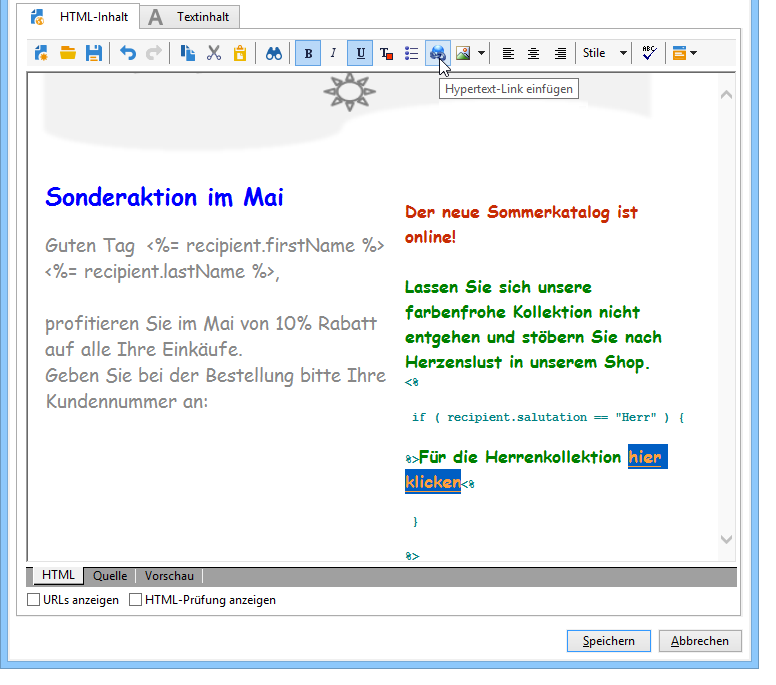

# Bedingter Inhalt{#conditional-content}

Die Konfiguration bedingter Inhalte erlaubt eine dynamische Personalisierung, beispielsweise auf der Basis des Empfängerprofils. Dabei werden Textbausteine und/oder Bilder ersetzt, wenn eine bestimmte Bedingung erfüllt ist.

 [Mehr zu dieser Funktion erfahren Sie im Video.](#conditionnal-content-video).


## Bedingungen in einer E-Mail verwenden {#using-conditions-in-an-email}

Im folgenden Beispiel erfahren Sie, wie Sie eine Nachricht erstellen und entsprechend dem Geschlecht und den Interessen des Empfängers dynamisch personalisieren können.

* Anzeige von &quot;Herr&quot; bzw. &quot;Frau&quot; entsprechend des Werts im Feld **[!UICONTROL Geschlecht]** der Datenquelle (männlich bzw. weiblich).
* Individuell auf den Empfänger zugeschnittene Zusammenstellung eines Newsletters oder eines Angebots in Abhängigkeit von seinen angegebenen oder erkannten Interessen:

   * Interessen 1 -- > Baustein 1
   * Interessen 2 -- > Baustein 2
   * Interessen 3 -- > Baustein 3
   * Interessen 4 -- > Baustein 4

Gehen Sie wie folgt vor, um einen von einem Feldwert abhängigen bedingten Inhalt zu erstellen:

1. Klicken Sie auf die Personalisierungsfeld-Schaltfläche und wählen Sie **[!UICONTROL Bedingter Inhalt > Wenn]**.

   

   Die Personalisierungselemente werden in den Nachrichten-Textkörper eingefügt.

1. Konfigurieren Sie nun den **If**-Ausdruck.

   Gehen Sie dazu wie folgt vor:

   * Wählen Sie das erste Element **`<field>`** des Ausdrucks aus (standardmäßig wird dieses Element beim Einfügen des **If**-Ausdrucks hervorgehoben) und klicken Sie auf das Personalisierungssymbol, um es durch das Testfeld zu ersetzen.

      

   * Ersetzen Sie **`<value>`** durch den Wert des Feldes, für das die Bedingung erfüllt wird. Dieser Wert muss in Anführungszeichen gesetzt werden.
   * Fügen Sie anschließend den Inhalt ein, der bei Erfüllung der Bedingung für den Versand genutzt werden soll. Hierbei kann es sich um einen Text, ein Bild, ein Formular, einen Link usw. handeln.

      

1. Klicken Sie nun auf den **[!UICONTROL Vorschau]**-Tab, um den dem Empfänger entsprechend personalisierten Nachrichteninhalt anzusehen.

   * Auswahl eines Empfängers, für den die Kriterien zutreffen:

      

   * Auswahl eines Empfängers für den die Kriterien nicht zutreffen:

      

Sie können weitere Bedingungen hinzufügen und Inhalte in Abhängigkeit von einem oder mehreren Feldwerten konfigurieren. Dies ist mit den Optionen **[!UICONTROL Bedingter Inhalt > Sonst]** und **[!UICONTROL Bedingter Inhalt > Sonst wenn]** möglich. Die Vorgehensweise ist die gleiche wie beim **If**-Ausdruck.


>[!CAUTION]
>
>In der JavaScript-Syntax müssen die Zeichen **%> &lt;%** bei Verwendung von **Sonst** und **Sonst wenn** entfernt werden.

Klicken Sie nun auf den **[!UICONTROL Vorschau]**-Tab und wählen Sie einen Empfänger aus, um den bedingten Inhalt anzusehen.


## Mehrsprachige E-Mail erstellen {#creating-multilingual-email}

Im folgenden Beispiel erfahren Sie, wie Sie eine mehrsprachige E-Mail erstellen. Inhalte werden in der bevorzugten Sprache des Empfängers angezeigt.

1. Erstellen Sie eine E-Mail und wählen Sie eine Zielpopulation aus. In unserem Beispiel basiert die Bedingung für die Darstellung einer bestimmten Version auf dem Wert **Sprache** des Empfängerprofils, also **EN**, **FR** oder **ES**.
1. Klicken Sie im HTML-Inhalt der E-Mail auf den Tab **[!UICONTROL Quelle]** und fügen Sie folgenden Code ein:

   ```
   <% if (language == "EN" ) { %>
   <DIV id=en-version>Hello <%= recipient.firstName %>,</DIV>
   <DIV>Discover your new offers!</DIV>
   <DIV><a href="https://www.adobe.com/products/en">www.adobe.com/products/en</A></FONT></DIV><%
    } %>
   <% if (language == "FR" ) { %>
   <DIV id=fr-version>Bonjour <%= recipient.firstName %>,</DIV>
   <DIV>Découvrez nos nouvelles offres !</DIV>
   <DIV><a href="https://www.adobe.com/products/fr">www.adobe.com/products/fr</A></DIV><%
    } %>
    <% if (language == "ES" ) { %>
   <DIV id=es-version><FONT face=Arial>
   <DIV>Olà <%= recipient.firstName %>,</DIV>
   <DIV>Descubra nuestros nuevas ofertas !</DIV>
   <DIV><a href="https://www.adobe.com/products/es">www.adobe.com/products/es</A></DIV>
   <% } %>
   ```

1. Überprüfen Sie den E-Mail-Inhalt im Tab **[!UICONTROL Vorschau]**, indem Sie Empfänger mit unterschiedlichen Sprachen auswählen.

   >[!NOTE]
   >
   >Da Sie für den E-Mail-Inhalt keine andere Version definiert haben, müssen Sie die Zielpopulation vor dem Versand der E-Mail filtern.

## Erstellen eines mehrsprachigen Newsletters mit bedingten Inhalten {#conditionnal-content-video}

Erfahren Sie, wie Sie einem Versand bedingte Inhalte hinzufügen können, beispielsweise einen mehrsprachigen Newsletter.

>[!VIDEO](https://video.tv.adobe.com/v/24926?quality=12)
