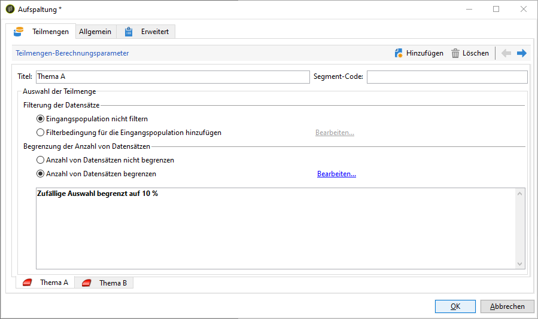
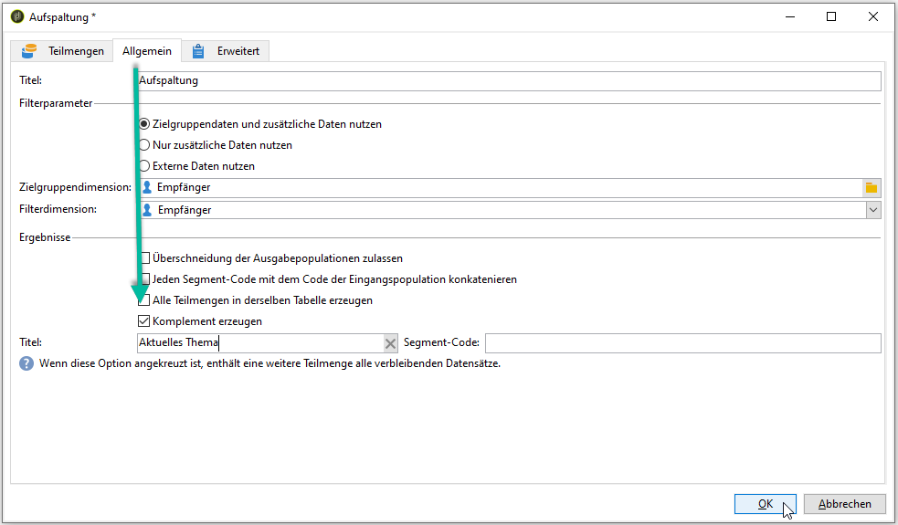
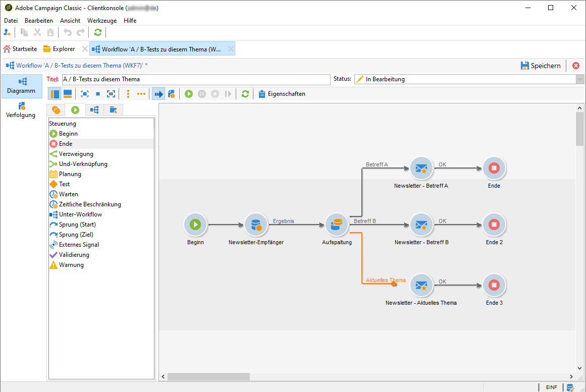

# Konfigurieren von A/B-Tests {#configuring-a-b-testing}

In diesem Abschnitt wird beschrieben, wie Sie einen Workflow zum Durchführen von A/B-Tests erstellen.

1. Erstellen Sie einen neuen Workflow und konfigurieren Sie dann eine Abfrageaktivität, um die gewünschte Population zu erfassen. Weitere Informationen finden Sie in der [Dokumentation zu Campaign v8](https://experienceleague.adobe.com/docs/campaign/automation/workflows/wf-activities/targeting-activities/query.html?lang=de){target="_blank"}.

1. Fügen Sie eine Aufspaltungsaktivität hinzu, um die Zielpopulation in mehrere Untermengen zu unterteilen. Weitere Informationen finden Sie in der [Dokumentation zu Campaign v8](https://experienceleague.adobe.com/docs/campaign/automation/workflows/wf-activities/targeting-activities/split.html?lang=de){target="_blank"}.

1. Öffnen Sie die Aktivität und konfigurieren Sie dann die einzelnen Untermengen entsprechend Ihren Anforderungen. Weitere Informationen zur Konfiguration einer **[!UICONTROL Aufspaltungsaktivität]** finden Sie in [diesem Abschnitt](../../workflow/using/split.md).

   In diesem Beispiel möchten wir zwei neue Themen für einen Newsletter testen, indem wir sie jeweils 10 % der Zielpopulation präsentieren.

   

1. Fügen Sie eine Transition hinzu, um an die verbleibende Population den Newsletter mit dem aktuellen Thema zu senden. Aktivieren Sie dazu die Option **[!UICONTROL Komplement erzeugen]** auf der Registerkarte **[!UICONTROL Allgemein]**.

   

1. Fügen Sie für jede Untermenge die zu testende Version des Versands hinzu.

   

Sie können den Workflow jetzt starten. Sobald die Sendungen ausgeführt wurden, können Sie das Verhalten der drei Untermengen in den Versand-Logs nachverfolgen, um zu sehen, welcher Betreff am erfolgreichsten war.

Mithilfe von Workflows können Sie Ihre Prozesse auch automatisieren, indem Sie automatisch die Versandvariante identifizieren, die besser abgeschnitten hat, und diese dann an die verbleibende Population senden. Weitere Informationen dazu finden Sie im [entsprechenden Anwendungsbeispiel](a-b-testing-use-case.md).
