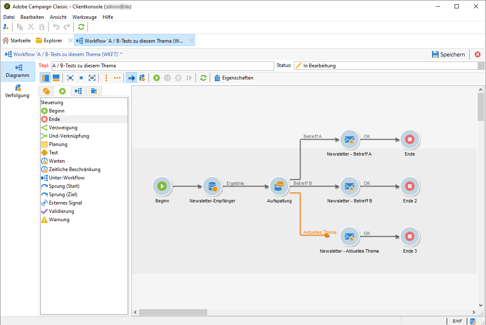

# Konfigurieren von A/B-Tests {#configuring-a-b-testing}

In diesem Abschnitt wird beschrieben, wie Sie einen Workflow zum Durchführen von A/B-Tests erstellen.

1. Erstellen Sie einen neuen Workflow und konfigurieren Sie dann eine [Abfrage](../../workflow/using/query.md)-Aktivität, um die gewünschte Population Zielgruppe.

1. hinzufügen Sie eine Aktivität [Teilen](../../workflow/using/split.md), um die Zielgruppe in mehrere Untergruppen zu unterteilen.

1. Öffnen Sie die Aktivität und konfigurieren Sie dann die einzelnen Untergruppen entsprechend Ihren Anforderungen. Weitere Informationen zum Konfigurieren einer **[!UICONTROL Split]**-Aktivität finden Sie in diesem Abschnitt.

   In diesem Beispiel möchten wir zwei neue Themen für einen Newsletter testen, indem wir sie jeweils 10 % der Zielgruppe präsentieren.

   

1. hinzufügen Sie eine Transition, um den Newsletter mit dem aktuellen Thema an die übrige Bevölkerung zu senden. Aktivieren Sie dazu die Option **[!UICONTROL Komplement]** erstellen auf der Registerkarte **[!UICONTROL Allgemein]**.

   

1. Fügen Sie für jede Untergruppe die zu testende Version des Versands hinzu.

   

Sie können den Workflow jetzt Beginn ausführen. Sobald die Versand gesendet wurden, können Sie das Verhalten der drei Untergruppen in den Versandlogs nachverfolgen, um zu sehen, welches Thema am erfolgreichsten war.

Workflows ermöglichen Ihnen auch, Ihre Prozesse zu automatisieren, indem Sie automatisch die Versand-Variante identifizieren, die besser abgeschnitten hat, und diese dann an die restliche Population senden. Weitere Informationen hierzu finden Sie in diesem dedizierten [Anwendungsfall](../../delivery/using/a-b-testing-use-case.md).
