# Konfigurationsschritte für Android

Nachdem das Paket installiert ist, können Sie die Einstellungen Ihrer Android-Mobile-App in Adobe Campaign Classic festlegen.

>[!NOTE]
>
>Informationen dazu, wie Sie Ihre Mobile-App für iOS konfigurieren und einen Versand für iOS erstellen, finden Sie in [diesem Abschnitt](../../delivery/using/configuring-the-mobile-application.md).

## Konfigurieren eines externen Android-Kontos {#configuring-external-account-android}

Für Android sind zwei Connectoren verfügbar:

* Der V1-Connector, der pro MTA-Kind eine Verbindung ermöglicht.
* Der V2-Connector, der gleichzeitige Verbindungen zum FCM-Server ermöglicht, um den Durchsatz zu erhöhen.

Wählen Sie den jeweiligen Connector folgendermaßen aus:

1. Gehen Sie zu **[!UICONTROL Administration > Plattform > Externe Konten]**.
1. Wählen Sie das externe Konto **[!UICONTROL Android-Routing]** aus.
1. Füllen Sie im **[!UICONTROL Connector]**-Tab das Feld **[!UICONTROL Connector-JavaScript]** aus:

   Für Android V2: https://localhost:8080/nms/jsp/androidPushConnectorV2.js

   >[!NOTE]
   >
   > Sie können das Feld auch wie folgt konfigurieren: https://localhost:8080/nms/jsp/androidPushConnector.js; wir empfehlen Ihnen jedoch, Version 2 des Connectors zu verwenden.

   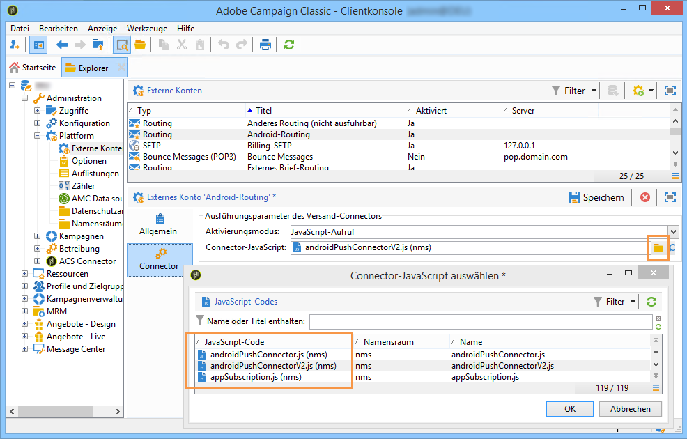

1. Für Android V2 ist ein zusätzlicher Parameter in der Adobe-Server-Konfigurationsdatei (serverConf.xml) verfügbar:

   * **maxGCMConnectPerChild**: Maximale Anzahl paralleler HTTP-Abfragen bei FCM durch jeden Kindserver (standardmäßig acht).

## Konfigurieren des Android-Dienstes {#configuring-android-service}

1. Klicken Sie im Knoten **[!UICONTROL Profile und Zielgruppen > Dienste und Abonnements]** auf die Schaltfläche **[!UICONTROL Neu]**.

   

1. Bestimmen Sie einen **[!UICONTROL Titel]** und einen **[!UICONTROL internen Namen]**.
1. Wählen Sie im Feld **[!UICONTROL Typ]** die Option **[!UICONTROL Mobile App]**.

   >[!NOTE]
   >
   >Das standardmäßig vorgeschlagene Zielgruppen-Mapping **[!UICONTROL Abonnierte Anwendungen (nms:appSubscriptionRcp)]** bezieht sich auf die Empfängertabelle. Sie haben die Möglichkeit, im Feld **[!UICONTROL Zielgruppen-Mapping]** des Dienstes ein anderes, zuvor erstelltes Mapping anzugeben. Weiterführende Informationen hierzu finden Sie im [Konfigurationshandbuch](../../configuration/using/about-custom-recipient-table.md).

   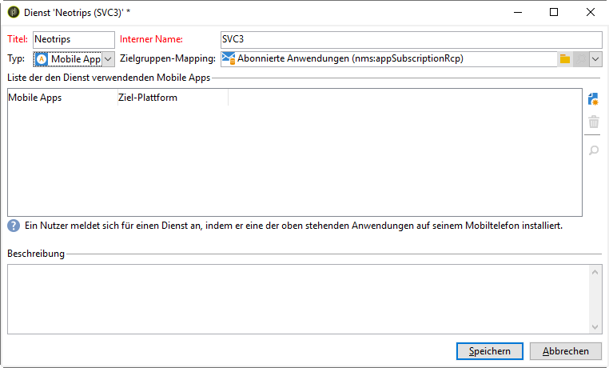

1. Klicken Sie dann auf die Schaltfläche **[!UICONTROL Hinzufügen]**, um den Anwendungstyp auszuwählen.

   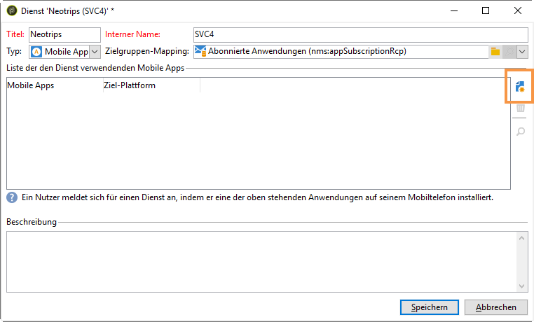

1. Erstellen Sie Ihre Android-Mobile-App. Weitere Informationen hierzu finden Sie in [diesem Abschnitt](../../delivery/using/configuring-the-mobile-application-android.md#creating-android-app).

## Erstellen der Android-Mobile-App {#creating-android-app}

Nachdem Sie den Dienst erstellt haben, müssen Sie jetzt Ihre Android-Mobile-App erstellen:

1. Klicken Sie in Ihrem neu erstellten Dienst auf die Schaltfläche **[!UICONTROL Hinzufügen]**, um den Anwendungstyp auszuwählen.

   

1. Wählen Sie **[!UICONTROL Android-Anwendung erstellen]** aus und geben Sie einen **[!UICONTROL Titel]** ein.

   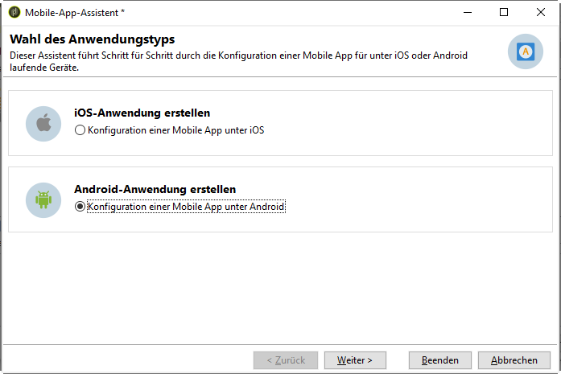

1. Stellen Sie sicher, dass in Adobe Campaign und im Anwendungs-Code derselbe **[!UICONTROL Integrationsschlüssel]** definiert ist (über das SDK). Weiterführende Informationen finden Sie unter [Integration des Campaign SDK in Mobile Apps](../../delivery/using/integrating-campaign-sdk-into-the-mobile-application.md).

   >[!NOTE]
   >
   > Der **[!UICONTROL Integrationsschlüssel]** kann mit einem Zeichenfolgenwert vollständig angepasst werden, muss jedoch mit dem im SDK angegebenen Schlüssel identisch sein.

1. Wählen Sie eine **[!UICONTROL API-Version]** aus:
   * HTTP. Weitere Informationen hierzu finden Sie in [diesem Abschnitt](../../delivery/using/configuring-the-mobile-application-android.md#android-service-http).
   * HTTP v1. Weitere Informationen hierzu finden Sie in [diesem Abschnitt](../../delivery/using/configuring-the-mobile-application-android.md#android-service-httpv1).

1. Füllen Sie die Felder **[!UICONTROL Verbindungsparameter für Firebase Cloud Messaging for Android]** aus.

1. Klicken Sie auf **[!UICONTROL Beenden]** und danach auf **[!UICONTROL Speichern]**. Ihre Android-Anwendung kann jetzt in Campaign Classic verwendet werden.

Standardmäßig speichert Adobe Campaign in der Tabelle **[!UICONTROL Abonnierte Anwendungen (nms:appSubscriptionRcp)]** im Feld **[!UICONTROL Nutzerkennung]** (@userKey) einen Schlüssel, der die Relation zwischen einem Empfänger und einem Abonnement herstellt. Gehen Sie wie folgt vor, wenn Sie zusätzliche Daten erheben möchten (beispielsweise einen komplexen Abstimmschlüssel):

1. Erweitern Sie das Schema **[!UICONTROL Abonnierte Anwendungen (nms:appsubscriptionRcp)]** und konfigurieren Sie die neuen Felder.

1. Geben Sie im Tab **[!UICONTROL Abonnementparameter]** das Mapping an.

   >[!CAUTION]
   >
   >Stellen Sie sicher, dass die Parameterbezeichnungen im Tab **[!UICONTROL Abonnementparameter]** mit denen im Anwendungs-Code übereinstimmen. Weiterführende Informationen finden Sie im Abschnitt [Integration des Campaign SDK in Mobile Apps](../../delivery/using/integrating-campaign-sdk-into-the-mobile-application.md).

### API-Version auswählen{#select-api-version}

Nachdem Sie einen Dienst und eine neue Mobile App erstellt haben, müssen Sie Ihre Mobile App entsprechend der ausgewählten API-Version konfigurieren.

Weitere Informationen zur Erstellung von Diensten und Mobile Apps finden Sie in [diesem Abschnitt](../../delivery/using/configuring-the-mobile-application-android.md#configuring-android-service).

#### HTTP v1-API-Version verwenden{#android-service-httpv1}

Gehen Sie wie folgt vor, um die HTTP v1-API-Version zu konfigurieren:

1. Wählen Sie im Fenster des **[!UICONTROL Mobile-App-Assistenten]** die Option **[!UICONTROL HTTP v1]** aus der Dropdown-Liste **[!UICONTROL API-Version]** aus.

1. Klicken Sie auf **[!UICONTROL Projekt-JSON-Datei zum Extrahieren der Projektdetails laden...]**, um Ihre JSON-Schlüsseldatei direkt zu laden. Weitere Informationen dazu, wie Sie die JSON-Datei extrahieren, finden Sie auf [dieser Seite](https://firebase.google.com/docs/admin/setup#initialize-sdk).

1. Sie können auch die folgenden Details manuell eingeben:
   * **[!UICONTROL Projektkennung]**
   * **[!UICONTROL Privater Schlüssel]**
   * **[!UICONTROL Client-E-Mail]**

   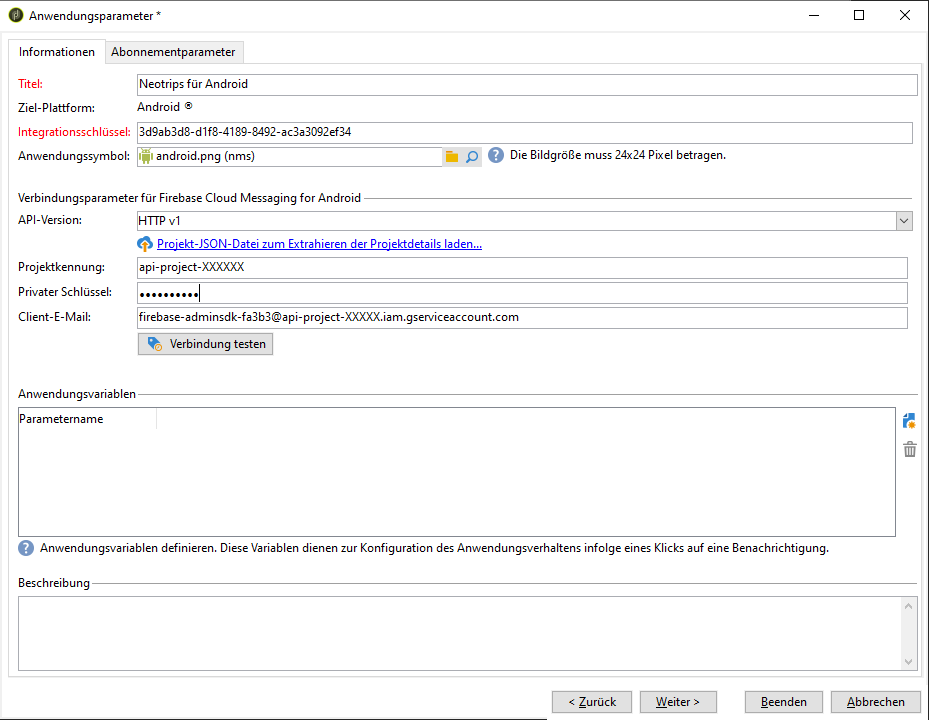

1. Klicken Sie auf **[!UICONTROL Verbindung testen]**, um zu prüfen, ob Ihre Konfiguration korrekt ist und ob der Marketing-Server Zugriff auf den FCM-Server hat.

   >[!CAUTION]
   >
   >Bei Mid-Sourcing-Implementierungen wird mit der Schaltfläche **[!UICONTROL Verbindung testen]** nicht geprüft, ob der MID-Server Zugriff auf den FCM-Server hat.

   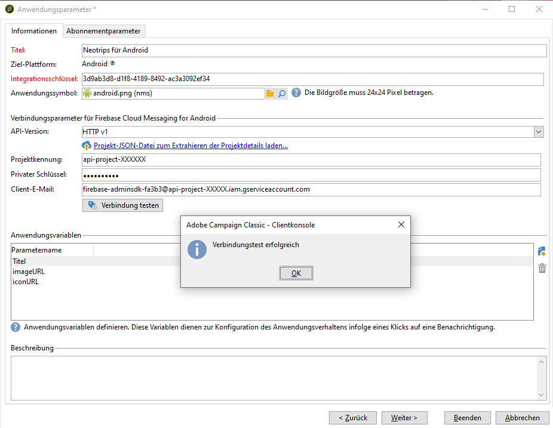

1. Bei Bedarf können Sie die Inhalte von Push-Nachrichten mit bestimmten **[!UICONTROL Anwendungsvariablen]** anreichern. Diese sind vollständig anpassbar; ein Teil der Payload der Nachricht wird an das Mobilgerät gesendet.

1. Klicken Sie auf **[!UICONTROL Beenden]** und danach auf **[!UICONTROL Speichern]**. Ihre Android-Anwendung kann jetzt in Campaign Classic verwendet werden.

Im Folgenden finden Sie die FCM-Payload-Namen, mit denen Sie Ihre Push-Benachrichtigung weiter personalisieren können:

| Nachrichtentyp | Konfigurierbares Nachrichtenelement (FCM-Payload-Name) | Konfigurierbare Optionen (Name der FCM-Payload) |
|:-:|:-:|:-:|
| Datennachricht | K. A. | validate_only |
| Benachrichtigungsinhalt | title, body, android_channel_id, icon, sound, tag, color, click_action, image, ticker, sticky, visibility, notification_priority, notification_count   | validate_only |

 
 

#### HTTP-API-Version{#android-service-http}

Gehen Sie wie folgt vor, um die HTTP-API-Version (frühere Version) zu konfigurieren:

1. Wählen Sie im Fenster des **[!UICONTROL Mobile-App-Assistenten]** aus der Dropdown-Liste **[!UICONTROL API-Version]** die Option **[!UICONTROL HTTP (frühere Version)]** aus.

1. Geben Sie den **[!UICONTROL Projektschlüssel]** ein, den der Entwickler der Mobile App bereitgestellt hat.

1. Bei Bedarf können Sie die Inhalte von Push-Nachrichten mit bestimmten **[!UICONTROL Anwendungsvariablen]** anreichern. Diese sind vollständig anpassbar; ein Teil der Payload der Nachricht wird an das Mobilgerät gesendet.

   Im folgenden Beispiel werden **title**, **imageURL** und **iconURL** hinzugefügt, um eine Rich-Push-Benachrichtigung einzurichten. Danach werden der Anwendung das Bild, der Titel und das Symbol bereitgestellt, die in der Benachrichtigung angezeigt werden sollen.

   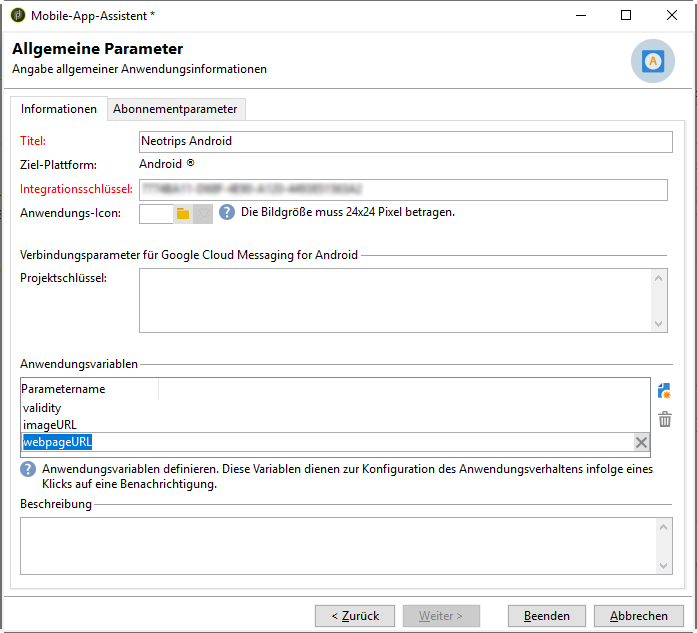

1. Klicken Sie auf **[!UICONTROL Beenden]** und danach auf **[!UICONTROL Speichern]**. Ihre Android-Anwendung kann jetzt in Campaign Classic verwendet werden.

Im Folgenden finden Sie die FCM-Payload-Namen, mit denen Sie Ihre Push-Benachrichtigung weiter personalisieren können:

| Nachrichtentyp | Konfigurierbares Nachrichtenelement (FCM-Payload-Name) | Konfigurierbare Optionen (Name der FCM-Payload) |
|:-:|:-:|:-:|
| Datennachricht | K. A. | dryRun |
| Benachrichtigungsinhalt | title, body, android_channel_id, icon, sound, tag, color, click_action   | dryRun |

 

## Erstellen einer Rich-Benachrichtigung für Android {#creating-android-delivery}

Bei Firebase Cloud Messaging stehen Ihnen zwei Nachrichtentypen zur Auswahl:

* **[!UICONTROL Datennachricht]** – wird von der Client-Mobile-App verarbeitet.
    Nachrichten werden direkt an die Mobile App gesendet, die die Android-Benachrichtigung erstellt und auf dem Gerät anzeigt. Datennachrichten enthalten nur die von Ihnen definierten Anwendungsvariablen.

* **[!UICONTROL Benachrichtigungsinhalt]** – wird automatisch vom FCM SDK verarbeitet.
     FCM übernimmt für die Client-Mobile-App automatisch das Anzeigen der Nachricht auf den Geräten Ihrer Benutzer. Benachrichtigungsinhalte enthalten einen vordefinierten Satz von Parametern und Optionen, können aber mit benutzerspezifischen Anwendungsvariablen weiter personalisiert werden.

Weitere Informationen zu Firebase Cloud Messaging-Nachrichtentypen finden Sie in der [FCM-Dokumentation](https://firebase.google.com/docs/cloud-messaging/concept-options#notifications_and_data_messages).

### Erstellen einer Datennachricht {#creating-data-message}

1. Gehen Sie zu **[!UICONTROL Kampagnenverwaltung]** > **[!UICONTROL Sendungen]**.

1. Klicken Sie auf **[!UICONTROL Neu]**.

   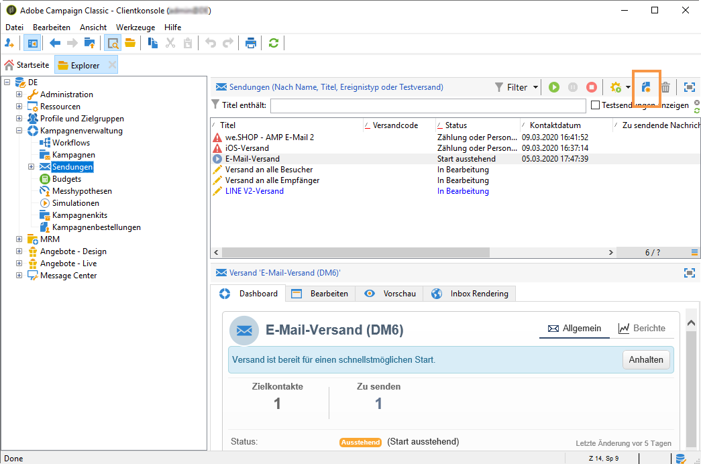

1. Wählen Sie **[!UICONTROL Android-Versand (Android)]** aus der Dropdown-Liste **[!UICONTROL Versandvorlage]**. Fügen Sie Ihrem Versand einen **[!UICONTROL Titel]** hinzu.

1. Klicken Sie auf **[!UICONTROL An]**, um die Zielpopulation zu definieren. Standardmäßig wird das Zielgruppen-Mapping **[!UICONTROL Abonnierte Anwendung]** angewendet. Klicken Sie auf **[!UICONTROL Hinzufügen]**, um Ihren Dienst auszuwählen.

   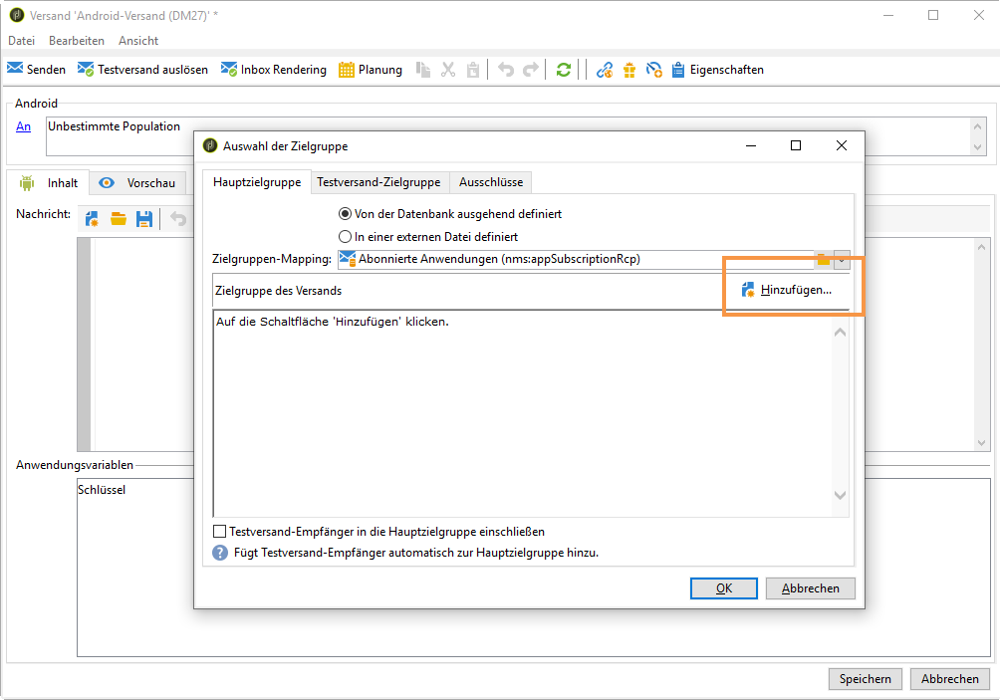

1. Wählen Sie im Fenster **[!UICONTROL Zieltyp]****** die Option &quot;Abonnenten einer Android-Mobile-App&quot; aus und klicken Sie auf **[!UICONTROL Weiter]**.

1. Wählen Sie aus der Dropdown-Liste **[!UICONTROL Dienst]** den zuvor erstellten Dienst und dann die Anwendung aus und wählen Sie danach **[!UICONTROL Beenden]**.
Die **[!UICONTROL Anwendungsvariablen]** werden je nachdem, was bei den Konfigurationsschritten hinzugefügt wurde, automatisch hinzugefügt.

   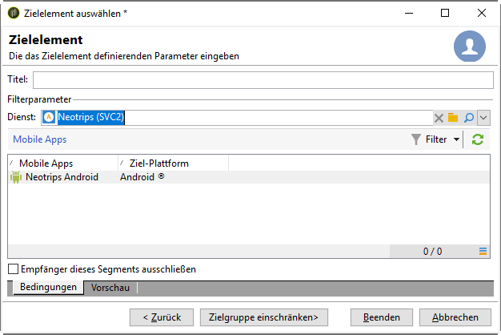

1. Wählen Sie **[!UICONTROL Datennachricht]** als **[!UICONTROL Nachrichtentyp]** aus.

1. Bearbeiten Sie Ihre Rich-Benachrichtigung.

   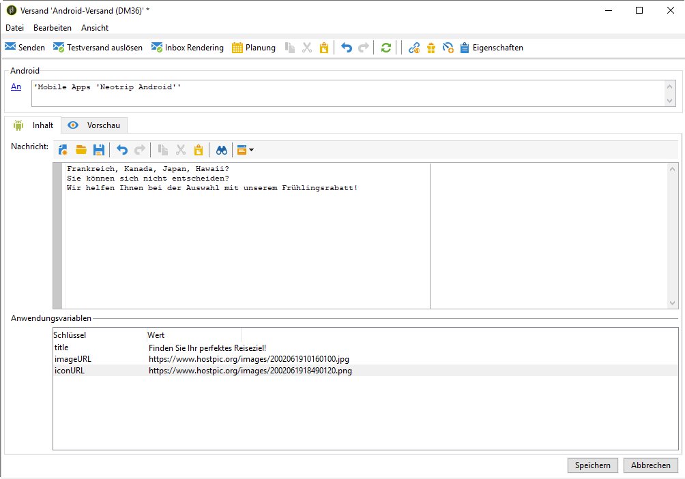

1. Bei Bedarf können Sie den zuvor konfigurierten **[!UICONTROL Anwendungsvariablen]** Informationen hinzufügen. **[!UICONTROL Anwendungsvariablen]** müssen im Android-Dienst konfiguriert werden und sind Teil der an das Mobilgerät gesendeten Nachrichten-Payload.

1. Klicken Sie auf **[!UICONTROL Speichern]** und führen Sie den Versand durch.

Auf den Android-Mobilgeräten der Abonnenten sollten das Bild und die Webseite in der Push-Benachrichtigung angezeigt werden.

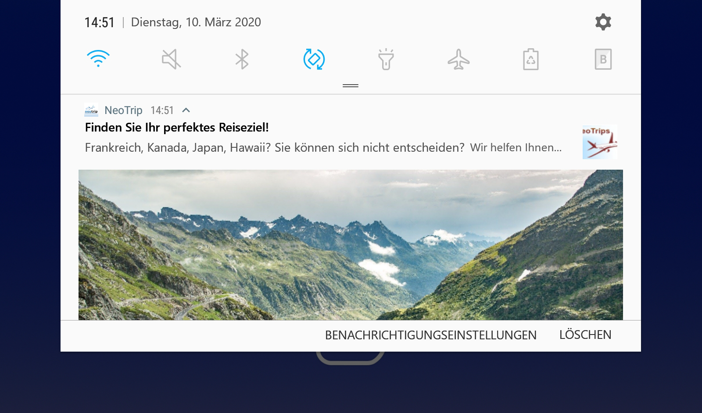

### Erstellen eines Benachrichtigungsinhalts {#creating-notification-message}

>[!NOTE]
>
>Zusätzliche Optionen für Benachrichtigungsinhalte sind nur bei der HTTP v1-API-Konfiguration verfügbar. Weitere Informationen hierzu finden Sie in [diesem Abschnitt](../../delivery/using/configuring-the-mobile-application-android.md#android-service-httpv1).

1. Gehen Sie zu **[!UICONTROL Kampagnenverwaltung]** > **[!UICONTROL Sendungen]**.

1. Klicken Sie auf **[!UICONTROL Neu]**.

   

1. Wählen Sie **[!UICONTROL Android-Versand (Android)]** aus der Dropdown-Liste **[!UICONTROL Versandvorlage]**. Fügen Sie Ihrem Versand einen **[!UICONTROL Titel]** hinzu.

1. Klicken Sie auf **[!UICONTROL An]**, um die Zielpopulation zu definieren. Standardmäßig wird das Zielgruppen-Mapping **[!UICONTROL Abonnierte Anwendung]** angewendet. Klicken Sie auf **[!UICONTROL Hinzufügen]**, um Ihren Dienst auszuwählen.

   

1. Wählen Sie im Fenster **[!UICONTROL Zieltyp]****** die Option &quot;Abonnenten einer Android-Mobile-App&quot; aus und klicken Sie auf **[!UICONTROL Weiter]**.

1. Wählen Sie aus der Dropdown-Liste **[!UICONTROL Dienst]** den zuvor erstellten Dienst und dann die Anwendung aus. Klicken Sie anschließend auf **[!UICONTROL Beenden]**.

   

1. Wählen Sie **[!UICONTROL Benachrichtigungsinhalt]** als **[!UICONTROL Nachrichtentyp]** aus.

1. Geben Sie einen Titel an und bearbeiten Sie Ihre Nachricht. Personalisieren Sie Ihre Push-Benachrichtigung über die **[!UICONTROL Benachrichtigungsoptionen]**:

   * **[!UICONTROL Kennung des Kanals]**: Legt die Kennung des Kanals Ihrer Benachrichtigung fest. Die Mobile App muss einen Kanal mit dieser Kennung erstellen, bevor eine Benachrichtigung mit dieser Kanalkennung empfangen werden kann.
   * **[!UICONTROL Ton]**: Legt den Ton fest, der abgespielt werden soll, wenn das Gerät Ihre Benachrichtigung empfängt.
   * **[!UICONTROL Farbe]**: Legt die für das Symbol der Benachrichtigung verwendete Farbe fest.
   * **[!UICONTROL Symbol]**: Legt das Symbol fest, das für die Benachrichtigung auf den Geräten Ihrer Profile angezeigt werden soll.
   * **[!UICONTROL Tag]**: Legt die Kennung fest, die zum Ersetzen bestehender Benachrichtigungen in der Benachrichtigungsablage verwendet werden soll.
   * **[!UICONTROL Klick-Aktion]**: Legt die Aktion fest, die für das Klicken eines Benutzers auf Ihre Benachrichtigung zugewiesen ist.

   Weitere Informationen zu den **[!UICONTROL Benachrichtigungsoptionen]** und dazu, wie diese Felder auszufüllen sind, finden Sie in der [FCM-Dokumentation](https://firebase.google.com/docs/reference/fcm/rest/v1/projects.messages#androidnotification).

   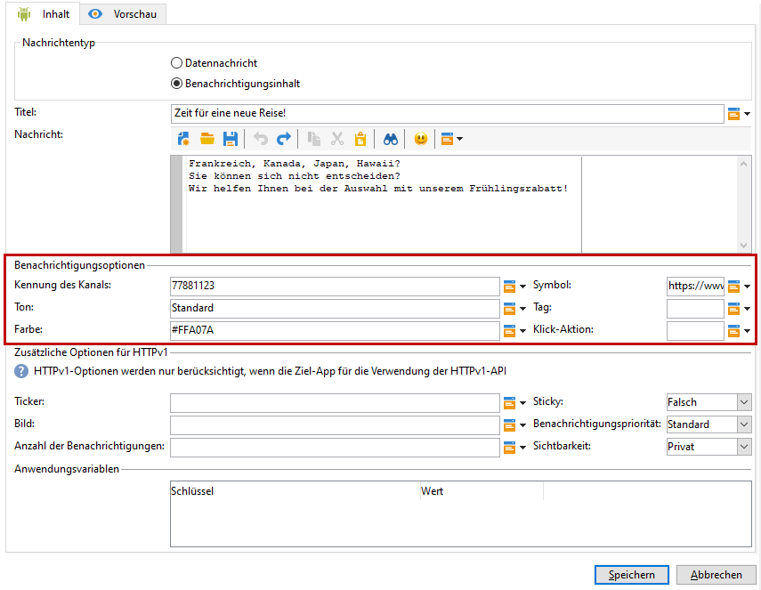

1. Wenn Ihre Anwendung mit dem HTTP v1-API-Protokoll konfiguriert ist, können Sie Ihre Push-Benachrichtigung mit den folgenden **[!UICONTROL zusätzlichen HTTP v1-Optionen]** weiter personalisieren:

   * **[!UICONTROL Ticker]**: Legt den Ticker-Text Ihrer Benachrichtigung fest. Nur verfügbar bei Geräten mit Android 5.0 Lollipop.
   * **[!UICONTROL Bild]**: Legt die URL des Bilds fest, das in Ihrer Benachrichtigung angezeigt werden soll.
   * **[!UICONTROL Anzahl der Benachrichtigungen]**: Legt die Zahl der neuen ungelesenen Informationen fest, die direkt auf dem Mobile-App-Symbol angezeigt werden.
   * **[!UICONTROL Sticky]**: Auf &quot;Wahr&quot; oder &quot;Falsch&quot; setzen. Bei der Einstellung &quot;Falsch&quot; wird die Benachrichtigung automatisch geschlossen, wenn der Benutzer darauf klickt. Bei der Einstellung &quot;Wahr&quot; wird die Benachrichtigung weiter angezeigt, wenn der Benutzer darauf klickt.
   * **[!UICONTROL Benachrichtigungspriorität]**: Sie können für Ihre Benachrichtigung die Prioritätsstufen &quot;Standard&quot;, &quot;Minimum&quot;, &quot;Niedrig&quot; oder &quot;Hoch&quot; festlegen. Weitere Informationen hierzu finden Sie in der [FCM-Dokumentation](https://firebase.google.com/docs/reference/fcm/rest/v1/projects.messages#NotificationPriority).
   * **[!UICONTROL Sichtbarkeit]**: Sie können für Ihre Benachrichtigung die Sichtbarkeitsstufen &quot;Öffentlich&quot;, &quot;Privat&quot; oder &quot;Geheim&quot; festlegen. Weitere Informationen hierzu finden Sie in der [FCM-Dokumentation](https://firebase.google.com/docs/reference/fcm/rest/v1/projects.messages#visibility).

   Weitere Informationen zu den **[!UICONTROL zusätzlichen HTTP v1-Optionen]** und dazu, wie diese Felder auszufüllen sind, finden Sie in der [FCM-Dokumentation](https://firebase.google.com/docs/reference/fcm/rest/v1/projects.messages#androidnotification).

   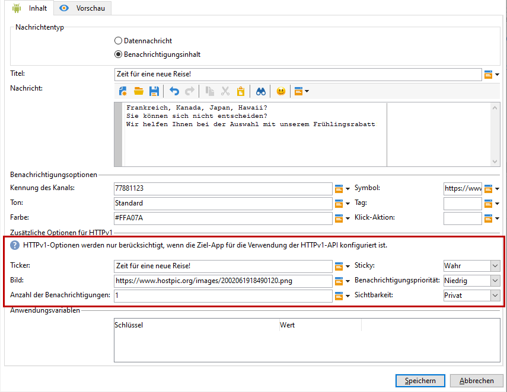

1. Bei Bedarf können Sie den zuvor konfigurierten **[!UICONTROL Anwendungsvariablen]** Informationen hinzufügen. **[!UICONTROL Anwendungsvariablen]** müssen im Android-Dienst konfiguriert werden und sind Teil der an das Mobilgerät gesendeten Payload.

1. Klicken Sie auf **[!UICONTROL Speichern]** und führen Sie den Versand durch.

Auf den Android-Mobilgeräten der Abonnenten sollten das Bild und die Webseite in der Push-Benachrichtigung angezeigt werden.
